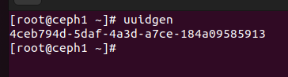

# Triển khai cụm Ceph (ceph-manual)
## Chuẩn bị 

 

## Cấu hình cài đặt
- Tạo ssh key trên ceph1:
```sh
ssh-keygen
```
- Chỉnh sửa file ~/.ssh/config để đăng nhập không cần pass root
```sh
Host ceph1
    Hostname ceph1
    User root
Host ceph2
    Hostname ceph2
    User root
Host ceph2
    Hostname ceph2
    User root
```
- Chỉnh quyền cho file config 
```sh
  chmod 777 ~/.ssh/config
```
- Copy SSH sang máy khác:
```sh
ssh-copy-id ceph1
ssh-copy-id ceph2
ssh-copy-id ceph3
```
- Trên tất cả các node cài đặt Ceph:
```sh
dnf install centos-release-ceph-reef epel-release
dnf install ceph
```
 

- Tạo mã uuidgen (đây là mã để định danh cụm, uuidgen sẽ tạo ra một mã bất kì mà rất ít khả năng trùng trên thế giới) (ở bản 18 trở đi ceph sẽ tự tạo)
```sh
uuidgen
```
 

- Cấu hình file config trong /etc/ceph/config trên ceph1
```sh 
[global]
        fsid = 4ceb794d-5daf-4a3d-a7ce-184a09585913
        mon_host = [v2:10.2.1.54:3300/0,v1:10.2.1.54:6789/0] [v2:10.2.1.81:3300/0,v1:10.2.1.81:6789/0] [v2:10.2.1.83:3300/0,v1:10.2.1.83:6789/0]
        public_network = 10.2.1.0/24
        cluster_network = 10.2.1.0/24
        mon_initial_members = ceph1
```
- Tạo keyring cho MON
```sh 
ceph-authtool --create-keyring /tmp/ceph.mon.keyring --gen-key -n mon. --cap mon 'allow *'
```

 

- Tạo keyring cho ADMIN (Một số phiên bản sẽ tự tạo keyring admin. Vào ls /etc/ceph để xem có không):
```sh
sudo ceph-authtool --create-keyring /etc/ceph/ceph.client.admin.keyring --gen-key -n client.admin --cap mon 'allow *' --cap osd 'allow *' --cap mds 'allow *' --cap mgr 'allow *'
```
- 
- Import keyring của MON vào 1 file duy nhất trong thư mục /etc/ceph/ceph.client.admin.keyring
```sh
sudo ceph-authtool /tmp/ceph.mon.keyring --import-keyring /etc/ceph/ceph.client.admin.keyring
```
- Import keyring của MON vào file bootstrap để khi xin tạo OSD không cần xin key:
```sh
sudo ceph-authtool /tmp/ceph.mon.keyring --import-keyring /var/lib/ceph/bootstrap-osd/ceph.keyring
```
