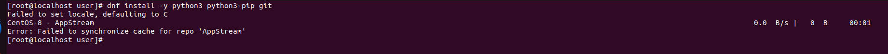
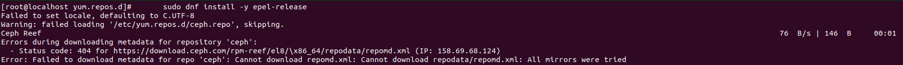
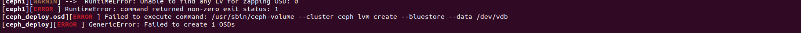
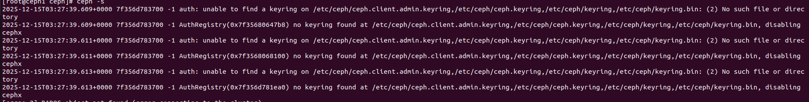

# Các lỗi thường gặp



CentOS 8 đã EOL (End-Of-Life) từ 2021, tất cả repo chính thức đều bị gỡ — nên dnf không thể sync repo. Fix lối:
Bước 1: Backup repo cũ
```sh
sudo mkdir /etc/yum.repos.d/backup
sudo mv /etc/yum.repos.d/*.repo /etc/yum.repos.d/backup/
```
Bước 2: Tạo repo CentOS 8 Vault mới
```sh
sudo tee /etc/yum.repos.d/CentOS-Vault.repo << 'EOF'
[baseos]
name=CentOS-8 - Base
baseurl=http://vault.centos.org/8.5.2111/BaseOS/x86_64/os/
gpgcheck=0
enabled=1

[appstream]
name=CentOS-8 - AppStream
baseurl=http://vault.centos.org/8.5.2111/AppStream/x86_64/os/
gpgcheck=0
enabled=1

[extras]
name=CentOS-8 - Extras
baseurl=http://vault.centos.org/8.5.2111/extras/x86_64/os/
gpgcheck=0
enabled=1
EOF
```
Bước 3: Clean cache và update 
```sh
sudo dnf clean all
sudo dnf makecache
sudo dnf update -y
```
Bước 4: Cài lại python
```sh
sudo dnf install -y python3 python3-pip git
```


Lối không thấy repo. Fix:
Bước 1: Thay thế repo cũ bằng repo mới
```sh
sed -i 's/mirrorlist/#mirrorlist/g' /etc/yum.repos.d/CentOS-*
sed -i 's|#baseurl=http://mirror.centos.org|baseurl=http://vault.centos.org|g' /etc/yum.repos.d/CentOS-*
```
Bước 2: Update
```sh
yum update -y
```
Bước 3: Cài lại python
```sh
sudo dnf install -y python3 python3-pip git
```



Lỗi truy cập sai đường dẫn. Fix:
```sh 
sudo tee /etc/yum.repos.d/ceph-reef.repo << 'EOF'
[ceph]
name=Ceph Reef
baseurl=https://download.ceph.com/rpm-18.2.1/el8/x86_64/
enabled=0
gpgcheck=1
gpgkey=https://download.ceph.com/keys/release.gpg
```


Lỗi chưa làm sạch ổ đĩa
Check xem ổ vdb có sạch không:
```sh
lsblk
```
Chưa sạch thì xóa:
```sh
dmsetup remove_all
```


Lỗi không có file cepg.admin.keyring. Chay
```sh
ceph-deploy gatherkeys ceph1
```


Lỗi cập nhật phiên bản mới nhất. Vào /etc/ceph/ceph.conf
```sh
require_osd_release = Reef #Thay the bằng tên bản đang cài
```

```sh
 systemctl restart ceph-mon@ceph1  
 systemctl restart ceph-mon@ceph2
 systemctl restart ceph-mon@ceph3
```


Lỗi không có file keyring
```sh
mkdir /var/lib/ceph/mgr/ceph-ceph1
```
```sh
# Lệnh này sẽ tạo hoặc lấy lại khóa cho mgr.ceph3
ceph auth get-or-create mgr.ceph1 mon 'allow profile mgr' osd 'allow *' mds 'allow *' -o /var/lib/ceph/mgr/ceph-ceph1/keyring
```
```sh   
systemctl daemon-reload
systemctl restart ceph-mgr@ceph1
```


Tắt cảnh báo này
```sh
ceph config set mon mon_warn_on_insecure_global_id_reclaim_allowed false
```


Lỗi này chịu , để 1 lúc nó thành lỗi ssh. Cách fix ssh permission: Xem cách taoh ssh trong file Ceph/Deploy_Ceph/1. Hướng dẫn cài đặt ceph 18.2.2-Ubuntu 22.04.pdf


