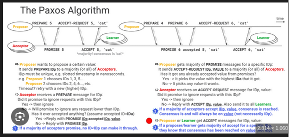
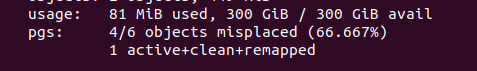

# PAXOS
## Tổng quan
1. Khái niệm 
- Paxos là bài toán đồng thuận nhằm mục địch giúp một mạng lưới các máy tính không tin cậy nhau có thể thống nhất được 1 giá trị duy nhất

2. Hiểu cách tại sao cần Paxos
- Trong hệt thống phân tán có các vấn đề:
  - Node failure: Máy chủ có thể chết bất cứ lúc nào
  - Network partition: Mạng bị đứt chia cụm thành 2 đoạn không thấy nhau
  - Latency: các gói tin chậm hoặc mất hẳn
--> Từ đó cần tới Paxos để chỉ có thể có 1 giá trị duy nhất được chọn và nó không bao giờ đổi
3. Các roles trong Paxos
- Paxos chia các node thành 3 roles:
 - Proposer: Là đại diện của client đưa ra 1 giá trị đề xuất để bình bầu
 - Acceptor: Là người bình bầu có hoặc không. Đây chính là bộ nhớ của hệ thống
 - Learner: Là người ko bình chọn

 

4. Quy trình hoạt động
- Quy trình hoạt động sẽ trải qua 2 bước: Chuẩn bị thăm dò và đề xuất chấp nhận. Giả sử có 3 nodes: Proposer A, Acceptor B, Learner C
- Giai đoạn 1: Chuẩn bị và thăm dò
  - Node A: Node A sẽ tự chọn 1 số ID bất kì, ví du là 100 và gửi đến 2 node còn lại
  - Node B, C: Node B sẽ nhận được giá trị đó và kiểm tra xem mình từng thấy giá trị nào lớn hơn như thế chưa. Nếu chưa thì nó đồng ý và gửi về 1 tin nhắn `PROMISE(1, null)`. Node C thì không làm gì
- Giai đoạn 2: Đề xuất và chấp nhận
  - Node A: Node A nhận được phản hồi `PROMISE` của B. Vì các phản hồi đa số là null nên thằng A sẽ tự tạo 1 giá trị X và gửi tin nhắn `ACCEPT_REQUEST(1, "X")` tới 2 nodes B và C
  - Node B và C: Nhận được tin nhắn `ACCEPT_REQUEST(1, "X")` và kiểm tra lại xem trước tới giờ có nhận tin này trước kia không, nếu không nó sẽ gắn thằng X vào trong ổ cứng và gửi tin nhắn ACCEPTED(1, "X") tới thằng A và thằng C
  ---> ĐỒng thuận thành công
