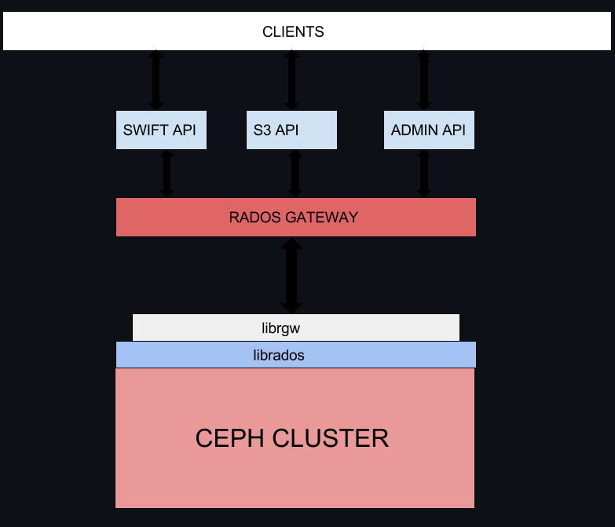

# RGW
## Khái niệm 
- Là một web server giúp chuyển đổi các yêu cầu HTTP thành lệnh để chuyển xuống RADOS. Nó không có giao diện mà giao tiếp trực tiếp qua API

## Ứng dụng
- Ứng dụng có thể bypass qua RADOS gateway và truy xuất trực tiếp tới librados, thường thấy trong các ứng dụng doanh nghiệp đòi hỏi hiệu năng cao. Ceph cho phép truy xuất trực tiếp tới cluster, điều khác biệt so với các hệ thống lưu trữ khác vốn giới hạn về các interface giao tiếp.