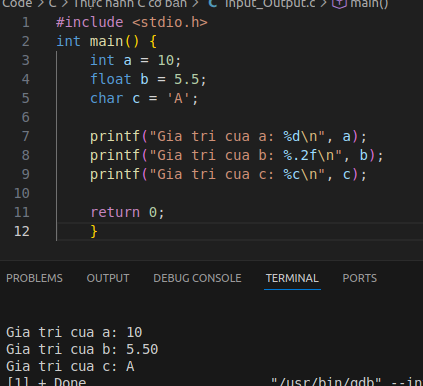
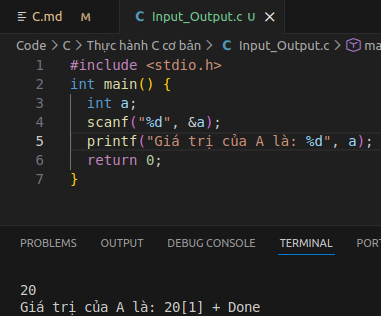
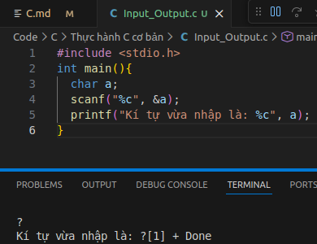

# Kiêủ dữ liệu vào ra trong C
1. Kiểu dữ liệu cơ bản
- `int`: số nguyên có hoặc không dấu  (4 byte) (Lưu được giá trị từ -2,147,483,648 đến 2,147,483,647)
  - `unsigned int`: số nguyên không dấu (4 byte)
- `long long int`: số nguyên lớn có dấu (8 byte) (Lưu được giá trị từ -9,223,372,036,854,775,808 đến 9,223,372,036,854,775,807)
  - `unsigned long long int`: số nguyên lớn không dấu (8 byte)
- `float`: số thực (4 byte)
- `double`: số thực chính xác kép (8 byte)
- `char`: ký tự (1 byte)
2. Đặt biến
- Tên biến chỉ gôm chữ cái, chữ số và dấu gạch dưới (_), không được bắt đầu bằng chữ số.
- Phân biệt chữ hoa và chữ thường.
```c
int a, b, c;                      // biến nguyên
```
3. Giá trị đặc tả 
- `int` : %d
- `unsigned int` : %u
- `long long int` : %lld
- `unsigned long long int` : %llu
- `float` : %f
- `double` : %lf
- `char` : %c
```c
#include <stdio.h>
int main() {
    int a = 10;
    float b = 5.5;
    char c = 'A';
    printf("Gia tri cua a: %d\n", a);
    printf("Gia tri cua b: %.2f\n", b);
    printf("Gia tri cua c: %c\n", c);
    return 0;
}
```


4. Scanf và Printf
- Scanf là giá trị nhập từ bàn phím còn Printf là in kết quả của biến ra terminal
- Khi dùng Scanf thì trước biến cần đặt thêm dấu & để xác định vị trí của biến đó trong ô nhớ 
```c
#include <stdio.h>
int main() {
  int a;
  scanf("%d", &a);
  printf("Giá trị của A là: ", a)
}
```


```c
#include <stdio.h>
int main(){
  char a;
  scanf("%c", &a);
  printf("Kí tự vừa nhập là: %c", a);
}
```


5. Toán tử
- Toán tử cơ bản: `+, -, *, /, %(chia lấy dư)`. Dấu `=` là toán tử gán. `==` để so sánh
```c
#include <stdio.h>
int main()
{
  int a;
  int b;
  int c;
  char x;
  printf("Nhập số a và b: ");
  scanf("%d%d", &a, &b);
  printf("Nhập dấu: ");
  scanf(" %c", &x);

  if (x == '/')
  {
    if (b == 0)
    {
      printf("Lỗi không chia được\n");
    } else {
        if (a%b==0){
          printf("Giá trị của c là: %d", a/b);
          }
        else{
          printf("Giá trị của c là: %f", (float)a/b);

        }
    }
  }
  else if (x == '+'){
    c = a+b;
    printf("Giá trị của c là: %d", c);
  }
  else if (x == '-'){
    c =a - b;
    printf("Giá trị của c là: %d", c);
    }
  else{
    c = a * b;
    printf("Giá trị của c là: %d", c);
    }
  return 0;
} 
```
6. So sánh
- Các phép so sánh trong C: 
  -`>=`: Lớn hơn hoặc bằng
  -`<=`: Nhỏ hơn hoặc bằng 
  -`==`: Bằng, Giống
  -`!=`: Khác, Không bằng
  