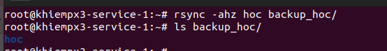
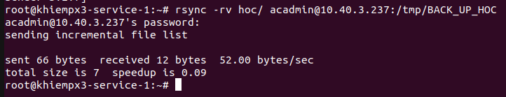
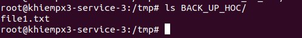
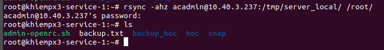
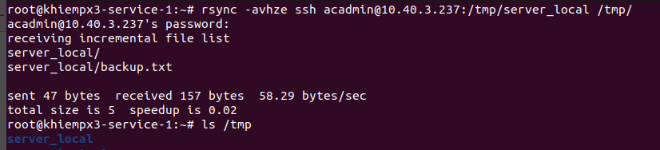
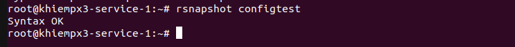
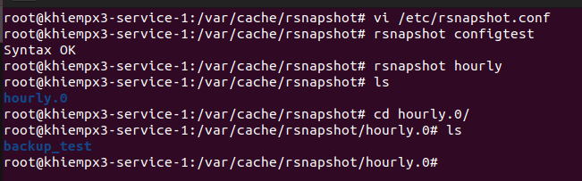

# Backup system basic
1. Backup thủ công bằng cp: Không phù hợp backup lớn và incremental backup (copy file thay đổi)
```sh
cp -a /source /backup
```
-a : giữ nguyên quyền

2. Backup bằng tar: dùng để đóng gói toàn hệ thống, tốt cho backup toàn bộ file nhưng ko incremental và chậm với dữ liệu lớn
```sh
tar -czfv backup.tar.gz /etc /var/www/html
``` 
3. Backup bằng dd dưới dạng images
```sh
dd if =/dev/sda of = /backup/disk.img
```
4. Backup bằng snapshot (LVM snapshot): chụp filesystem tại 1 thời điểm, backup an toàn
```sh
lvcreate --size 1G --snapshot --name snap_lv /dev/vg0/lv0
```
# Rsync
## 1. Tổng quát
- Là công cụ backup mạnh, sao chép thông minh hỗ trợ:
  - Incremental backup: Copy file thay đổi
  - Copy qua SSH
  - Giữ nguyên permission, owner, symlink
  - Resume khi mất mạng 
  - Nhanh
  - Tối ưu cho backup thường xuyên
- Các thông số cơ bản:
  - -v: verbose 
  - -r: Sao chép dữ liệu 1 cách đệ quy
  - -a: Chế độ cho phép sao chép các tệp đệ quy và giữa các liên kết quyền sở hữu
  - -z: Nén dữ liệu
  - -h: Định dạng số
## 2. Các lệnh rsync 
1. Backup từ local --> local
```sh
rsync -ahz  /folder1 /folder2/
```


2. Backup từ local --> server và từ server --> local
local --> server
```sh 
rsync -ahz /folder1 root@x.x.x.x:/home/
```





server --> local
```sh
rsync -avhz root@x.x.x.x:/home/ /tmp/
```



3. Backup qua SSH
- Để dùng giao thức SSH ta thêm tùy chọn -e cùng với tên giao thức: 
```sh
rsync -avhze ssh root@x.x.x.x:/tmp/backup/abc.log /tmp/
```


# Rsnapshot 
- Là một công cụ backup dựa trên rsync có thể backup theo dạng snapshot hàng ngày, tuần, tháng, năm mà không tốn nhiều dung lượng nhờ incremental và hard link. Lần đầu nó sẽ copy toàn bộ thư mục và những lần sau nó chỉ copy những file nào thay đổi, những file không thay đổi nó sẽ snapshot sang file khác nhờ hard links. Vì thế sẽ không gây tốn dung lượng
- Cài đặt Rsnapshot
```sh
apt install rsnapshot 
```
- Trước khi chạy cần nhập câu lệnh `rsnapshot configtest` để xem có chạy không. NẾu hiện Synax OK thì tiếp tục



- Cấu hình rsnapshot: Vào file cấu hình `/etc/rsnapshot.conf`:
```sh
rsnapshot_root /backup/ #Thư mục lưu trữ backup
retain  hourly  6  #Mỗi giờ tạo 6 backup
retain  daily   7  #Mỗi ngày tạo 7 backup
retain  weekly  4  #Mỗi tuần sẽ tạo 4 bản 
retain  monthly 3  #Mỗi tháng tạo 3 bản
backup /var/log/file.log localhost/ #Backup trên local
backup root@x.x.x.x:/home/..   thu_muc_backup # backup ssh (thu_muc_backup không cần tạo trước)
```



- Cấu hình Cron để chạy tự động:
```sh
crontab -e
```
```sh
* * * * * /usr/bin/snapshot hourly
* * * * * /usr/bin/snapshot daily
* * * * * /usr/bin/snapshot weekly
* * * * * /usr/bin/snapshot monthy
``` 
a