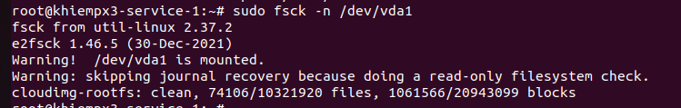
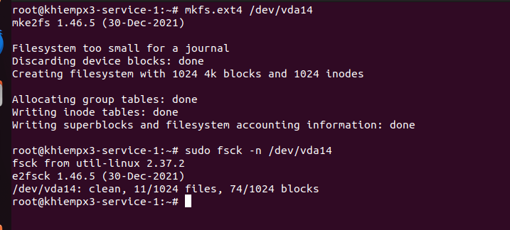
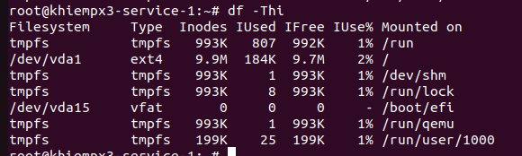
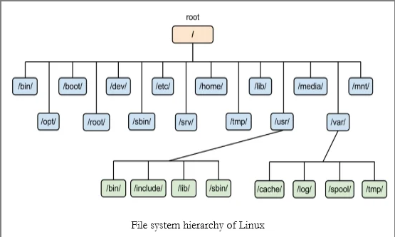

 # File system
 ## 1. Các loại filesystem

 - **EXT4**: phổ biến, hỗ trợ file lớn, hiệu năng tốt.
 - **XFS**: xử lý tốt file lớn và hệ thống có băng thông cao.
 - **Btrfs**: hỗ trợ copy-on-write, snapshot, RAID.
 - Các loại khác: `tmpfs`, `vfat`, `ntfs`, ...

 ## 2. Kiểm tra và sửa filesystem (`fsck`)

 `fsck` dùng để quét và sửa lỗi filesystem.

 Khi dùng `fsck`:

 - Chỉ chạy trên phân vùng không `mounted` (hoặc ở chế độ cứu hộ).
 - Dùng khi máy không khởi động, phân vùng bị chuyển sang `read-only` hoặc có bad blocks.

 Ví dụ và các option phổ biến:

 ```sh
 fsck -A        # kiểm tra tất cả các filesystem trong /etc/fstab
 fsck -C        # hiển thị thanh tiến trình
 fsck -M        # bỏ qua filesystem đang mounted
 fsck -N        # show các thao tác sẽ làm (không thực hiện)
 fsck -t ext4 /dev/sda1  # chỉ định kiểu filesystem
 fsck -y /dev/sda1      # tự động đồng ý sửa lỗi
 ```



 ## 3. Tạo filesystem (`mkfs`)

```sh
mkfs.ext4 /dev/sdb1
mkfs.xfs /dev/sdb1
```


 ## 4. Kiểm tra dung lượng: `df` và `du`

 - `df` (disk free): xem dung lượng trống của các phân vùng.
 - `du` (disk usage): xem dung lượng sử dụng trong thư mục.


 Ví dụ:

 ```sh
 df -h        # hiển thị theo định dạng dễ đọc (GB/MB)
 df -hT       # thêm cột kiểu filesystem
 df -i        # hiển thị inode

 du -h        # xem dung lượng của thư mục hiện tại
 du -sh /var  # tổng dung lượng /var dưới dạng dễ đọc
 du -ah       # liệt kê dung lượng tất cả file và thư mục
 ```


# Filesystem Hierarchy Standard (FHS)
## 1. Khái niệm 
- Là tiêu chuẩn để mọi thư mục trên Linux phải tổ chức và thực hiện theo, mỗi thư mục được đung để làm gì



## Cấu trúc
1. / - Root directory: là thư mục đầu của hệ thống , tất cả các thư mục khác nằm dưới thư mục này
2. /bin: Chứa các cấu hình cơ bản của linux như: cat, ls, cp, mv, rm, ping, grep
3. /sbin (System binaries): Lệnh cho quản trị viên như: mkfs, fdisk, ifconifg, ip, shutdown
4. /usr: phần mềm cho người dùng, chứa các phần mềm cài đặt từ repo
   - `/usr/bin`: chương trình dành cho user
   - `/usr/sbin`: chương trình dành cho hệ thống
   - `/usr/lib`: thư viện
   - `/usr/share`: data/docs
5. /var: Chứa dữ liệu thay đổi liên tục
   - `/var/log`: chứa log của hệ thống
   - `/var/www`: web server
   - `/var/lib`: database
   - `/var/spool`: mail queue, printer queue
   - `/var/cache`: chứa cache của hệ thống
6. /home: Chứa dữ liệu của user thường và mỗi 1 user sẽ có 1 thư mục riêng
7. /etc: Thư mục quan trọng nhất trong Linux
   - `/etc/ssh/sshd_config`: Cấu hình SSH
   - `/etc/fstab`: Cấu hình mount partition
   - `/etc/hostname`: Tên máy
   - `/etc/resolv.conf`: DNS
   - `/etc/passwd`: Danh sách user
   - `/etc/nginx/nginx.conf`: cấu hình Nginx
8. /lib: Chứa các thư viện cho hệ thống
9. /tmp: là thư mục chứa các file chứa tạm, sẽ tự động mất sau khi reboot. Thường dùng để unzip các file.zip, session web và các tiến trinh chạy
10. /dev: là thư mục chứa các file thiết bị 
   - Đĩa cứng: `/dev/sda`
   - Phân vùng: `/dev/sda1`
   - USB: `/dev/sdb`
   - Terminal: `/dev/tty`
   - camera: `/dev/video0`
11. - /mnt: Thư mục chứa mount thủ công từ admin
    - /media: Thư mục chứa mount tự động USB/CD
12. /opt: Thư mục chứa các phần mềm không phải là của hệ thống mà cài từ bên ngoài như Chorm, VMware, Forticlient,....
13. /proc: là thư mục ảo (virtual filesystem) chứa các thông tin liên quan tới RAM của kernel
14. /root: home của user root, khác với / là chỉ có root mới truy cập được
15. /sys: Giống /proc nhưng là thông tin về kernel và thiết bị
16. /run: Chứa các thông tin runtime, thường bị xóa sau khi reboot
   - PID files
   - Socket files
   - systemd runtime data 