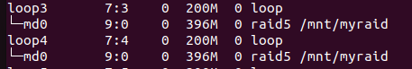
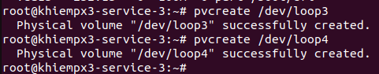
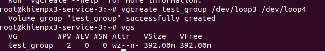
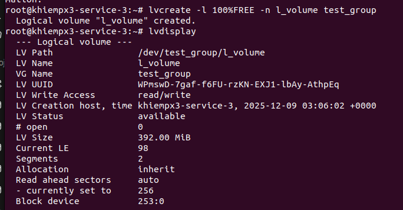
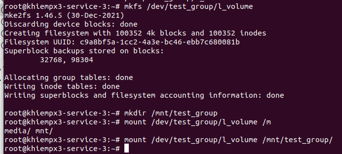
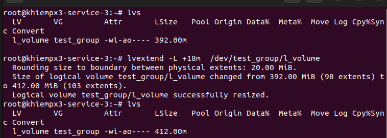
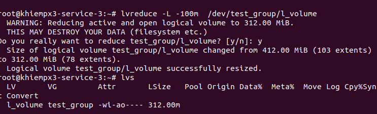
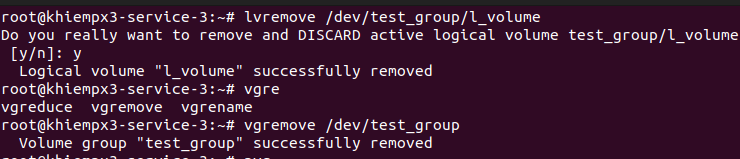
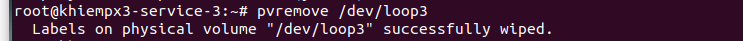

# LVM 
## 1. Khái niệm và thuật ngữ
1. Khái niệm
- LVM là kỹ thuật quản lý việc thay đổi kích thước lưu trữ của ổ cứng. Là một phương pháp ấn định không gian ổ đĩa thành những logicalvolume khiến cho việc thay đổi kích thước của một phân vùng trở nên dễ dàng
2. Một số thuật ngữ
- PV (physical volume): là đĩa cứng vật lý hoặc các parition tham gia vào LVM
- VG (volume group): là một nhóm các physical volome
- LV (logical volume): là phân vùng, mount của LVM vừa tạo 
- Tổng quan các bước thực hiện tạo: `Disk/Partition → PV → VG → LV → Filesystem → Mount`
## Cách sử dụng
- Giả sử bạn đang có 2 ổ đĩa như hình



Bước 1: Format 2 ổ thành 1 PV
```sh
pvcreate /dev/loop3 
pvcreate /dev/loop4
```


Bước 2: Tạo group volume
```sh
vgcreate /dev/loop3 /dev/loop4
vgs
```



Bước 3: Tạo Logical volume: `lvcreate -L size_volume -n (ten logical) (tên group volume)`

```sh
lvcreate -L 100%FREE l_volume test_group
lvdisplay
```


Bước 4: Mount
```sh
mkfs ext4 /dev/test_group/l_volume
mkdir /mnt/test_group
mount /dev/test_group/l_volume /mnt/test_group
```


Bước 5: Thay đổi dung lượng 
- Lệnh chung: `lvextend/lvreduce -L (n) /dev/(tên group)/(tên logical)`. Trong đó:
  - lvextend: là lệnh tăng dung dượng
  - lvreduce: là lệnh giảm dung lượng
  - L: là option của lệnh
  - (n): là số dung lượng mà ta muốn tăng hoặc giảm
- Tăng: 
```sh
  lvextend -L +16m /dev/test_group/l_volume
  ```


- Giảm
```sh
  lvreduve -L -100m /dev/test_group/l_volume
  ```


- Sau khi thay đổi dung lượng cần xác nhận thay đổi:
```sh 
resize2fs /dev/test_group/l_volume
```
Bước 6: Thay đổi dung lượng của 1 group volume bằng cách thêm disk vào
```sh
pvcreate /dev/loop5
vgextend /dev/test_group dev/loop5
```
Bước 7: Xóa
```sh
lvremove /dev/test_group/l_volume
vgremove /dev/test_group
pvremove /dev/loop3
```
  - Xóa type lvm
  ```sh
  dmsetup remove_all
  ```

  

  
