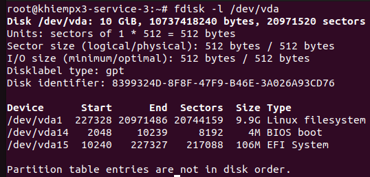
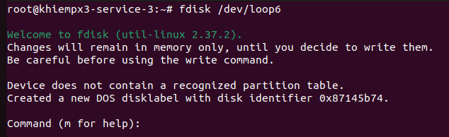
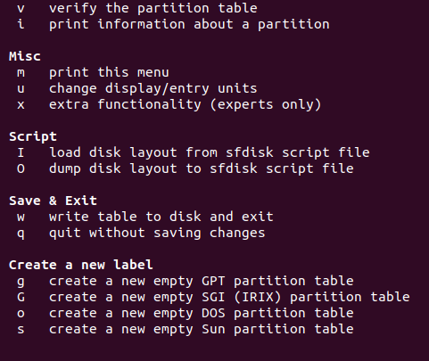
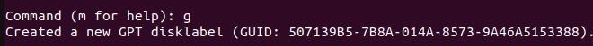
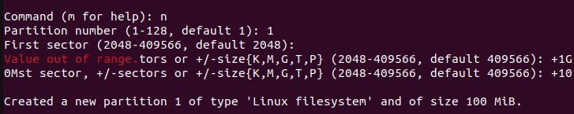
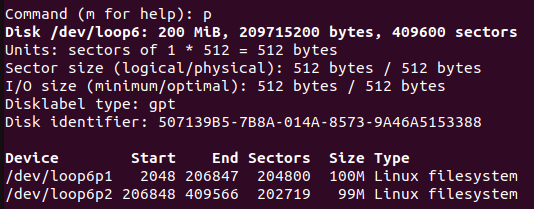
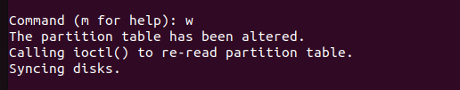
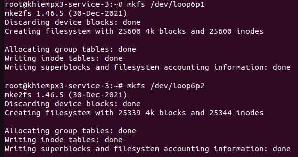

# Partition Disk
## 1. Khái niệm 
- Partition (phân vùng) là cách chia ổ đĩa vật lý thành các phần nhỏ hơn để cài hệ điều hành, lưu dữ liệu, Swap, boot
- Có 2 cách để partition:
            
            |                       |               Ưu điểm               |              Nhược điểm               |
            |_ _ _ _ _ _ _ _ _ _ _ _|_ _ _ _ _ _ _ _ _ _ _ _ _ _ _ _ _ _ _| _ _ _ _ _ _ _ _ _ _ _ _ _ _ _ _ _ _ _ |
            |                       | - Hoạt động tốt trên tất cả các nền | - Dữ liệu MBR được lưu trữ trên 1 vùng|
            |                       | tảng Window hiện nay                |nhất định vì thế dễ bị lỗi và không có |
            |         MBR           |                                     |khả năng khôi phục                     |
            |                       |                                     | - Hỗ trợ tối đa 4 phân vùng chính     | 
            |                       |                                     | - Muốn tạo nhiều phân vùng thì phải   |
            |                       |                                     |tạo kiểu Logical                       |
            |_ _ _ _ _ _ _ _ _ _ _ _|_ _ _ _ _ _ _ _ _ _ _ _ _ _ _ _ _ _ _|_ _ _ _ _ _ _ _ _ _ _ _ _ _ _ _ _ _ _ _|
            |                       |- Hoạt động tốt trên hệ điều hành Mac|- Chỉ hỗ trợ cho Window 64 bit         |
            |                       |Window, Linux                        |                                       |
            |                       |- Dễ dàng khôi phục dữ liệu vì GPT   |                                       |
            |          GPT          |chạy trên nhiều ổ cứng               |                                       |
            |                       |                                     |                                       |
            |                       |                                     |                                       |
            |_ _ _ _ _ _ _ _ _ _ _ _|_ _ _ _ _ _ _ _ _ _ _ _ _ _ _ _ _ _ _| _ _ _ _ _ _ _ _ _ _ _ _ _ _ _ _ _ _ _ |

## fidisk
### 1. Khái niệm
- Là tiện ích quản lý phân vùng trên Linux giúp thay đổi kích thước, tạo, xóa, sao chép và thay di chuyển các phân vùng
### 2. Cách dùng
1. Liệt kê phân vùng trên ổ
- Liệt kê phân vùng trên 1 ổ  
```sh
fdisk -l /dev/vda
```


- Liệt kê phân vùng trên tất cả các ổ
```sh
fdisk -l
```
2. Tạo bảng phân vùng
- Tạo phân vùng trên /dev/loop6:
```sh
fdisk /dev/loop6
```


- Nhập `m` trong Command để hiển thị các hướng dẫn



- Nhập `g` để tạo 1 phân vùng mới kiểu GPT :



- Nhập `n` để tùy chỉnh partition và cấu hình.



- Nhập `p` để xemm số phân vùng đã tạo trên ổ đĩa:



- Nhập `w` để thoát và lưu:



- Sau khi xong kích hoạt phân vùng như bài filesystem:
```sh
  mkfs /dev/loop6p1
  mkfs /dev/loop6p2
```



```sh
  mkdir -p /mnt/loop6p1/ /mnt/loop6p2/
  mount /dev/loop6p1 /mnt/loop6p1
  mount /dev/loop6p2 /mnt/loop6p2
```
