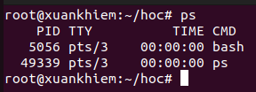
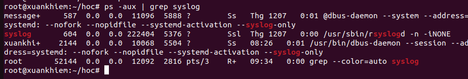
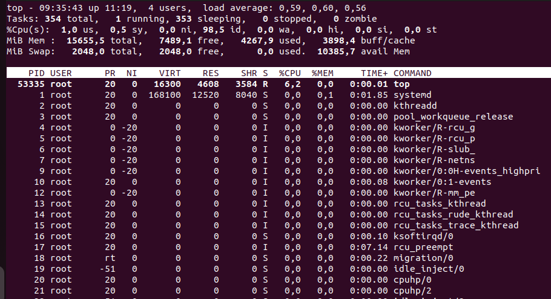
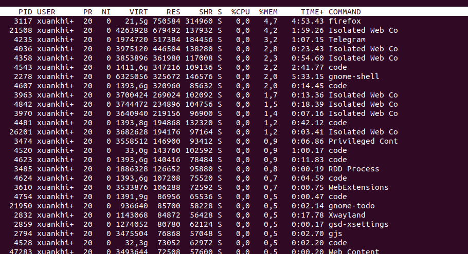
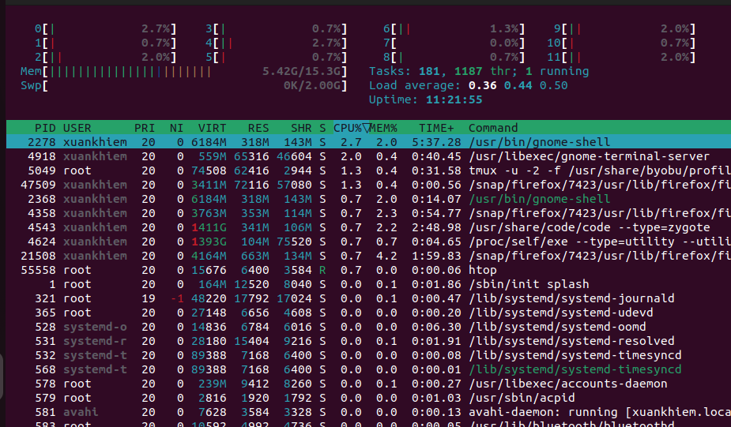

 
# Processes (Tiến trình)

Quản lý tiến trình trong Linux: loại tiến trình, cách xem, theo dõi và dừng tiến trình.

## 1. Các loại tiến trình

- **Foreground**: tiến trình chạy trực tiếp trong terminal hiện tại, người dùng tương tác trực tiếp.
- **Background**: tiến trình chạy ngầm (sufffix `&` khi khởi chạy) và không chiếm terminal.

## 2. Các lệnh xem và theo dõi tiến trình

- `ps` — chụp trạng thái tiến trình tại một thời điểm.



```sh
ps aux | grep tên_tiến_trình   # tìm tiến trình theo tên
ps -ef                         # dạng khác (UID, PID, PPID, CMD)
```




- `top` — hiển thị thông tin động về CPU/RAM, cập nhật thường xuyên.



Trong `top`:

- `Shift+P`: sắp xếp theo sử dụng CPU.
- `Shift+M`: sắp xếp theo sử dụng RAM.



- `k` rồi nhập PID: kill tiến trình (theo prompt của top).

- `htop` — phiên bản nâng cao, có giao diện màu và thao tác dễ dàng (nếu chưa cài: `sudo apt install htop`).



Trong `htop`:

- `F3`: tìm tiến trình theo tên.
- `F9`: kill tiến trình (chọn signal, ví dụ `9` để ép kill).

## 3. Dừng (kill) tiến trình

Quy trình chung:

1. Tìm PID: `ps aux | grep tên_tiến_trình` hoặc dùng `pidof`/`pgrep`.
2. Dùng `kill` hoặc `kill -9` (ép buộc) để dừng tiến trình.

Ví dụ:

```sh
pgrep -fl nginx        # tìm process và lệnh khởi chạy
kill 12345             # gửi SIGTERM tới PID 12345
kill -9 12345          # gửi SIGKILL (ép dừng)
pkill -f tên_tiến_trình   # kill theo tên (toàn bộ tiến trình khớp)
killall nginx          # kill tất cả process tên nginx
```

Lưu ý: Dùng `kill -9` chỉ khi `kill` thông thường không hiệu quả.

## 4. Một số lệnh hữu ích khác

- `nice` / `renice`: thay đổi ưu tiên (niceness) của tiến trình.
- `nohup command &`: chạy tiến trình không bị dừng khi logout.
- `systemctl status <service>`: kiểm tra service-managed processes (systemd).
