# 1. Các lệnh quản lý file và thư mục

 - `ls` — liệt kê file/thư mục

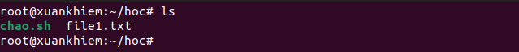

 ```sh
 ls -l     # chi tiết (quyền, chủ sở hữu, kích thước, ngày sửa)
 ls -a     # hiện cả file ẩn
 ls -h     # kích thước dạng đọc được
 ls -R     # đệ quy liệt kê thư mục con
 ```

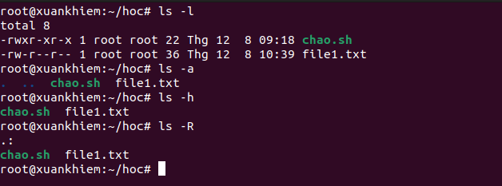

 - `cp` — sao chép file/thư mục

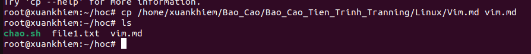

 ```sh
 cp file.txt /path/to/dest/            # copy file
 cp -r dir1/ dir2/                     # copy thư mục
 cp -p file file.bak                   # giữ quyền và chủ sở hữu
 ```

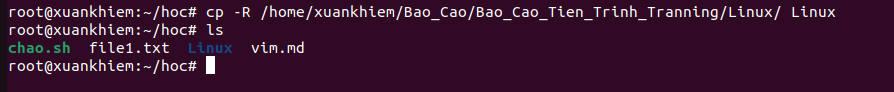

 - `mv` — di chuyển hoặc đổi tên

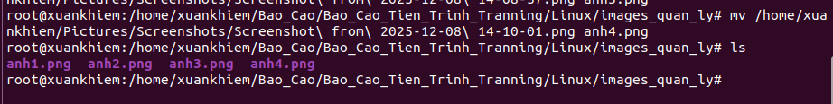

 ```sh
 mv oldname newname
 mv file /path/to/destination/
 ```

 - `rm` — xóa file/thư mục (cẩn thận)

 ```sh
 rm file.txt
 rm -r somedir/    # xóa thư mục và nội dung
 rm -f file.txt    # xóa ép buộc
 ```
 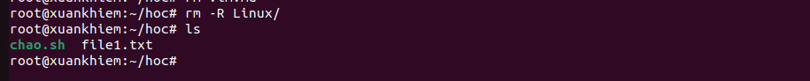

 - `touch` — tạo file rỗng hoặc cập nhật thời gian sửa đổi

 ```sh
 touch newfile.txt
 ```

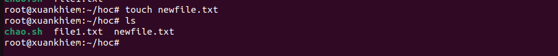

 # 2. Phân quyền và sở hữu

 - `chmod` — thay đổi quyền truy cập (r=4, w=2, x=1)

 ```sh
 chmod 644 file.txt   # rw-r--r--
 chmod +x script.sh    # thêm quyền thực thi
 ```

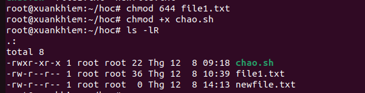

 - `chown` — thay đổi chủ sở hữu

 ```sh
 chown user:group file.txt
```

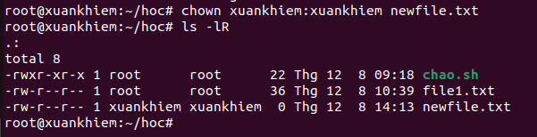

 # 3. Công cụ tìm kiếm file và nội dung

 - `find` — tìm file theo tên, loại, thời gian, v.v.

 ```sh
 find / -name "*.log"        # tìm tất cả file .log
 find . -type d -name "tmp"  # tìm thư mục tên tmp
 ```

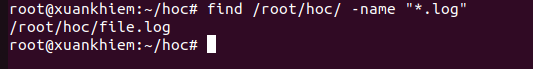

 - `grep` — tìm nội dung trong file

 ```sh
 grep -R "TODO" .            # tìm chữ TODO trong thư mục hiện tại (đệ quy)
 grep -i "error" /var/log/syslog
 ```

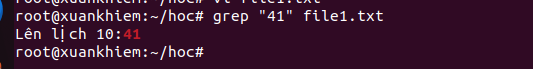

 - `which` — xác định đường dẫn thực thi của lệnh trong `$PATH`

 ```sh
 which python3
 which -a python3   # liệt kê tất cả kết quả trùng
 ```
 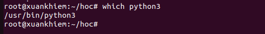
