# RAID
## 1.Khái niệm RAID
- RAID: là viết tắt của Redundant Array of Inexpensive tức là xây dựng một hệ thống lưu trữ với các tính năng dự phòng, sao chép các tính năng quan trọng để không một bộ phận nào có thể bị lỗi và làm sập toàn bộ hệ thống và dữ liệu đọc và ghi được phân bổ trên nhiều ổ đĩa nên RAID cũng có thể mang lại lợi ích về hiệu suất.
- Trong RAID có 3 chức năng chính:
  - Mirrored: Sao chép dự liệu 1:1 giữa 2 hay nhiều ổ cứng
  - Striped: Chia nhỏ các file, dữ liệu thành các block nhỏ và ghi chúng trên 2 hay nhiều ổ đĩa song song
  - Parity: Xử dụng thuật toán XOR giúp phục hồi dữ liệu khi 1 ổ bị hỏng
## Các loại RAID
### 1. RAID 0 

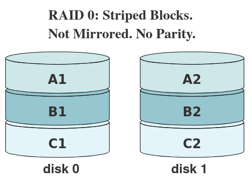

- Dữ liệu ở đấy sẽ được lưu trữ trên nhiều ổ đĩa bằng cách sử dụng striped. Điều này giúp tăng hiệu suất đáng kể. Nhưng nó không có tính dự phòng, nếu bị hỏng ta có thể mất hêt dữ liệu. Nên dùng RAID 0 khi muốn gia tăng hiệu suất mà không quan tâm đến lưu trữ lâu dài

### 2. RAID 1

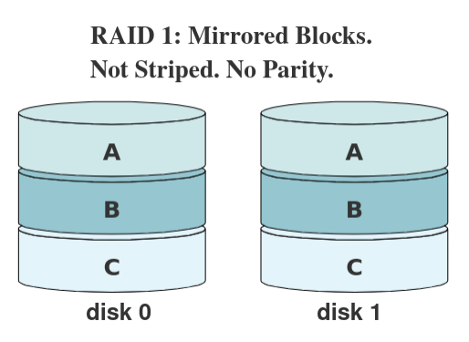

- Dữ liệu ở đây sẽ được sao lưu 1:1 trên 2 ổ cứng bằng cách sử dụng Mirrored. Điều này giúp tăng tính dự phòng nhưng hiệu suất đọc sẽ bị giảm đi còn hiệu xuất ghi sẽ nhanh hơn do ghi trên cả 2 ổ đĩa

### 3. RAID 10


- Ở đây sẽ kết hợp cả RAIO 0 và 1 nên ta cần ít nhất 4 ổ đĩa để tối ưu hóa hiệu suất và tính dự phòng

### RAID 5

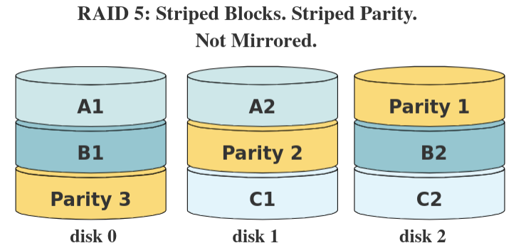

- Thay vì lưu trữ toàn bộ bản sao dữ liệu, chúng ta có thể tiết kiệm dung lượng bằng cách lưu trữ parity data
- RAID 5 hoạt động bằng cách chia nhỏ các dữ liệu thành các block và parity rồi lưu trữ ở tất cả các ổ
- RAID 5 có thể khôi phục dữ liệu chỉ khi duy nhất 1 ổ chết, còn 2 ổ  thì không khôi phục được

### mdadm 
- mdadm là một công cụ trên Linux dùng để tạo, quản lý và giám sát các mảng RAID software (RAID mềm, không cần controller phần cứng).
- Giả sử ta có ổ cứng như sau:

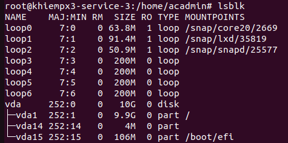

- Tạo RAID 5 với 3 ổ đĩa trên
```sh
mdadm --verbose --create /dev/md0 --level=5 --raid-devices=3 /dev/loop3 /dev/loop4 /dev/loop5
```
- `--verbose`: Cho biết điều gì đang xảy ra
- `--create`: Tạo 1 RAID mới
- `--level=5`: Tạo RAID 5
- `--raid-devices=3`: Tạo RAID trên 3 ổ cứng 

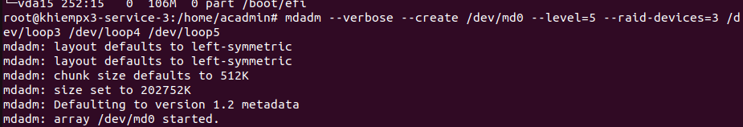

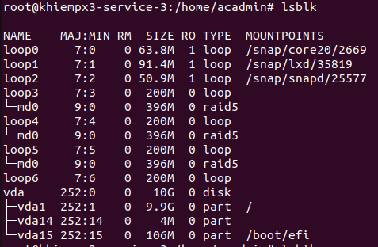

- Xem thông tin tại /proc/mdstat:
```sh
cat /proc/mdstat
```
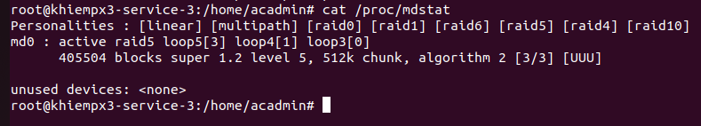

- Tạo filesystem và mount:
```sh
mkfs /dev/md0
mkdir /mnt/myraid 
mount dev/md0 /mnt/myraid 
```

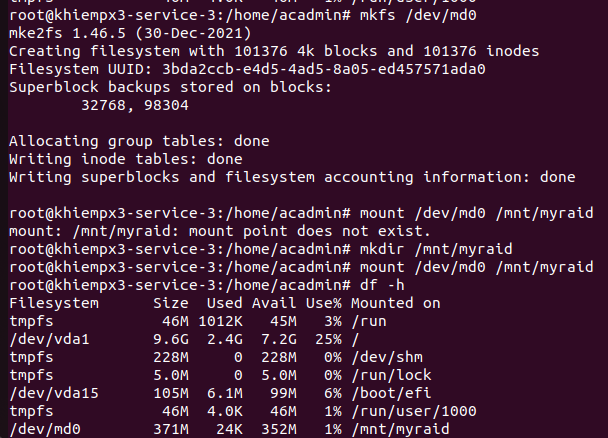

- Xem trạng thái:
```sh 
mdadm --detail /dev/md0
```
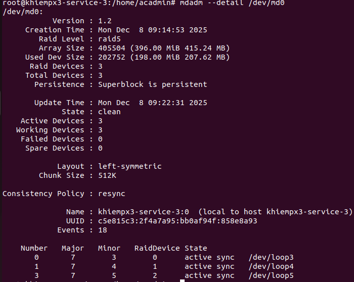
### Mô phỏng 1 ổ bị hỏng bằng mdadm:
``` sh
mdadm /dev/md0 -f /dev/loop3
```

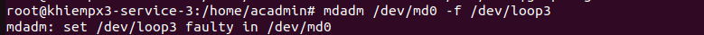

- Xem trạng thái:
```sh 
mdadm --detail /dev/md0
```
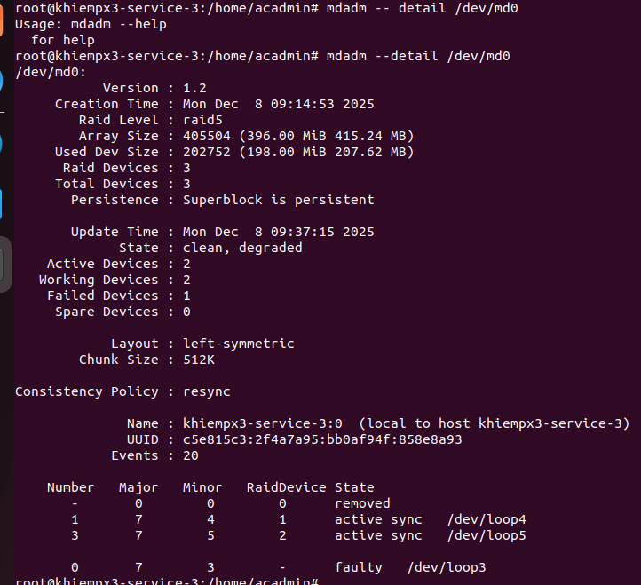

- Thay thế ổ đĩa bị lỗi
```sh
mdadm /dev/md0 --remove /dev/loop3
```
- add ổ mới
```sh
mdadm /dev/md0 --add /dev/loop3
```
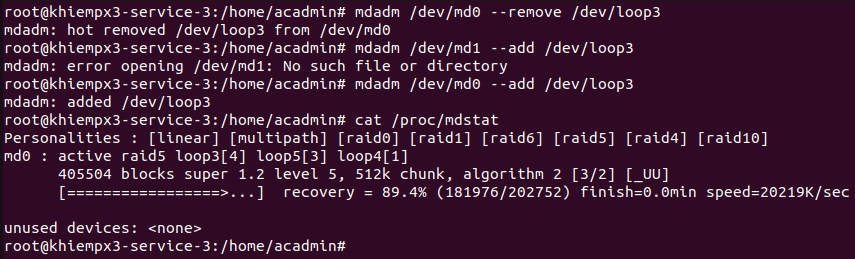

-Thêm ổ dự phòng
```sh
mdadm /dev/md0 --add-spare /dev/md1
```


