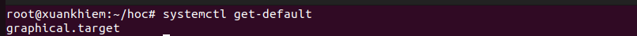

# Quá trình khởi động (Boot Process)

Tài liệu tóm tắt các bước chính khi một máy Linux khởi động, kèm lệnh kiểm tra và mẹo gỡ lỗi.

## Tổng quan các bước

1. **Firmware (BIOS / UEFI)**
     - Khởi động phần cứng, kiểm tra RAM/CPU/thiết bị (POST).
     - Tìm thiết bị khởi động theo thứ tự (boot order) và nạp bootloader từ MBR hoặc EFI System Partition.

2. **Bootloader (ví dụ GRUB)**
     - Hiển thị menu lựa chọn hệ điều hành; tải kernel và initramfs vào bộ nhớ.
     - Tham số kernel (kernel cmdline) được truyền từ GRUB vào kernel.

3. **Kernel**
     - Kernel giải nén, khởi tạo driver thiết bị cơ bản và mount `initramfs` (còn gọi là initrd).
     - Sau khi sẵn sàng, kernel chuyển quyền sang tiến trình `init` nằm trong initramfs hoặc trên root filesystem.

4. **Init (systemd / SysVinit / other)**
     - `systemd` (phổ biến hiện nay) đọc unit files/targets và khởi các dịch vụ (daemon) theo cấu hình.
     - Mục tiêu cuối cùng là khởi hệ thống ở một runlevel / target như `multi-user.target` hoặc `graphical.target`.

## init, runlevels và systemd targets

- Truyền thống SysV dùng runlevels (0..6):
    - 0 = halt, 1 = single-user, 6 = reboot; 2-5 tùy distro.
- systemd dùng `targets` thay cho runlevels: `poweroff.target`, `rescue.target`, `multi-user.target`, `graphical.target`.

Chuyển target ví dụ:

```sh
# Xem target mặc định
systemctl get-default

# Đổi về graphical (có GUI)
sudo systemctl set-default graphical.target

# Khởi lại tới multi-user ngay
sudo systemctl isolate multi-user.target
```



## Kiểm tra trạng thái boot và gỡ lỗi

- Xem log kernel ban đầu:

```sh
dmesg | less
```

- Xem log systemd / boot:

```sh
journalctl -b         # log từ lần boot hiện tại
journalctl -b -1      # log lần boot trước
journalctl -u sshd    # log một unit cụ thể
```

- Kiểm tra GRUB config / tham số kernel:

```sh
cat /etc/default/grub
sudo update-grub      # (Debian/Ubuntu) cập nhật menu grub
```

## Một số tình huống thường gặp & cách xử lý

- **Máy không khởi động (stuck ở firmware / no boot device)**:
    - Kiểm tra boot order trong UEFI/BIOS, đảm bảo ổ chứa GRUB/EFI partition được chọn.

- **GRUB bị mất / GRUB rescue**:
    - Dùng live-USB chroot vào hệ thống và cài lại GRUB (`grub-install`, `update-grub`).

- **Kernel panic / lỗi khi mount root**:
    - Kiểm tra `initramfs` có chứa driver cần thiết cho controller ổ đĩa không; rebuild `initramfs` (vd. `sudo update-initramfs -u`).

- **Dịch vụ không khởi động (systemd failed)**:
    - Dùng `journalctl -b -u <unit>` và `systemctl status <unit>` để xem lỗi.

## Tài nguyên & lệnh hữu ích

- `lsblk`, `blkid` — xem thiết bị/block
- `efibootmgr` — quản lý boot entries trên UEFI
- `systemctl`, `journalctl`, `dmesg`, `grub-install`, `update-grub`, `update-initramfs`

---