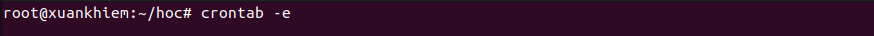
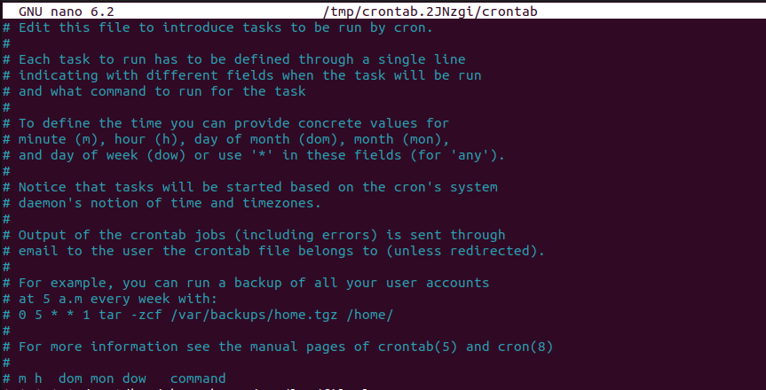
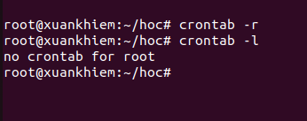
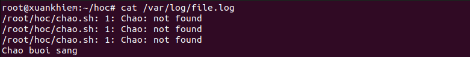

# Crontab
## 1. Khai niệm Crontab
- Crontab (cron table) là một tệp cấu hình trên hệ điều hành Linux/Unix, được sử dụng để lên lịch và tự động hóa việc thực thi các tác vụ (jobs) vào các thời điểm cụ thể.
- Mục đích chính của Crontab bao gồm:
  - Tự động hóa các tác vụ định kỳ như sao lưu dữ liệu, gửi email, hoặc chạy các script.
  - Giúp quản trị hệ thống tiết kiệm thời gian và công sức bằng cách tự động hóa các công việc lặp đi lặp lại.
- Crontab thường được sử dụng trong các môi trường máy chủ để quản lý các tác vụ hệ thống một cách hiệu quả.
- Crontab bao gồm các thành phần chính như:
  - Cron Daemon: Một dịch vụ chạy nền chịu trách nhiệm kiểm tra và thực thi các tác vụ theo lịch trình.
  - Crontab File: Tệp cấu hình chứa các lệnh và lịch trình thực thi.
## 2. Cách hoạt động của Crontab
- Người dùng hoặc quản trị viên hệ thống tạo và chỉnh sửa tệp Crontab để xác định các tác vụ cần thực thi và lịch trình của chúng.
- Cron Daemon sẽ kiểm tra tệp Crontab định kỳ và thực thi các lệnh khi đến thời điểm đã định.
- Mỗi dòng trong tệp Crontab đại diện cho một tác vụ, bao gồm thời gian thực thi và lệnh cần chạy.
- Crontab hỗ trợ các định dạng thời gian linh hoạt, cho phép người dùng xác định phút, giờ, ngày trong tháng, tháng, và ngày trong tuần để thực thi các tác vụ.
## 3. Ứng dụng của Crontab trong Linux
- Crontab được sử dụng rộng rãi trong các môi trường máy chủ Linux để tự động hóa các tác vụ quản trị hệ thống.
- Các ứng dụng chính của Crontab trong Linux bao gồm:
  - Tự động sao lưu dữ liệu định kỳ để đảm bảo an toàn thông tin.
  - Gửi email nhắc nhở hoặc báo cáo tự động.
  - Chạy các script bảo trì hệ thống như dọn dẹp tệp tạm thời.
  - Cập nhật hệ thống và cài đặt bản vá bảo mật tự động.
- Crontab giúp đảm bảo tính ổn định và hiệu suất của hệ thống bằng cách tự động hóa các công việc quản trị.
- Crontab thường được tích hợp với các công cụ quản lý hệ thống khác để cung cấp một hệ thống tự động hóa toàn diện.
- Việc triển khai Crontab thường bao gồm việc tạo và chỉnh sửa tệp Crontab, cũng như thiết lập quyền truy cập để đảm bảo an ninh.
## 4. Cấu hình Crontab
- Một dòng trong crontab gồm 5 trường thời gian + câu lệnh: 
*    *    *    *    *   command
|    |    |    |    |
|    |    |    |    └── Thứ trong tuần (0-6)   Chủ nhật = 0 hoặc 7
|    |    |    └────── Tháng (1-12)
|    |    └──────────  Ngày trong tháng (1-31)
|    └───────────────  Giờ (0-23)
└────────────────────  Phút (0-59)
- Sử dụng lệnh `crontab -e` để chỉnh sửa tệp Crontab của người dùng hiện tại.





- Sử dụng lệnh `crontab -l` để liệt kê các tác vụ đã được lên lịch trong tệp Crontab.


- Sử dụng lệnh `crontab -r` để xóa tệp Crontab của người dùng hiện tại.



Ví dụ:
1 = stdout (kết quả bình thường)

2 = stderr (lỗi)

> = redirect (chuyển hướng)

2>&1 = gửi stderr (2) đến cùng nơi stdout (1) đang đi
```bash
# Chạy script chao.sh vào lúc 9h sáng mỗi ngày in vao file.log
0 9 * * * /path/to/backup.sh >> file.log 2>&1
``` 


- Thiết lập quyền truy cập cho tệp Crontab để đảm bảo chỉ người dùng có quyền thích hợp mới có thể chỉnh sửa hoặc xem nội dung.
- Kiểm tra và xác nhận hoạt động của Crontab bằng cách theo dõi các tệp nhật ký hệ thống hoặc sử dụng các công cụ giám sát.
- Duy trì và cập nhật tệp Crontab định kỳ để đảm bảo các tác vụ được thực thi đúng lịch trình và hiệu quả.
## 5. Bảo mật Crontab
- Giới hạn quyền truy cập vào tệp Crontab chỉ cho các người dùng cần thiết để ngăn chặn chỉnh sửa trái phép.
- Sử dụng các phương thức xác thực mạnh mẽ để đảm bảo chỉ người dùng hợp lệ mới có thể truy cập và chỉnh sửa tệp Crontab.
- Theo dõi và ghi lại các hoạt động liên quan đến việc chỉnh sửa và thực thi các tác vụ trong Crontab để phát hiện các hành vi đáng ngờ.
- Cập nhật hệ thống và các thành phần liên quan định kỳ để vá các lỗ hổng bảo mật có thể ảnh hưởng đến Crontab.
- Sử dụng các công cụ giám sát và cảnh báo để theo dõi tình trạng bảo mật của Crontab trong môi trường Linux.
# At
## 1. Khái niệm at
- `at` trong Linux là một cách thay thế cho trình xây dựng lịch – cron, để lên lịch cho các tác vụ thực hiện một lần. Nghĩa là bạn có thể chỉ định thời gian tùy ý để thực hiện các nhiệm vụ cụ thể. Hơn nữa, bạn có thể liệt kê hoặc xóa các tác vụ đã được lưu cần thực hiện trong tương lai gần. Tuy nhiên, người dùng càn quyền quản lý hệ thống để sử dụng lệnh này. Các lệnh `atq`, `atrm` và `batch` cũng là một phần của lệnh at, cho phép xếp hàng, kiểm tra hoặc xóa, hủy các tác vụ đã lên lịch.
## 2. Cách sử dụng at
                        |              Tùy chọn               |              Công Dụng                |
                        |                 -b                  | Thực hiện lên lịch khi hệ thống không |
                        |                                     | quá tải                               |  
                        |                 -c                  | Xem chi tiết công việc cho thiết bị   | 
                        |                                     | cuối                                  |  