 # Linux cơ bản

 Tài liệu tóm tắt các kiến thức cơ bản về Linux: shell, thao tác thư mục, luồng I/O và một số lệnh thường dùng.

 ## Shell

 - **sh**: bản tiêu chuẩn chạy script trên hệ thống Unix.
 - **bash**: nâng cấp của `sh`, có nhiều tính năng hơn, phổ biến trên Linux.
 - **csh**: shell kiểu C, có cú pháp khác.
 - **ksh**: phổ biến trên UNIX, hỗ trợ mảng và cú pháp lặp nâng cao.

 ## Thao tác thư mục

 - Thay đổi thư mục: `cd <thư_mục>`

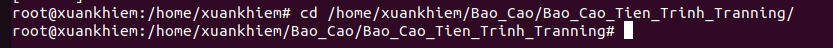

 - Xem thư mục hiện tại: `pwd`

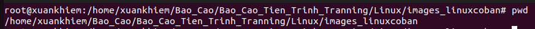


 ## Lịch sử lệnh

 - Xem lịch sử: `history`
 - Dùng phím lên/xuống để chọn lại lệnh trước đó.

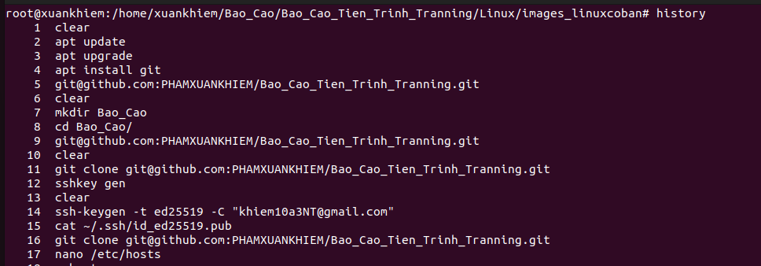

 -Tìm lệnh cũ theo ngược: `Ctrl + R`

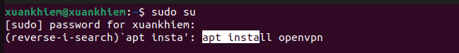
 
 -Tìm lệnh cũ xuôi (Trong Ubuntu thì sẽ là Pause Terminal bật lên là : `stty -ixon`): `Ctrl + S`

 

 ## Biến môi trường

 - Gán biến: `export TEN_BIEN="gia_tri_gan"`
 - Xem biến: `echo $TEN_BIEN`

 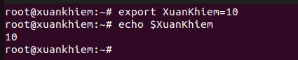

 - Xem tất cả biến: `env`
 ## Trang hướng dẫn (man)

 - Xem hướng dẫn chi tiết: `man <ten_lenh>` (ví dụ `man ls`).

 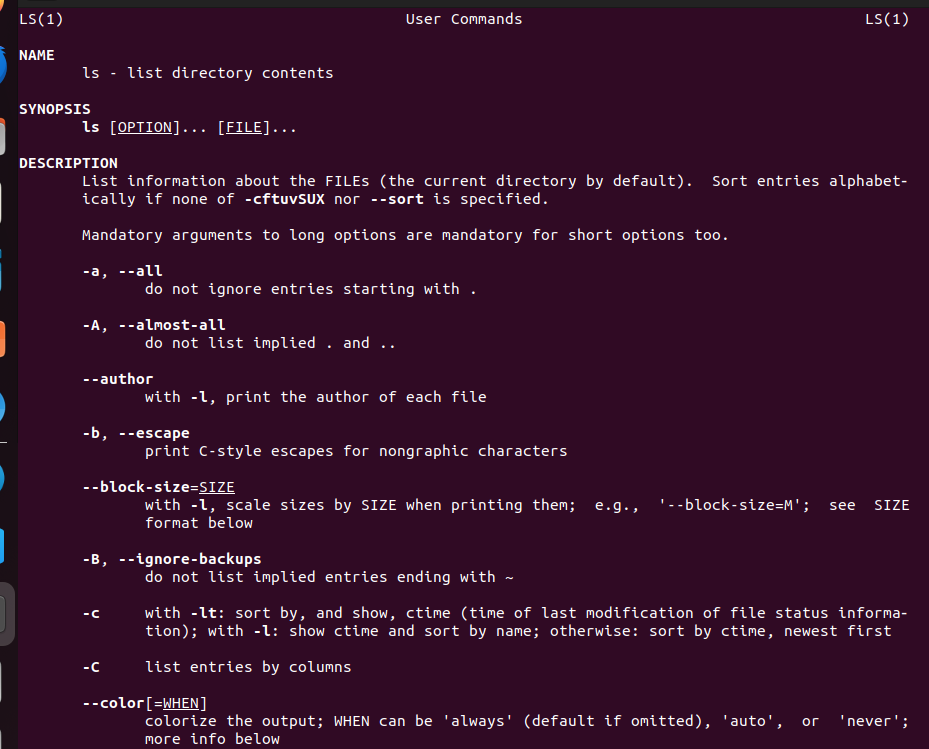

 ## Luồng dữ liệu: STDIN / STDOUT / STDERR

 - **STDIN**: luồng vào (mặc định là bàn phím). Ví dụ: `cat < file.txt`.

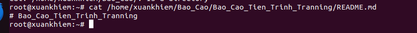

 - **STDOUT**: luồng ra chuẩn, hiện trên terminal. Ví dụ: `ls`

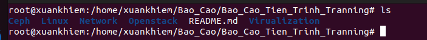

 - **STDERR**: luồng lỗi, cũng hiện trên terminal.


 - **Piping**: dùng `|` để lấy `STDOUT` của chương trình này làm `STDIN` của chương trình khác. Ví dụ: `ip a | grep ens32`.

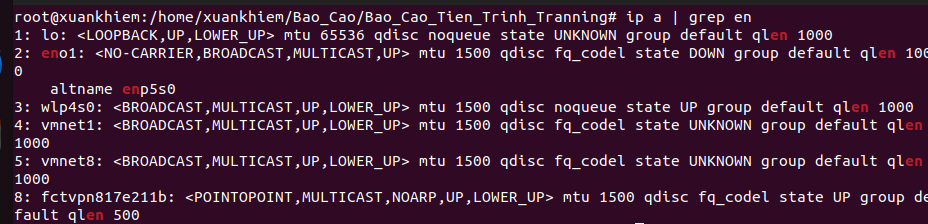

 ## Một số lệnh quan trọng

 ### cat

 Dùng để xem, ghép hoặc tạo file.

 ```sh
 cat file.txt            # xem file
 cat file.txt file1.txt >> output.txt  # ghép file
 cat > newfile.txt       # tạo file nhanh
 ```

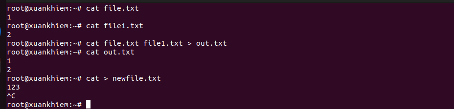

 Các option hữu ích:

 - `-n`: đánh số dòng (kể cả dòng trống)

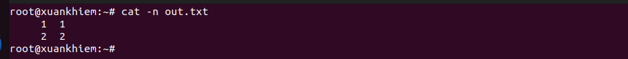

 - `-b`: đánh số dòng không rỗng

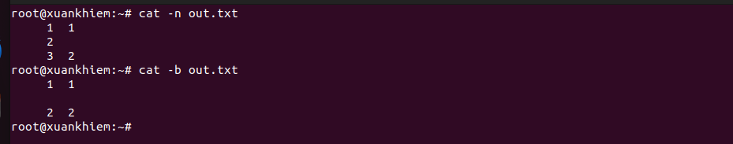

 - `-A`: hiển thị ký tự đặc biệt

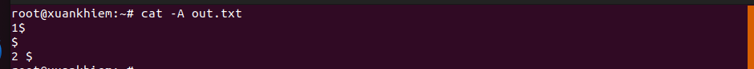

 - `-s`: xóa dòng trống lặp

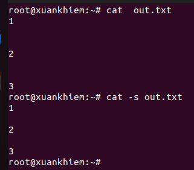

 ### join

 Ghép hai file theo cột khóa chung (file phải được sắp xếp trước).

 ```sh
 join file1.txt file2.txt
 ```

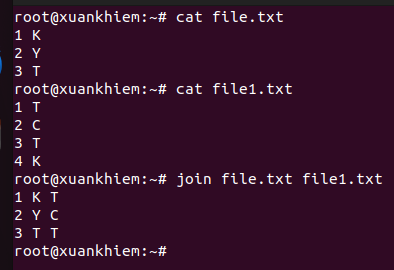

 Option thường dùng:

 - `-a N`: in toàn bộ dữ liệu của file N (1 hoặc 2)

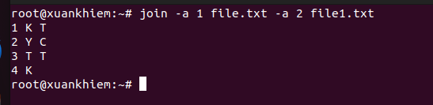

 - `-v N`: in dữ liệu không khớp của file N

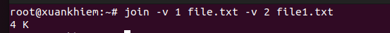

 - `-t CHAR`: chỉ định dấu phân cách (ví dụ CSV)

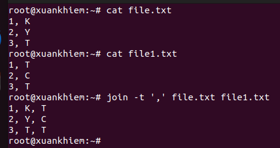

 - `-o + STT_file.STT_cột`: chỉ định cột của file nào được xuất ra

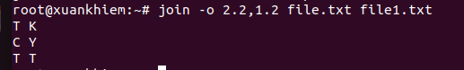

 - `-e`: điền giá trị cho ô trống


 ### paste

 Ghép hai file theo cột ngang (không dựa trên khóa).

 ```sh
 paste file1.txt file2.txt > newfile.txt
 ```

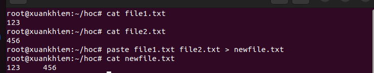

 Option:

 - `-d SEPARATOR`: thay đổi dấu phân cách

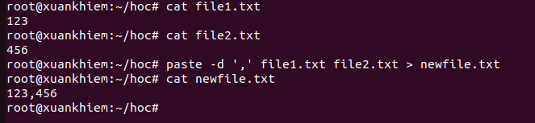


 - `-s`: ghép các dòng của một file thành hàng ngang

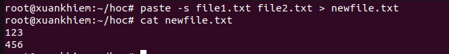

 ### tac

 Đọc file từ dưới lên (ngược với `cat`), hữu ích khi xem log:

 ```sh
 tac /var/log/syslog | head -n 10
 ```

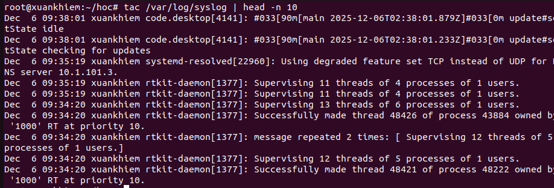

 ### sort

  Sắp xếp văn bản.

 ```sh
 sort file.txt
 sort -n file.txt     # sắp xếp theo số
 sort -r file.txt     # đảo ngược
 sort -k 2 -t ',' file.csv  # sắp theo cột 2 với dấu phẩy
 ```

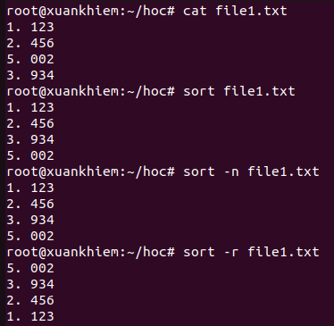

 ### uniq

 Lọc trùng lặp (thường dùng sau `sort`).

 ```sh
 sort file.txt | uniq
 sort file.txt | uniq -c   # đếm số lần xuất hiện
 ```
 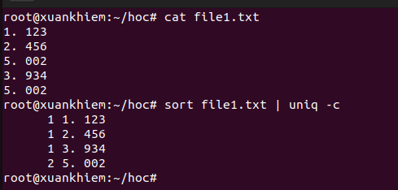

 Option:

 - `-c`: đếm số lần xuất hiện

  

 - `-d`: chỉ in dòng trùng

   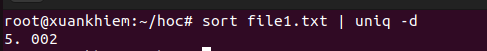

 - `-u`: chỉ in dòng không trùng

    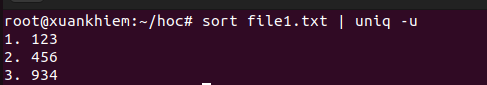

 ### split

 Chia file lớn thành các file nhỏ:

 ```sh
 split -l 1000 bigfile.txt   # chia theo 1000 dòng
 split -b 10M bigfile.txt    # chia theo kích thước
 split -d -l 1000 bigfile.txt prefix_  # dùng số làm hậu tố
 ```

 ### head

 Xem đầu file (mặc định 10 dòng):

 ```sh
 head file.txt
 head -n 20 file.txt   # xem 20 dòng đầu
 ```
  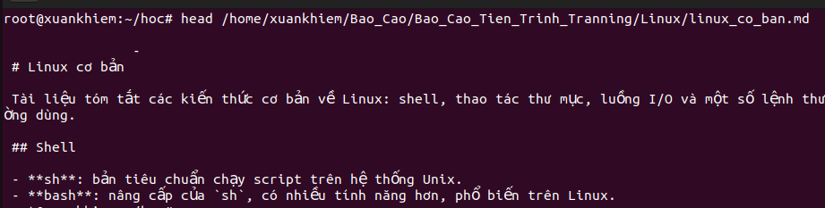


  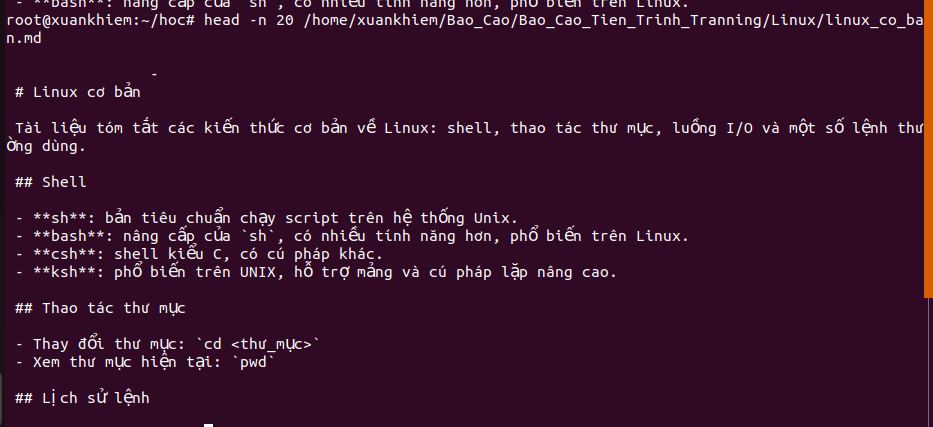

### grep 
 Dùng để lọc dòng có từ khóa hoặc định dạng nhất định
 ```sh
 grep [option] 'từ khóa' ten_file
 ```
 - Option: 
  -i : Không phân biệt chữ hoa chữ thường

    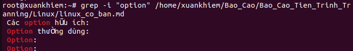

  -v : Tìm những dòng ko có từ đó

    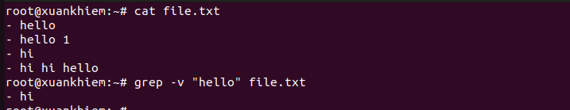

  -r : Tìm đệ quy trong thư mục
  
    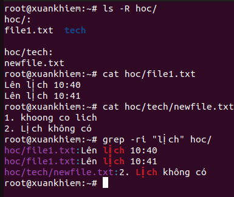

  -n : Hiện số dòng 

    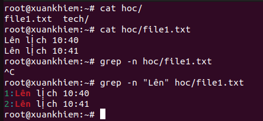
### sed 
 Dùng để chỉnh sửa văn bản theo dòng mà không cần mở file
 ```sh
 sed -i 's/từ_tìm_kiếm/từ_thay_thế/g' tên_file
 ```
 Trong đó: -i là thay đổi trực tiếp vào trong file
            s là thay thế 
            g là thay thế tất cả các lần xuất hiện trên một dòng
    
    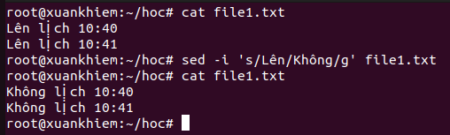

### awk 
- Dùng để  chia dòng thành các cột
```sh
awk '{print $cột}' tên_file
```
 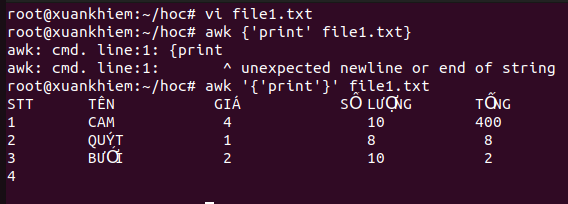

 ### fold
   Dùng để cắt dòng và giới hạn số từ cho 1 dòng
  ```sh
  fold [option] [độ rộng] tên file
  ```
- Option: 
  - w: Chiều rộng tối đa của dòng theo từ
  - s: Chỉ ngắt tại dòng có khoảng trắng 

   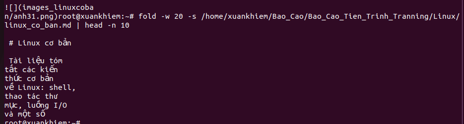
