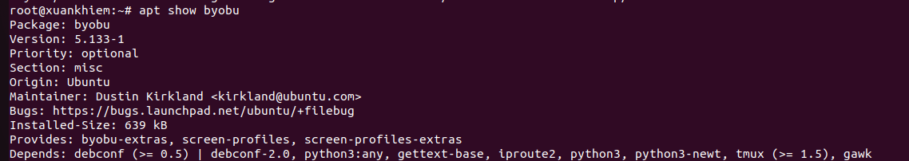
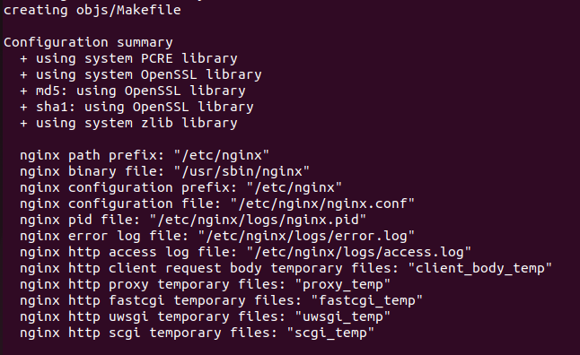

# Manager Software
## Package
1. Khái niệm 
- Là các file nén (.deb hoặc .rpm) chứa:
  - Các file chương trình: Mã biên dịch, file cấu hình, tài liệu hướng dẫ
  - Metadata: Thông tin chương trình, tác giả, mô tả phần mềm 
  - Scripts: Chứa các scripts trước và sau khi cài đặt
## Dependencies
1. Khái niệm  
- Là các gói trợ giúp để các chương trình có thể chạy được



## Conflicts
- Xung đột gói xảy ra khi 2 gói phần mềm cùng tồn tại trên một hệ thống
- Lý do:
    Cả hai gói cùng muốn ghi đè lên một file hệ thống chung.
    Gói A yêu cầu một phiên bản của thư viện libc, nhưng gói B lại yêu cầu một phiên bản khác không tương thích.
    Hai dịch vụ cùng muốn chiếm dụng một cổng mạng (port) mặc định (ví dụ: hai web server cùng muốn dùng port 80).
- Kết quả: Trình quản lý gói sẽ báo lỗi và bắt bạn phải gỡ bỏ một trong hai trước khi cài cái còn lại.
## Nén và giải nén 
1. Tar
- Dùng để nén và giải nén
- Option:
  - `-c`: create
  - `-x`: giải nén
  - `-f`: file
  - `-v`: verbose
  - `-z`: nén .tar.gz
  - `-j`: nén .tar.bz2
  - `-J`: nén .tar.xz
  - `-C`: Đổi thư mục khi giải nến
- Cú pháp: 
```sh
tar [option] file.tar file.txt
```
2. Zip
- Cũng dùng để nén 
- Option: 
  - `-r`: Đệ quy   
  - `-9`: Nén mạnh
  - `-0`: Không nén chỉ gom
  - `-e`: Đặt password
  - `-X`: exclude
  - `-q`: quiet
  - `-m`: move (nén xong xóa luôn file gốc)
- Cú pháp:
```sh
zip [options] file.zip files
```
3. Unzip
- Dùng để giải nén
- Option:
  - `-l`: xem list
  - `-d`: giải nén vào thư muc
  - `-o`: overwrite
  - `-q`: im lặng
  - `-P`: Đặt password
- Cú pháp:
```sh
unzip [option] tên_file.zip
```
4. Unrar
- Dùng để giải nén file rar
- Option: 
 - `l`: xem nội dung  
 - `x`: extract giữ nguyên path
 - `e`: extract không giữ pass
 - `t`: test file
 - `p`: in ra STDOUT
Cú pháp:
```sh
unrar [command] [options] archive.rar [path]
```
## Trình quản lý gói
1. apt và apt-get
- Là công cụ giúp tự động tìm kiếm và cài đặt các gói phụ thuộc
  - apt update: Tự động cập nhật các phần mềm từ kho repo
  - apt upgrade: Mâng cấp tất cả các gói lên phiên bản mới nhất
  - apt install: Cài đặt phần mềm
  - apt remove: gỡ cài đặt phần mềm nhưng giữ lại file cấu hình
  - apt purche: gỡ cài đặt hoàn toàn phần mềm và gỡ cài đặt file cấu hình
  - apt autoremove: Tự động dọn dẹp các gói phụ thuộc thừa không cần thiết
2. dpkg
- Là công cụ chỉ cài các gói phần mềm .deb mà đã có sẵn hoặc tải từ Internet về máy. Nó không tự biết tải và cài đặt thêm các gói phụ thuộc từ Internet
- Option:
 - `-i`: Cài đặt gói
 - `-r`: gỡ cài đặt gói
 - `-l`: liệt kê danh sách đã cài bằng gói dpkg
 - `-L`: Gói đó đã cài những file nào vào thư mục nào
 - `-s`: Kiểm tra thông tin chi tiết của 1 gói
Cú pháp: 
```sh
dpkg [Option] tên_gói.đeb
```
## Startup Script
- Là một tập lệnh chứa các câu lệnh hệ điều hành hoắc các phần mêm tự động thực thi khi người dùng đăng nhập
- Có 2 cách để viết Startup Script: 
  - Cách 1: Dùng systemd tạo 1 file dịch vụ gọi chung là Unit file
    - Cấu trúc chung của 1 Unit file gồm 3 phần chính:
      - [Unit]: Định nghĩa các thông tin mô tả thứ tự khởi động của các dịch vụ
        - Description: Mô tả ngắn gọn về dịch vụ
        - After: Xác định dịch vụ này sẽ khởi động sau khi các dịch vụ hoặc mục tiêu nào đó sẵn sàng
        - Requires: Danh sách các dịch vụ bắt buộc phải có, nếu không có dịch vụ của bạn sẽ không chạy
        - Wants: Danh sách các dịch vụ nên có
      - [Services]: Định nghĩa các chương trình được chạy và quản lý
        - Type: Loại dịch vụ (thường dùng simple, forking hoặc oneshot)
        - User/Group: Định nghĩa user và group nào sẽ thực thi câu lệnh này
        - WorkingDirectory: Thư mục mặc định sẽ làm việc chạy script
        - ExecStart: Đường dẫn tuyệt đối đến file chạy script
        - ExecReload: Câu lệnh cần chạy khi thực hiện `systemctl reload`
        - Restart: Chính sách tự động khởi động lại 
        - RestartSec: Thời gian chờ khi khởi động lại
        - Evironment: Thiết lập các biến môi trường
      - [Install]: Xác định dịch vụ được kich hoạt khi sử dụng `systemctl enable`    
        - WantedBy: Xác định target mà dịch vụ này trả về. Phổ biến nhất là multi-user.target (tương đương với runlevel3, không có giao diện nhưng có mạng) 
    - Tạo dịch vụ tại /etc/systemd/system/myscript.service 
    ```sh
        [Unit]
        Description=Dịch vụ giám sát thông số Ceph
        After=network.target ceph.target

        [Service]
        Type=simple
        User=cloud-user
        WorkingDirectory=/home/cloud-user/scripts
        ExecStart=/usr/bin/python3 /home/cloud-user/scripts/monitor.py
        Restart=always
        RestartSec=5

        [Install]
        WantedBy=multi-user.target      
    ```
    - Reload lại systemd:
    ```sh
    systemctl restart daemon-reload
    systemctl enable myscript.service
    systemctl status myscript.service
    ```
  - Cách 2: Sử dụng crontab 
    - Chỉ nên sử dụng khi có script cơ bản. Crontab cung cấp @reboot giúp chúng ta thực hiện nhanh chóng nhưng nhược điểm là sẽ không kiểm soát được trạng thái của services sống hay chết. Các bước thực hiện:
    Bước 1: Mở crontab -e lên
    ```sh
    crontab -e
    ```
    Bước 2: Thêm @reboot + đường dẫn vào cuối file
    ```sh
    @reboot /path/to/your/script
    ```
## Cài đặt chương trình từ Source 
- Là chúng ta sẽ tùy chỉnh các tính năng hoặc cài đặt các phiên bản mới mà repo chưa có. Đây là quy trình cài đặt thủ công vì phải tự biên dịch mã nguồn thành ngôn ngữ máy
- Để cài đặt chương trình từ source ta cần 5 bước (Ví dụ cài nginx từ source):
 - Bước 1: Tải các công cụ biên dịch và các thư viện phụ thuộc
 ```sh
 sudo apt update
 sudo apt install build-essential # Cài đặt trình biên dịch .gcc, make và các công cụ build
 sudo apt install libpcre3 libpcre3-dev zlib1g zlib1g-dev libssl-dev # Cài đặt các thư viện phụ thuộc cho Nginx
 ```
 - Bước 2: Tải mã nguồn của Nginx trên trang chủ và giải nén
 ```sh
 wget https://nginx.org/download/nginx-1.9.9.tar.gz
 tar -xvf nginx-1.9.9.tar.gz
 cd nginx-1.9.9
 ```
 - Bước 3: Cấu hình ./configure để định nghĩa nơi cài đặt và các module cần cài đặt
 ```sh
 ./configure \
    --prefix=/etc/nginx \     
    --sbin-path=/usr/sbin/nginx \ 
    --conf-path=/etc/nginx/nginx.conf \ 
    --with-http_ssl_module \ 
    --with-http_v2_module \
    --with-http_realip_module \
    --with-http_stub_status_module
```



 - Bước 4: Biên dịch và cài đặt
 ```sh 
 make install
 ```
 - Bước 5: Tạo services cho nó bằng systemd
 ```sh
vi /lib/systemd/system/nginx.service
 ```
 ```sh
[Unit]
Description=The NGINX HTTP and reverse proxy server
After=syslog.target network-online.target remote-fs.target nss-lookup.target
Wants=network-online.target

[Service]
Type=forking
PIDFile=/run/nginx.pid
ExecStartPre=/usr/sbin/nginx -t
ExecStart=/usr/sbin/nginx
ExecReload=/usr/sbin/nginx -s reload
ExecStop=/bin/kill -s QUIT $MAINPID
PrivateTmp=yes
Restart=on-failure

[Install]
WantedBy=multi-user.target
```
```sh
systemclt daemon-reload
systemclt restart nginx
```


