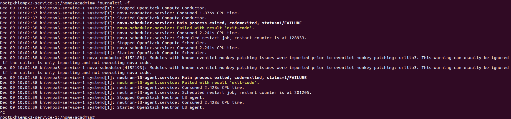
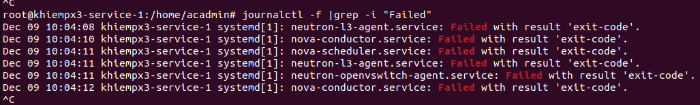
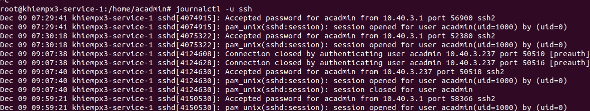
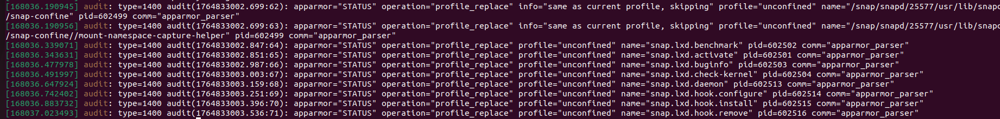
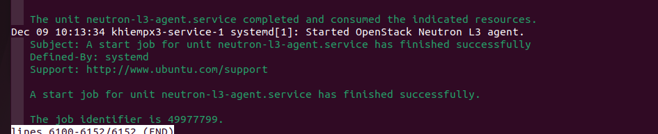

# Syslogd
##  File Log
1. Khái niệm
- Log là nơi hệ thống ghi lại mọi hoạt động của cả hệ thống
2. Vị trí của file log 
- Trong Linux hầu hết các file log quan trọng nằm ở `/var/log` 
- Các loại log chính: 
  - `/var/log/syslog`: là nơi lưu trữ tổng hợp của hệ thống kernal + services (Ubuntu/Debian)
  - `/var/log/messages`: là nơi lưu trữ tương tự như syslog (CentOS/Rhel)
  - `/var/log/auth.log`: là nơi lưu trữ các xác thực như ssh, sudo, authencation
  - `/var/log/kernel.log`: là nơi lưu log của kernel
  - Log của các dịch vụ như: apache2, cron, nginx,...
## Cách kiểm tra và đọc log
1. Xem log
- Xem log theo thời gian thực:
```sh
tail -f /var/log/syslog
```


hoặc 
```sh
journalctl -f
```



- Tìm thêm keyword lỗi:
```sh
journalctl -f | grep -i "fail"
```


- Xem log các services:
```sh
journalctl -u ssh
```


- Xem log thời gian cụ thể thê `--since` và `--until`
```sh
journalctl --since "2024-12-08 10:00" --until "2024-12-08 11:00"
```
- Xem lỗi kernal
```sh
dmesg
```

- Kiểm tra sự cố khi lỗi services:
```sh
systemctl status neutron
journalctl -xe
```



## Rotate Logs
- Giúp giới hạn kích thước log, nén log cũ và xóa chúng nếu quá cũ 
- Các tùy chọn: 
  - `-d`, `--debug`: Ở chế độ này sẽ không có sự thay đổi nào về file log, chỉ là kiểm thử với chế độ `-v`
  - `-f`, `--force`: Lệnh này ép Logrotate phải thực hiện rotate mặc dù nó cảm thấy không cần rotate
  - `-m`, `--mail`: Sẽ gửi log đã rotate tới email của chúng ta
  - `-v`, `--verbose`: Chế độ hiển thị chi tiết thực hiện khi Logrotate
- Cài đặt logrotate
```sh 
apt install logrotate
```
- Cấu hình logrotate: vào `/etc/logrotate.conf`
```sh 

