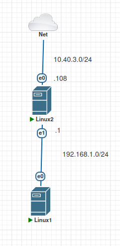
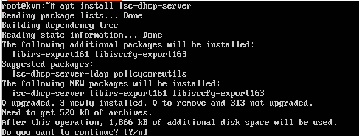

# LAB DHCP
## Mô hình



## Cài đặt và cấu hình
- Trên Linux2 cài đặt isc-dhcp-server và phải cấu hình ip tĩnh cho Linux 2 
```sh
apt install isc-dhcp-server -y
```


```sh
```
- Kiểm tra dịch vụ 
```sh
systemctl status isc-dhcp-server
```
- Cấu hình dịch vụ DHCP ta cấu hình ở file /etc/dhcp/dhcpd/dhcp.conf
```sh
```
- Bên Linux1 chỉnh file cấu hình /etc/netplan/cloud-*.conf thành `dhcp4: true`
```sh
```
- Giải phóng IP và xin cấp phát lại từ Linux1
```sh
dhclient 
dhclient -r
```
- Kiểm tra và ping thử ra internet
```sh
ip a
ping 8.8.8.8
```
