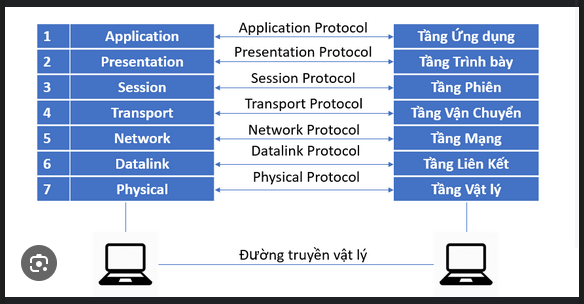
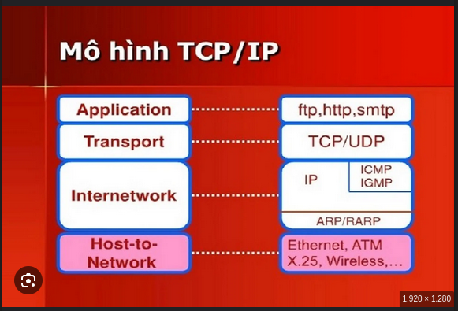
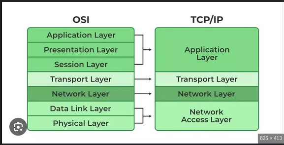

# OSI và TCP/IP — Tổng quan đầy đủ

Tài liệu này tóm tắt các kiến thức quan trọng về mô hình OSI và mô hình TCP/IP, giải thích các tầng, PDU, các giao thức chính, hoạt động của TCP/UDP/IP, các công nghệ liên quan (Ethernet, ARP, ICMP, NAT, routing), và lệnh/kiểm tra thực tế để học và gỡ lỗi mạng.

---

## 1. Mô hình OSI (7 tầng)

OSI là mô hình tham chiếu gồm 7 tầng, giúp phân tách chức năng mạng:

1. **Layer 1 — Physical (Vật lý)**
   - Chức năng: truyền bit qua phương tiện (cáp đồng, quang, sóng vô tuyến).
   - Ví dụ: Ethernet PHY, cáp Cat5/6, fiber optics, modems, SFP.
   - Đơn vị dữ liệu: bit.

2. **Layer 2 — Data Link (Liên kết dữ liệu)**
   - Chức năng: đóng gói khung (frame), MAC addressing, phát hiện lỗi (FCS), điều khiển truy cập phương tiện.
   - Công nghệ: Ethernet (IEEE 802.3), VLAN (802.1Q), PPP, HDLC.
   - Thiết bị: switch, bridge.
   - Đơn vị dữ liệu: frame (Ethernet frame chứa MAC src/dst, EtherType, payload, FCS).

3. **Layer 3 — Network (Mạng)**
   - Chức năng: định tuyến, địa chỉ logic, phân mảnh/ghép.
   - Giao thức tiêu biểu: IPv4, IPv6, ICMP, routing protocols (RIP/OSPF/BGP).
   - Thiết bị: router.
   - Đơn vị dữ liệu: packet (gồm header IP + payload).

4. **Layer 4 — Transport (Vận chuyển)**
   - Chức năng: truyền dữ liệu giữa host — đảm bảo (TCP) hoặc không đảm bảo (UDP), đa luồng/đa cổng.
   - Giao thức: TCP, UDP, (SCTP).
   - Đơn vị dữ liệu: segment (TCP), datagram (UDP).

5. **Layer 5 — Session (Phiên)**
   - Chức năng: quản lý phiên, handshake, duy trì/đóng phiên.
   - Ví dụ: quản lý phiên trong SSL/TLS, RPC sessions.

6. **Layer 6 — Presentation (Trình diễn)**
   - Chức năng: mã hóa/giải mã, nén, chuyển đổi định dạng (ví dụ UTF-8, Base64).
   - Ví dụ: TLS encryption, MIME encoding.

7. **Layer 7 — Application (Ứng dụng)**
   - Chức năng: giao diện với ứng dụng người dùng.
   - Giao thức: HTTP(S), FTP, SMTP, DNS, DHCP, SSH, SNMP.
   - Đơn vị dữ liệu: message / data.

---

## 2. Mô hình TCP/IP (Internet model)

TCP/IP thường có 4 tầng (hay 5 tùy cách chia):

- **Link (Network Interface)** ≈ OSI L1 + L2 (Ethernet, Wi-Fi).
- **Internet** ≈ OSI L3 (IP — IPv4/IPv6, ICMP, ARP nằm ở giới tuyến L2/L3).
- **Transport** ≈ OSI L4 (TCP/UDP).
- **Application** ≈ OSI L5-L7 (HTTP, DNS,...).

## 3. So sánh OSI và TCP/IP
| Khía cạnh          | Mô hình OSI               | Mô hình TCP/IP            |
|--------------------|---------------------------|---------------------------|
| Số tầng            | 7 tầng                    | 4-5 tầng                  |
| Mục đích           | Chuẩn hóa giao tiếp mạng  | Thiết kế giao thức Internet    |
| Tầng vật lý        | Layer 1                   | Link Layer                |
| Tầng liên kết      | Layer 2                   | Link Layer                |
| Tầng mạng          | Layer 3                   | Internet Layer            |
| Tầng vận chuyển    | Layer 4                   | Transport Layer           |
| Tầng phiên         | Layer 5                   | Không tách riêng          |
| Tầng trình diễn    | Layer 6                   | Không tách riêng          |
| Tầng ứng dụng      | Layer 7                   | Application Layer         |   

