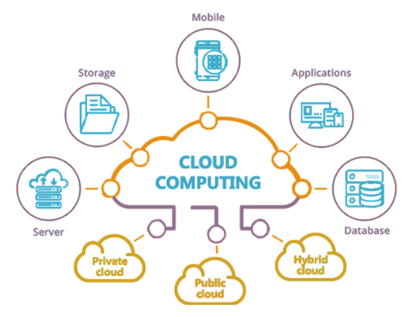
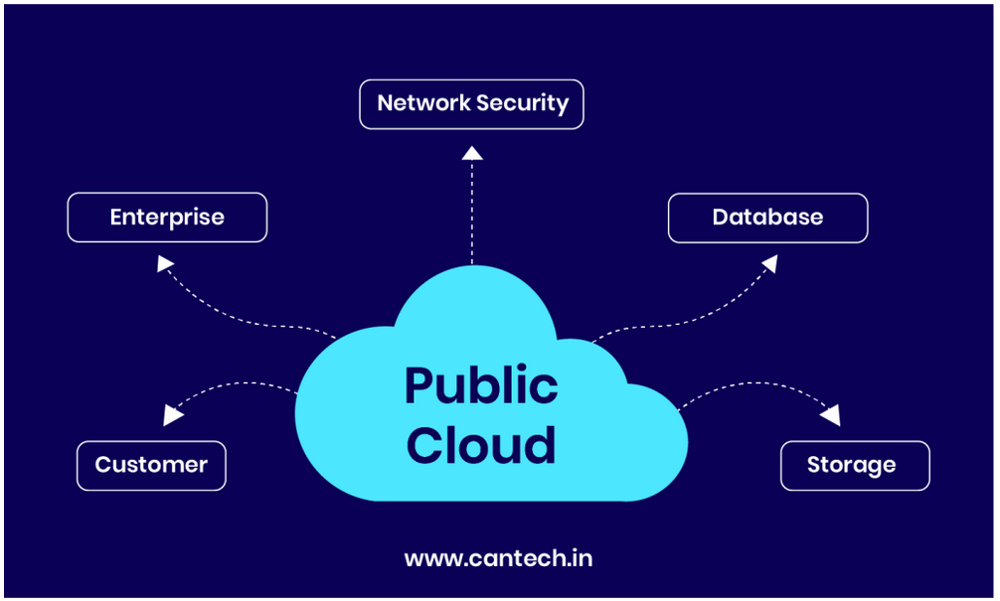
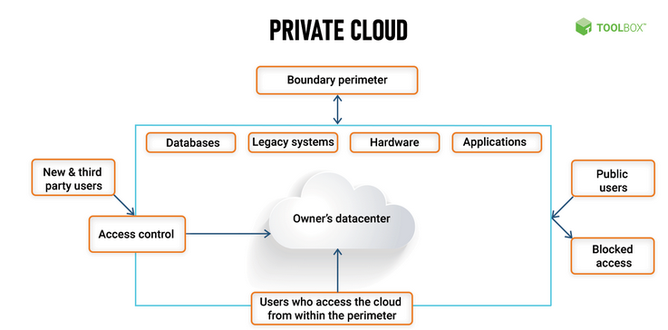
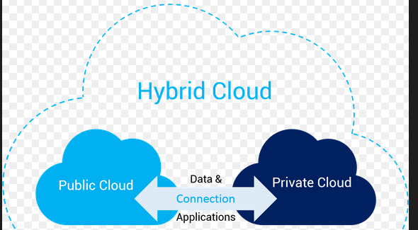
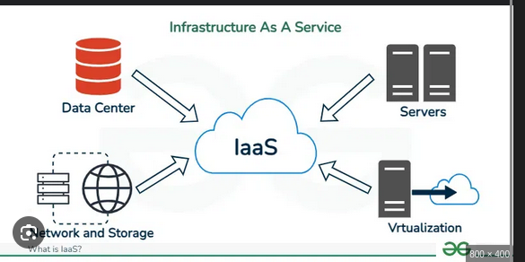
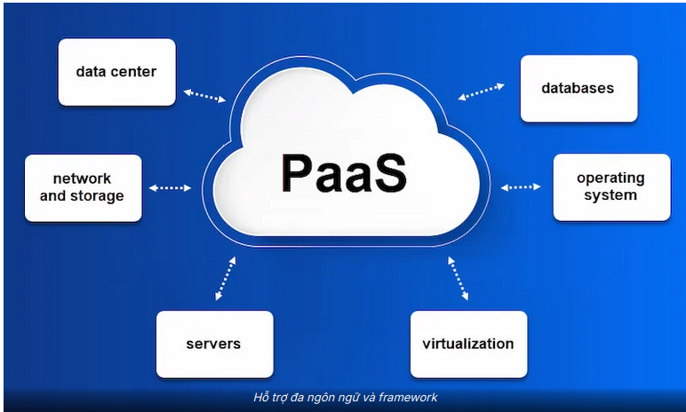
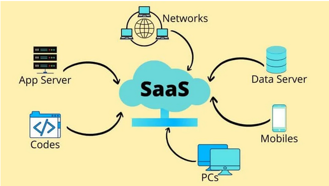

# Cloud Computing

Cloud Computing (Điện toán đám mây) là mô hình cung cấp tài nguyên CNTT như máy chủ, lưu trữ, cơ sở dữ liệu, mạng, phần mềm... qua Internet theo yêu cầu.

Đặc điểm chính:
- On-Demand Self-Service: Người dùng tự cấp phát tài nguyên.
- Broad Network Access: Truy cập qua nhiều loại thiết bị.
- Resource Pooling: Tài nguyên được chia sẻ giữa nhiều người dùng.
- Rapid Elasticity: Mở rộng/thu hẹp nhanh theo nhu cầu.
- Measured Service: Việc sử dụng được theo dõi và báo cáo.

Mô hình triển khai:
- Public Cloud: Dich vụ đám mây công cộng duoc cung cấp bởi bên thứ ba qua Internet.

- Private Cloud: Đám mây riêng duoc xây dựng và quản lý nội bộ cho một tổ chức.

- Hybrid Cloud: Kết hợp cua mô hình đám mây Public Cloud và Private Cloud.

Mô hình dịch vụ:
- IaaS (Infrastructure as a Service): Cung cấp hạ tầng CNTT (máy chủ, lưu trữ, mạng).

- PaaS (Platform as a Service): Cung cấp nền tảng phát triển ứng dụng.

- SaaS (Software as a Service): Cung cấp phần mềm qua Internet.

# OpenStack

## 1. Khái quát
OpenStack là nền tảng mã nguồn mở để xây dựng và quản lý cloud (public và private). Mục tiêu là cung cấp giải pháp linh hoạt để triển khai dịch vụ đám mây.

Thành phần chính:
- Nova: Compute
- Neutron: Network
- Cinder: Block Storage
- Swift: Object Storage
- Glance: Image service
- Keystone: Identity service
- Horizon: Dashboard (giao diện web)

## 2. Ứng dụng và lợi ích
- Triển khai và quản lý máy ảo, mạng, lưu trữ theo yêu cầu.
- Linh hoạt, có thể tùy chỉnh và mở rộng.
- Chi phí thấp khi sử dụng mã nguồn mở và cộng đồng hỗ trợ.

## 3. Triển khai
OpenStack có thể triển khai thủ công hoặc dùng các công cụ tự động hóa như DevStack, OpenStack-Ansible, Kolla-Ansible...