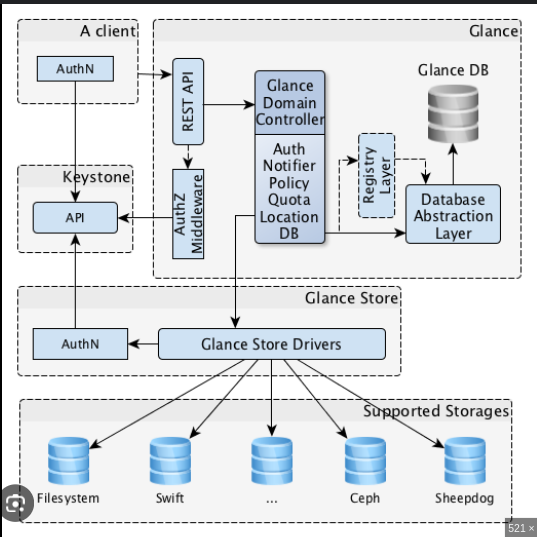

# Glance

## 1. Khái niệm
Glance là dịch vụ quản lý hình ảnh (VM images) trong OpenStack, chịu trách nhiệm lưu trữ, truy xuất và quản lý metadata của ảnh máy ảo.

Mục tiêu:
- Cung cấp dịch vụ lưu trữ và quản lý image cho các thành phần khác (Nova...).
- Hỗ trợ nhiều định dạng image: QCOW2, RAW, VMDK, v.v.
- Tích hợp với Nova để cung cấp image khi tạo VM.


## 2. Cách hoạt động
- Người dùng hoặc dịch vụ gửi yêu cầu tải lên hoặc truy xuất image qua API Glance.
- Đối với upload: Glance lưu image vào Glance Store và metadata vào Glance Registry (nếu dùng).
- Đối với truy xuất: Glance tìm image trong store và trả về dữ liệu cùng metadata.



## 3. Ứng dụng
- Lưu trữ và chia sẻ các image máy ảo.
- Cung cấp image cho Nova khi tạo VM.
- Quản lý phiên bản image, thực hiện chuyển đổi định dạng.

## 4. Cấu hình
- Cài đặt Glance bằng các công cụ quản lý gói (apt, yum).
```sh
   sudo apt update
   sudo apt install glance python3-glanceclient
```
- Các file cấu hình: `glance-api.conf`, `glance-registry.conf`.
- Cấu hình backend của Glance Store để xác định nơi lưu image (file system, object storage...).
```sh
   [glance_store]
   stores = file,http
   default_store = file
   filesystem_store_datadir = /var/lib/glance/images/
```
- Cấu hình Keystone để xác thực:
```sh
   [keystone_authtoken]
   auth_uri = http://controller:5000
   auth_url = http://controller:35357
   memcached_servers = controller:11211
   auth_type = password
   project_domain_name = Default
   user_domain_name = Default
   project_name = service
   username = glance
   password = GLANCE_PASS
```
- Cấu hình Logging trong `glance-api.conf` và `glance-registry.conf`:
```sh
   [DEFAULT]
   log_file = /var/log/glance/glance-api.log
```
## 5. Bảo mật
- Dùng Keystone cho xác thực.
- Mã hóa dữ liệu nhạy cảm khi truyền tải và lưu trữ.
- Giới hạn quyền truy cập vào image theo nhu cầu.

## 6. Tích hợp
- Thiết lập endpoints và service trong Keystone để Nova và các dịch vụ khác truy cập Glance.