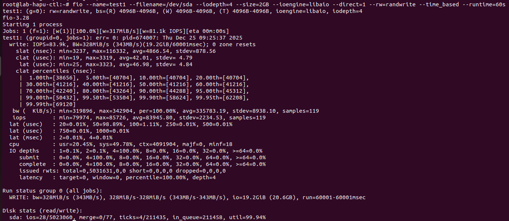

# dd
## Khái niệm về hiệu năng I/O
- Hiệu năng I/O là thước đo khả năng hệ thống xử lý các thao tác nhập và xuất dữ liệu của CPU/RAM vói các thiết bị ngoại vi hoặc lưu trữ (card mạng, ổ cứng)
- Hiệu năng I/O trong ceph là tập trung vào disk I/O (tốc độ đọc và ghi dữ liệu lên ổ đĩa) và được đánh giá qua 3 chỉ số:
 - IOPS (I/O operations per second): Là số lượng thao tác ghi và đọc nhỏ nhất của thiết bị trên 1 giây. Chỉ số này càng cao thì tốc độ phản hồi của truy xuất dữ liệu ngẫu nhiên càng nhanh
 - Throughput (Thông lượng viết tắt là BW): Tổng dữ liệu được truyền tải trên 1 đơn vị thời gian(MB/s hoặc GB/s). Công thức:
```sh
Throughput=IOPS×BlockSize
```
 - Latency (Độ trễ): Là thời gian để  từ khi một yêu cầu I/O được gửi đi đến khi nó hoàn thành
## dd
1. Khái niệm
- dd (Data Duplicator): là công cụ sao chép dữ liệu thô cơ bản  
2. Nguyên lý hoạt động
- dd sẽ đọc từ A ghi vào B và ghi thời gian. Cũng giống như ta có 1 cái xô nước và một van xả, ta muốn đo xem bao lâu thì xô đầy thì `dd` sẽ giúp ta đo.
3. Ưu nhược điểm
- Ưu điểm: 
  - Có hầu hết trên mọi hệ điều hành Linux
  - Dễ dùng, test nhanh được ổ cứng đó sống hay chết và xem được tốc độ ghi cơ bản là bao nhiêu
- Nhược điểm  
  - Chỉ kiểm tra được tốc độ tuần tự
  - Không giả lập được nhiều tình huống phức tạp 
  - Thường bị ảnh hưởng bởi bộ nhớ đệm (cache) nên kết quả thường dẫn tới bị ảo
4. Lệnh thử
```sh
dd if=/dev/ceph.../... of=file.txt bs=10MB count=1
```


# Fio benchmark 
## Khái niệm
- FIO (Flexible I/O Tester): là công cụ chuẩn công nghiệp dùng để kiểm thử áp lực và đánh giá hiệu năng của hệ thống lưu trữ 
- Khác với dd là đánh giá 1 luồng đơn thuần, FIO có khả năng sinh ra các tải (workload), giả lập được các hành vi thực tế của Database (Random I/O), Webserver (Many files), hoặc Big Data (Throughput)
## Các option quan trọng
-  `--bs`: Kích thước khối, nếu chọn bs = 4k (nhỏ) dùng để đo IOPS, bs =  1M (lớn) là đo throughput
-  `--name`: Tên job benchmark
-  `--ioengine`: Là cách để FIO nói chuyện với hệ điều hành. 3 loại phổ biến nhất:
                 - `sync`,`psync`: Hiệu năng thấp, không tận dụng được xử lý song song. Dùng trong test ổ cứng thô, đơn luồng
                 - `libaio`: Là tiêu chuẩn, dùng với hầu hết các loại database lớn và dùng để test HDD,SSD,SATA. Dùng kèm với lệnh `--direct=1`
                 - `--io_uring`: Hiệu năng cực cao, độ trễ thấp. Dùng cho các loại ổ cứng nhanh như NVMe 
-  `--rw`: loại workload:
                 - `read`: đọc tuần tự
                 - `write`: ghi tuần tự 
                 - `randread`: đọc ngẫu nhiên
                 - `randwrite`: ghi ngẫu nhiên
                 - `randrw`: đọc và ghi ngẫu nhiên hỗn hợp 
-  `--numjobs`: số tiến trình chạy song song
-  `--iodepth`: là tổng số IO outstanding tối đa để tính số lượng request đang đợi ổ cứng xử lý. Nếu `iodepth` càng cao thì IOPS càng cao dẫn tới tăng độ trễ . Nên chọn với HDD (1-8), SSD và SATA (32), NVMe (64,128,256). Số request đc tính bằng công thức: `QD = iodepth * numjobs`
-  `--runtime`: Thời gian chạy lệnh benchmark (s)
-  `--filename`: Thiết bị / file để test (dev/sbd1,/mnt/fiotest/testfile)
-  `--size`: kích thước tổng dữ liệu file test
-  `--time_base`: Chạy benchmark theo thời gian chứ không theo dung lượng nữa
-  `--ramp_time`: Benchmark sẽ chạy trước 1 khoảng thời gian làm nóng trước khi thu thập dữ liệu
-  `--verify`: Kiểm tra tính toàn vẹn của dữ liệu
-  `--iodepth_batch_submit`: số lượng I/O gửi xuống cùng lúc tới Kernal, khi không cấu hình thì mặc định bằng iodepth
-  `--iodepth_batch_complete_max`: Số lượng I/O hoàn thành để thực hiện cái `iodepth_batch_submit` tiếp. Giống cái trên khi không cấu hình thì mặc định bằng iodepth
** Cách để nhìn câu lệnh mà biết nó đo throughput, IOPS hay latency 
  - Dựa vào `--bs`: Nếu  giá trị `bs` nhỏ (4KB,8KB) là nó sẽ đo IOPS hoặc latency còn ngược lại nó mà lớn (32KB,64KB) thì nó sẽ đo Throughput
  - Dựa vào `--rw`: Nếu giá trị này là `randread` hay `randwrite` thì nó sẽ nhắm vào IPOS hoặc latency, còn `read`, `write` thì nó sẽ nhắm vào Throughput
  - Dựa vào `--iodepth`: Nếu nhỏ (1,2,3,4,..) thì là nhắm vào latency, còn to (32,64,128,..) là đo max IOPS và max Throughput
## Ví dụ về cách đọc khi chạy xong lệnh FIO
- Lệnh ví dụ kiểm tra Throughput
```sh
fio --name=test --bs=1MB --ioengine=libaio --rw=randrw --size=2G --runtime=20s --direct=1 --filename=/dev/vda
```
- Kết quả: 


- Lệnh ví dụ kiểm tra IOPS
```sh
fio --name=test --bs=4KB --ioengine=libaio --direct=1 --rw=randwrite --size=1GB --filename=/dev/sda/ --iodepth=32 --numjob=4 --runtime=60s --time_based 
```


- Lệnh kiểm tra latenyc 
```sh
  fio --name=test1 --filename=/dev/sda --iodepth=4 --size=2GB --ioengine=libaio --direct=1 --rw=randwrite --time_based --runtime=60s 
```



