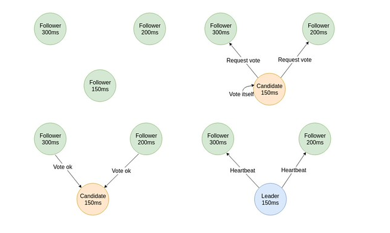
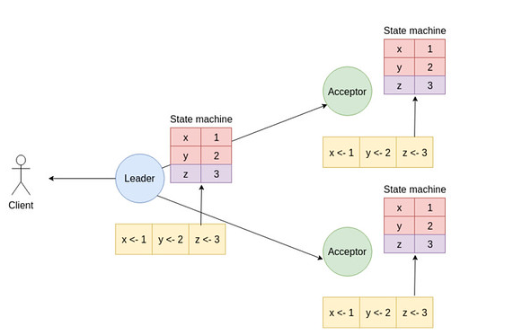

# Raft
## Khái niệm
- Raft là một thuật toán đồng thuận phân tán được thiết kế để quản lý một nhóm các máy chủ (nodes) trong một hệ thống phân tán. Mục tiêu chính của Raft là đảm bảo rằng tất cả các máy chủ trong nhóm đều đồng ý về trạng thái hiện tại của hệ thống, ngay cả khi có sự cố xảy ra, chẳng hạn như mất kết nối mạng hoặc lỗi phần cứng.
- Raft được thiết kế như Paxos về khả năng chịu lỗi và hiệu suất nhưng có cấu trúc đơn giản và dễ hiểu hơn nhiều. 
- Raft chia quá trình đồng thuận thành ba phần chính: 
  - leader election : bầu chọn lãnh đạo
  - log replication : sao chép nhật ký
  - safety: đảm bảo an toàn.
- Mỗi node trong hệ thống Raft có 3 vai trò chính: 
  - Leader: Xử lý tất cả các yêu cầu từ client, quản lý việc sao chép nhật ký và gửi đề xuất đến các follower
  - Follower: Không đưa ra yêu cầu mà chỉ trả lời yêu cầu từ leader và Candidate 
  - Candidate: Khi một follower không nhận được tín hiệu từ leader trong một khoảng thời gian nhất định, nó sẽ chuyển sang trạng thái candidate và bắt đầu quá trình bầu chọn để trở thành leader mới.
## Các bước hoạt động của Raft
- Một số thuật ngữ quan trọng trong Raft:
  - `Term`: Một khoảng thời gian trong Raft, mỗi term bắt đầu với một cuộc bầu chọn mới
  - `Log Entry`: Một mục trong nhật ký của mỗi node, chứa lệnh và term mà lệnh đó được thêm vào
  - `Commit`: Khi một lệnh được sao chép đến đa số các node, nó được coi là đã cam kết và có thể được thực thi
1. Leader Election (Bầu chọn lãnh đạo)

- Khi các node trong hệ thống khởi động, chúng bắt đầu ở trạng thái follower
- Các node Leader gửi tín hiệu `heartbeat` định kỳ để thông báo sự hiện diện của mình đến các follower
- Nếu một follower không nhận được tín hiệu heartbeat trong một khoảng thời gian nhất định và bị `timeout`, nó sẽ chuyển sang trạng thái candidate và tăng giá trị của `Term` lên một đơn vị và bắt đầu quá trình bầu chọn 
- Mỗi candidate sẽ tự bỏ phiếu cho mình và gửi RequestVote RPC đến các node khác trong hệ thống. Lúc này có 3 trường hợp xảy ra:
  - Nếu một candidate nhận được đa số phiếu bầu, nó trở thành leader mới
  - Nếu một candidate nhận được tín hiệu từ một leader khác với term cao hơn, nó sẽ chuyển về trạng thái follower
  - Nếu không có ai thắng cuộc bầu chọn trong một khoảng thời gian nhất định, quá trình bầu chọn sẽ được lặp lại
2. Log Replication (Sao chép nhật ký)
- Khi một client gửi một lệnh đến leader, leader sẽ thêm lệnh đó vào nhật ký của mình dưới dạng một log entry. Cấu trúc của một log entry bao gồm:
  - `Term`: Term hiện tại của leader
  - `Command`: Lệnh mà client gửi đến
  - `Index`: Vị trí của log entry trong nhật ký
- Quy trình diễn ra như sau:
  - Leader nhận lệnh từ client và tạo một log entry mới

  !(images_raft/anh2.png)

  - Leader gửi AppendEntries RPC đến tất cả các follower để sao chép log entry mới
  - Mỗi follower sẽ kiểm tra log entry nhận được: 
    - Nếu log entry phù hợp với nhật ký của follower, nó sẽ thêm log entry vào nhật ký của mình và gửi phản hồi thành công đến leader
    - Nếu log entry không phù hợp, follower sẽ gửi phản hồi thất bại và yêu cầu leader gửi lại log entry từ một vị trí cụ thể

  !(images_raft/anh3.png)

  - Khi leader nhận được phản hồi thành công từ đa số các follower, nó sẽ đánh dấu log entry là đã cam kết (committed) và gửi thông báo đến các follower để họ cũng đánh dấu log entry đó là đã cam kết
  - Cuối cùng, cả leader và follower sẽ thực thi các lệnh trong nhật ký đã cam kết theo thứ tự 

  

3. Safety
- Để đảm bảo tính an toàn và tính nhất quán của hệ thống, Raft áp dụng một số nguyên tắc sau:
  - Log Matching Property: Nếu hai log entries có cùng index và term, thì tất cả các log entries trước đó cũng phải giống nhau
  - Election Safety: 
    - Một node chỉ có thể trở thành leader nếu nó có log entries cập nhật nhất
    - Nếu một node đã cam kết một log entry trong một term, thì log entry đó phải tồn tại trong nhật ký của tất cả các leader trong các term sau đó
  - Leader Completeness: Mọi log entry đã cam kết trong một term phải tồn tại trong nhật ký của tất cả các leader trong các term sau đó
  - State Machine Safety: Mọi lệnh được thực thi trên state machine phải tuân theo thứ tự của log entries đã cam kết
  - Một số yêu cầu khác safety khác:
    - Node Leader không bao giờ được ghi đè hoặc xóa log của nó
    - Chỉ những entry của node Leader mới được cam kết
    - Chi có duy nhất 1 node Leader trong mỗi term
    - Khi một node Follower bị crash và khởi động lại, nó phải đồng bộ lại log của mình với node Leader trước khi tham gia vào quá trình đồng thuận
  ## So sánh với Paxos
  - Cả Raft và Paxos đều là các thuật toán đồng thuận phân tán, nhưng chúng có những khác biệt quan trọng về thiết kế và cách hoạt động
              
              |                     |         Raft            |          Paxos            |
              |---------------------|-------------------------|---------------------------|
              | Độ phức tạp         | Đơn giản và dễ hiểu hơn | Phức tạp và khó hiểu hơn  |
              |---------------------|-------------------------|---------------------------|
              | Quá trình bầu chọn  | Rõ ràng với các bước    | Không rõ ràng, có thể     |
              | lãnh đạo            | cụ thể                  | gây nhầm lẫn              |   
              |---------------------|-------------------------|---------------------------|
              | Quản lý nhật ký     | Sao chép nhật ký rõ ràng| Quản lý nhật ký phức tạp hơn|
              |---------------------|-------------------------|---------------------------|
              | Hiệu suất           | Thường nhanh hơn do     | Có thể chậm hơn do        |
              |                     | thiết kế đơn giản       | độ phức tạp cao hơn       |
              |---------------------|-------------------------|---------------------------|
              | Tính an toàn        | Đảm bảo tính an toàn    | Đảm bảotính an toàn thông |
              |                     | thông qua các nguyên tắc| qua các nguyên tắc phức   |
              |                     | rõ ràng                 | tạp hơn                   |
              |---------------------|-------------------------|---------------------------| 
## Use case
- Raft được sử dụng rộng rãi trong các hệ thống phân tán và cơ sở dữ liệu để đảm bảo tính nhất quán và độ tin cậy của dữ liệu. Một số ví dụ về ứng dụng của Raft bao gồm:
  - Hệ thống quản lý cấu hình phân tán như etcd và Consul sử dụng Raft để đồng bộ cấu hình giữa các node
  - Hệ thống lưu trữ phân tán như RethinkDB và TinyDB sử dụng Raft để đảm bảo tính nhất quán của dữ liệu
  - Các hệ thống nhắn tin phân tán như NATS sử dụng Raft để quản lý trạng thái của các server trong cụm
  - Hệ thống điều phối container như Kubernetes sử dụng etc để lưu trữ trạng thái của cụm, do đó gián tiếp sử dụng Raft