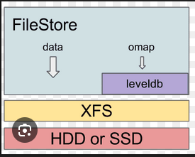

# FileStore
## Khái niệm 
- FileStore là một backend của Ceph được dùng để lưu trữ dữ liệu (objects) trên hệ thống file truyền thống như XFS, EXT4, BTRFS,...
- Hiểu đơn giản: FileStore mượn hệ thống quản lý tệp tin của Linux để cất dữ liệu của Ceph. Mỗi khi bạn lưu một tấm ảnh vào Ceph, FileStore sẽ biến tấm ảnh đó thành một file nằm trong thư mục của Linux.

## Cách hoạt động
- 1.1 Biến đối tượng thành file
  - Khi một file được lưu trữ vào Ceph thì RADOS sẽ biến file đó thành các đối tượng (objects). FileStore sẽ nhận các objects này và lưu chúng dưới dạng file trong hệ thống file của Linux. Nó sẽ đặt tên cho các object này, taọ cho chúng địa chỉ đường dẫn tới thư mục đó và ghi dữ liệu vào đường dẫn đó.
- 1.2 Quản lý metadata
  - Khi ghi dữ liệu xong, FileStore sẽ dùng XATTRs (Extended Attributes) của hệ thống file để lưu trữ metadata. Đôi khi XATTRs quá bé không đủ chỗ để lưu metadata, FileStore sẽ tạo các file riêng biệt để lưu trữ metadata này như LevelDB, RocksDB
- 1.3 Ghi dữ liệu
  - FileStore sẽ dùng Journal (nhật ký) để ghi dữ liệu. Quy trình sẽ như sau:
    Bước 1: Khi có dữ liệu mới cần ghi, FileStore sẽ ghi dữ liệu này vào Journal trước. Việc này giúp tăng tốc độ ghi dữ liệu và đảm bảo tính nhất quán đặc biệt khi ghi dữ liệu mà bị ngắt quãng đột ngột thì dữ liệu vẫn được bảo vệ trong Journal.
    Bước 2: Sau khi dữ liệu đã được ghi vào Journal, FileStore sẽ xác nhận với hệ thống rằng dữ liệu đã được ghi thành công. Điều này giúp đảm bảo rằng dữ liệu không bị mất mát trong quá trình ghi.
    Bước 3: Sau khi dữ liệu đã được ghi vào Journal, FileStore sẽ tiến hành ghi dữ liệu từ Journal vào hệ thống file chính. Quá trình này có thể diễn ra sau một khoảng thời gian nhất định hoặc khi Journal đạt đến một kích thước nhất định.
    Bước 4: Sau khi hoàn thành nó sẽ xóa các mục đã ghi khỏi Journal để giải phóng không gian lưu trữ.
- 1.4 Ưu điểm
  - An toàn dữ liệu: Việc sử dụng Journal giúp bảo vệ dữ liệu khỏi mất mát trong trường hợp hệ thống bị ngắt quãng đột ngột như mất điện.
  - Ổn định: Dựa trên hệ thống file truyền thống của Linux nên FileStore rất ổn định và đáng tin cậy.
  - Dễ sửa chữa: Khi có sự cố xảy ra, ta có thể sử dụng các công cụ sửa chữa hệ thống file của Linux để khôi phục dữ liệu.
- 1.5 Nhược điểm
  - Mặc dù cơ chế của Journal rất an toàn nhưng nó cũng có một số nhược điểm:
    - Hiệu suất ghi dữ liệu: Việc ghi dữ liệu vào Journal trước khi ghi vào hệ thống file chính có thể làm giảm hiệu suất ghi dữ liệu tổng thể do phải ghi 2 lần: 1 lần vào Journal và 1 lần vào hệ thống file chính.
    - Quản lý Journal: Khi ghi Journal thì thường dùng ổ cứng SSD để làm thiết bị lưu trữ. Do đó ổ cứng SSD có thể bị hao mòn nhanh hơn do phải ghi nhiều lần vào Journal.
    - Tốn tài nguyên CPU để ghi dữ liệu vào Journal và sau đó ghi từ Journal vào hệ thống file chính.
