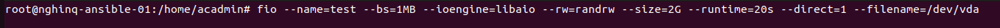

# dd
## Khái niệm về hiệu năng I/O
- Hiệu năng I/O là thước đo khả năng hệ thống xử lý các thao tác nhập và xuất dữ liệu của CPU/RAM vói các thiết bị ngoại vi hoặc lưu trữ (card mạng, ổ cứng)
- Hiệu năng I/O trong ceph là tập trung vào disk I/O (tốc độ đọc và ghi dữ liệu lên ổ đĩa) và được đánh giá qua 3 chỉ số:
 - IOPS (I/O operations per second): Là số lượng thao tác ghi và đọc của thiết bị trên 1 giây. Chỉ số này càng cao thì tốc độ phản hồi của truy xuất dữ liệu ngẫu nhiên càng nhanh
 - Throughput (Thông lượng): Tốc độ truyền tải dữ liệu được tính bằng MB/s hoặc GB/s. Nó cho biết được khối lượng dữ liệu tối đa có thể di chuyển trong khoảng thời gian nhất định.
 - Latency (Độ trễ): Là thời gian để tính hoàn thành 1 I/O đơn lẻ. Độ trễ càng thấp thì tốc độ càng cao và hệ thống không bị giật
## dd
1. Khái niệm
- dd (Data Duplicator): là công cụ sao chép dữ liệu thô cơ bản  
2. Nguyên lý hoạt động
- dd sẽ đọc từ A ghi vào B và ghi thời gian. Cũng giống như ta có 1 cái xô nước và một van xả, ta muốn đo xem bao lâu thì xô đầy thì `dd` sẽ giúp ta đo.
3. Ưu nhược điểm
- Ưu điểm: 
  - Có hầu hết trên mọi hệ điều hành Linux
  - Dễ dùng, test nhanh được ổ cứng đó sống hay chết và xem được tốc độ ghi cơ bản là bao nhiêu
- Nhược điểm  
  - Chỉ kiểm tra được tốc độ tuần tự
  - Không giả lập được nhiều tình huống phức tạp 
  - Thường bị ảnh hưởng bởi bộ nhớ đệm (cache) nên kết quả thường dẫn tới bị ảo
4. Lệnh thử
```sh
dd if=/dev/ceph.../... of=file.txt bs=10MB count=1
```



# Fio banchmark 
## Khái niệm
- FIO (Flexible I/O Tester): là công cụ chuẩn công nghiệp dùng để kiểm thử áp lực và đánh giá hiệu năng của hệ thống lưu trữ 
- Khác với dd là đánh giá 1 luồng đơn thuần, FIO có khả năng sinh ra các tải (workload), giả lập được các hành vi thực tế của Database (Random I/O), Webserver (Many files), hoặc Big Data (Throughput)
 