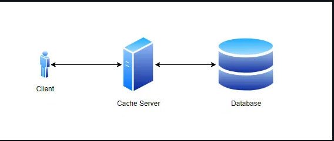
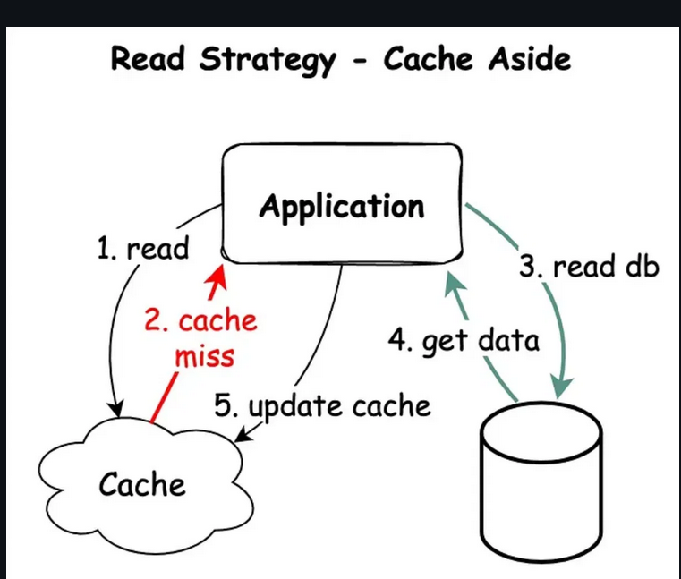

# Flusing strategies
## Caching
### 1. Khái niệm
- Caching là một kỹ thuật lưu trữ tạm thời dữ liệu vào một vùng nhớ đệm (cache) để tăng tốc độ truy cập dữ liệu trong các lần truy cập tiếp theo
- Khi một ứng dụng hoặc hệ thống yêu cầu dữ liệu, nó sẽ kiểm tra xem dữ liệu có trong cache hay không. Nếu có, dữ liệu sẽ được lấy từ cache thay vì truy cập vào nguồn dữ liệu gốc giúp giảm thời gian truy cập cà tang hiệu suất hệ thống

### 2. Các chiến lược caching
1. Cacing được chia làm 2 loại chính: 
 - Chiến lược đọc dữ liệu: bao gồm cache aside và Read through.
 - Chiến lược ghi dữ liệu: bao gồm write through, write back và write around.
2. Cache aside: Mô hình này hữu ích khi dữ liệu không được truy cập thường xuyên. Cách hoạt động cơ bản của cache aside:
 - Bước 1: Kiểm tra cache: Nếu có dữ liệu trong cache thì dữ liệu được trả về từ cache, giúp giảm thiểu thời gian truy cập. Nếu không có dữ liệu trong cache thì hệ thống sẽ thông báo tới ứng dụng để chuyển tới bước tiếup theo.
 - Bước 2: Truy cập dữ liệu vào nguồn chính : Nếu cache không có dữ liệu, hệ thống sẽ truy cập vào người dữ liệu chính từ bên ngoài như cơ cở dữ liệu
 - Bước 3: Cập nhật cache: Dữ liệu được lấy từ nguồn chính sẽ được lưu vào cache để sử dụng cho các lần truy cập tiếp theo.
 - Bước 4: Xử lý dữ liệu lỗi thời: Dữ liệu trong cache cần được đồng bộ hoắc được loại bỏ khi nó không còn đồng bộ dữ liệu với nguồn chính



3. Ưu điểm
 - TIết kiệm tài nguyên
 - Linh hoạt
 - Dễ triển khai
3. Read through là một mô hinh được thiết kế để tự động hóa quy trình tải và lưu trữ dữ liệu vào cache bằng cách sử dụng một lớp trung gian ( cache proxy hoặc cache library)
  - Bước 1: Yêu cầu dữ liệu: Khi ứng dụng yêu cầu dữ liệu, yêu cầu sẽ được gửi đến lớp trung gian thay vì trực tiếp truy cập vào nguồn dữ liệu chính
  - Bước 2: Kiểm tra cache: Lớp trung gian sẽ kiểm tra xem dữ liệu có trong cache hay không. Nếu có, dữ liệu sẽ được trả về từ cache
  - Bước 3: Truy cập nguồn chính: Nếu dữ liệu không có trong cache, lớp trung gian sẽ tự động truy cập vào nguồn dữ liệu chính để lấy dữ liệu
  - Bước 4: Cập nhật cache: Dữ liệu lấy từ nguồn chính sẽ được lưu vào cache để sử dụng cho các lần truy cập tiếp theo
  - Bước 5: Trả về dữ liệu: Cuối cùng, dữ liệu được trả về cho ứng dụng từ lớp trung gian

  

4. Wrire around là một chiến lược mà khi một dữ liệu mới được viết, nó được ghi trực tiếp vào nguồn dữ liệu chính mà không cần cập nhật 
dữ liệu đó vaò cache nhau lập tức
- Các bước tạo:
  - Bước 1: Yêu cầu ghi dữ liệu: Dữ liệu mới hoăt cập nhật sẽ được ghi trực tiếp vào nguồn dữ liệu chính, bỏ qua việc ghi vào cache
  - Bước 2: Không trực tiếp ghi lên cache, tăng hiệu suất ghi dữ liệu
  - Bước 3: Đọc ddữ liệu: Khi dữ liệu được yêu cầu, hệ thống sẽ kiểm tra cache trước. Nếu dữ liệu không có trong cache, nó sẽ truy cập vào nguồn dữ liệu chính để lấy dữ liệu
  - Bước 4: Cập nhật từ nguồn chính, sắnx sàng cho các yêu cầu đọc tiếp theo


5. Write back: là chiến lược ghi dữ liệu vào cache trước khi ghi vào nguồn dữ liệu chính, sau đó dồng bộ hóa với dữ liệu chính sau 1 khoảng thời gian nhất định hoặc dựa trên 1 sự kiện nào đó
- Các bước tạo:
  - Bước 1: Khi có yêu cầu ghi dữ liệu, dữ liệu sẽ được ghi vào cache trước tiên
  - Bước 2: Dữ liệu trong cache sẽ được đánh dấu là "bẩn" (dirty), cho biết rằng nó đã được cập nhật nhưng chưa được ghi vào nguồn dữ liệu chính
  - Bước 3: Ghi dữ liệu vào nguồn chính: Dữ liệu từ cache sẽ được ghi vào nguồn dữ liệu chính theo các điều kiện nhất định như:
    - Thời gian định kỳ: Dữ liệu được ghi vào nguồn chính sau một khoảng thời gian xác định
    - Kích thước cache: Khi cache đạt đến một kích thước nhất định, dữ liệu sẽ được ghi vào nguồn chính để giải phóng không gian trong cache
  - Bước 4: Sau khi được dồng bộ hóa với dữ liệu chính thành công thì dấu "bẩn" sẽ được xóa bỏ


6. Write through: là chiến lược ghi dữ liệu đồng thời vào cả cache và nguồn dữ liệu chính
- Các bước tạo:
  - Bước 1: Yêu cầu ghi dữ liệu: khi có yêu cầu ghi dữ liệu, dữ liệu sẽ được ghi vào cache và nguồn dữ liệu chính. Điều ày đảm bảo rằng dữ liệu chính và cache luôn đồng bộ 
  - Bước 2: Ghi vào cache: Dữ liệu được ghi vào cache trước tiên, giúp tăng hiệu suất ghi dữ liệu và đảm bảo rằng yêu cầu học tiếp theo cho dữ liệu sẽ được truy cập nhanh chóng từ cache
  - Bước 3: Ghi vào nguồn dữ liệu chính: Đồng thời với cache thì dữ liệu cũng được ghi vào nguồn chính. Điều này đảm bảo tính nhất quán và độ tin cậy của dữ liệu
## Flusing strategies
### 1. Khái niệm
- Flushing strategies (chiến lược xả và làm sạch) là phương pháp sử dụng để loại bỏ đi dữ liệu đã cũ hoặc không cần thiết khỏi bộ nhớ đệm(cache) hoặc của hệ thống nhằm đảm bảo tính nhất quán và hiệu suất của hệ thống thường bao gồm cả việc ghi đè (write back), ghi trực tiếp (write through) hay xả bộ nhớ định kỳ như dùng night flushing.
### 2. fsync
1. Khái niệm
- fsync là một hệ thống gọi (system call) trong các hệ điều hành giống Unix được sử dụng để đảm bảo rằng tất cả dữ liệu đã được ghi vào một tập tin hoặc thiết bị lưu trữ cụ thể được ghi hoàn toàn từ bộ nhớ đệm (cache) xuống thiết bị lưu trữ vật lý như ổ cứng hoặc SSD
2. Cách thức hoạt động
- Bình thường khi muốn ghi dữ liệu xuống disk thì chương trình sẽ gọi hàm `write(fd, buf, len)`. Đây chính là mô hình Buffered I/O. Khi đó:
  - Dữ liệu sẽ được copy vào RAM trước
  - Copy xong vào RAM thì Kernal sẽ đánh dấu là Dirty
  - Đánh dấu xong sẽ trả lại cho ứng dụng câu trả lời là ghi xong (Thực sự là chưa ghi)
  - Sau đó khi nào Kernal rảnh mới từ từ ghi dữ liệu xuống disk
---> Tại sao phải nói dối là đã ghi xong xuống disk mà trong khi đó chưa ghi gì? Tại nó muốn gom 1 phát bằng đấy file để chạy 1 lần xuống disk luôn cho nhanh. Ưu điểm là nhanh nhưng rủi ro là khi nếu chưa ghi kịp xuống disk mà mất điện thì nó sẽ mất hết dữ liệu. Chính vì thế fsync ra đời để làm cái bước 4 ngay và luôn 
- Hoạt động của fsync:
 - Giai đoạn 1: Kích hoạt và chuyển đổi ngữ cảnh
   - Khi ứng dụng gọi hàm `fsync()`, CPU sẽ thực hiện chuyển đổi giữa User Mode sang Kernal Mode. Tại đây Kernal sẽ xác định `inode` (là 1 thực thể giúp xắp xếp file trong Linux). Khi đó tiến trình gọi (calling process) sẽ bị đưa vào trạng thái Uninterruptible Sleep (D), nghĩa là bị chặn hoàn toàn và phải buộc chờ đợi cho quá trình I/O kết thúc
 - Giai đoạn 2: Xả bộ nhớ đệm hệ điều hành
   - Kernal sẽ quét không gian địa chỉ (address space) của file Dirty Page (file bẩn hay còn là các file chưa đồng bộ)
   - Các dữ liệu này sẽ được đóng gói thành các yêu cầu I/O và đưa xuống hàng đợi (Device Queue) và đồng thời `fsync()` cũng bắt ghi các Metadata để đảm bảo tính nhất quán.
   Nếu sử dụng Journal FileSystem thì bước này cũng phải commit và được ghi nào Journal Log 
 - Giai đoạn 3: Xả bộ nhớ đệm phần cứng
   - Khi này Kernal sẽ gửi lệnh xuống Controller của ổ cứng. Với tùy loại ổ cứng ta dùng là gì thì Kernal sẽ dùng lệnh đó để ra lệnh:
     - Nếu ổ cứng chuẩn SATA: lệnh `FLUSH CACHE`
     - Nếu ổ cứng chuẩn SCSI: lệnh `SYNCHRONIZE CACHE`
     - Nếu ổ cứng chuẩn NVMe: lệnh `FLUSH` hoặc `FUA`
  - Giai đoạn 4: Hàm fsync chỉ trả về giá trị return khi giai đoạn 3 kết thúc và chắc chắn rằng dữ liệu đã được nằm ở trên disk

```sh
// BƯỚC 1: Mở file
int fd = open("dulieu.txt", O_WRONLY);

// BƯỚC 2: Ghi dữ liệu (Lúc này dữ liệu mới chỉ vào RAM)
// Nếu thiếu bước này, bước 3 là vô nghĩa.
write(fd, "Quan trọng", 10); 

// BƯỚC 3: Ép xuống đĩa (Chốt đơn)
fsync(fd); 

// BƯỚC 4: Đóng file
close(fd);
```
### 3. fdatasync
- Giống gần như y hết `fsync` chỉ khác chỗ  Metadata của `fsync` là tất cả các thông tin Metadata của file còn `fdatasync` chỉ cần mỗi thông tin tối thiểu để truy cập vào data
### 4. O_SYNC, O_DSYNC
- O_SYNC nó là hằng số nhét vào hàm  `open()` để gọi `fsync()` thôi O_DSYNC tương tự dùng để gọi `fdatasync()`
```sh
// BƯỚC 1: Mở file kèm theo cờ O_SYNC
// Dấu gạch đứng "|" nghĩa là "VÀ" (kết hợp các tính năng)
int fd = open("dulieu.txt", O_WRONLY | O_SYNC); 

// BƯỚC 2: Ghi dữ liệu
// Lệnh này bây giờ sẽ chạy RẤT CHẬM.
// Lý do: Nó tự động làm: copy vào RAM -> đẩy xuống đĩa -> chờ đĩa báo OK -> mới chạy xong.
write(fd, "Quan trọng", 10); 

// BƯỚC 3: KHÔNG CẦN fsync(fd) NỮA
// (Vì lệnh write ở trên đã làm hộ rồi)

// BƯỚC 4: Đóng file
close(fd);
```
### O_DIRECT
- Cũng là 1 hằng số trong hàm `open()` như `O_SYNC, O_DSYNC` nhưng khác ở chỗ khi dùng `O_DIRECT` thì sẽ sử dụng mô hình Direct I/O tức là sẽ bỏ qua hoàn toàn bước ghi vào Page Cache, thiết lập kênh trực tiếp ghi từ User Space xuống Disk. Nó sẽ giảm tải CPU do không cần sao chép dữ liệu giữa các vùng nhớ RAM

```sh
// BƯỚC 1: Mở file với cờ O_DIRECT
// Ý nghĩa: "Này OS, mở file này ra, nhưng cấm được dùng Page Cache (RAM) của mày để chứa dữ liệu của tao."
int fd = open("database.db", O_RDWR | O_DIRECT);

// BƯỚC 2: Chuẩn bị dữ liệu (PHẦN KHÓ NHẤT LÀ ĐÂY)
// Bạn KHÔNG THỂ dùng biến bình thường hay malloc() bình thường được.
// Bộ nhớ phải được CĂN CHỈNH (Aligned), thường là bội số của 512 bytes.
void *buf;
posix_memalign(&buf, 512, 4096); // Cấp phát RAM đặc biệt

// BƯỚC 3: Ghi dữ liệu
// Dữ liệu đi thẳng từ biến 'buf' -> Ổ cứng. Không ghé qua RAM của OS.
write(fd, buf, 4096);
```
