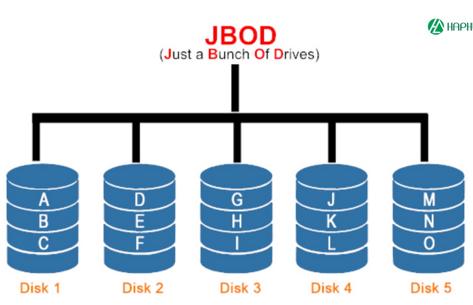

# JBOD
## Khái niệm
- JBOD (Just a Bunch Of Disk) là một kiến trúc lưu trữ dữ liệu trong đó có nhiều ổ đĩa bên trong một hộp lưu trữ duy nhất 
- Dữ liệu được ghi và cấu hình vào JBOD một cách tuần từ trên các ổ đĩa

## Cách hoạt động
- JBOD hoạt động bằng cách kết nối nhiều ổ đĩa vật lý (có thể khác nhau về dung lương, hãng) vào một hệ thống lưu trữ duy nhất
- Mỗi ổ đĩa trong JBOD hoạt động độc lập và không có sự kết hợp hoặc phân phối dữ liệu giữa các ổ đĩa
- Dữ liệu được ghi tuần tự trên từng ổ đĩa, khi một ổ đĩa đầy, dữ liệu sẽ được ghi vào ổ đĩa tiếp theo trong chuỗi cho đến khi tất cả các ổ đĩa đều đầy
- Khi đọc dữ liệu, hệ thống sẽ truy xuất dữ liệu từ từng ổ đĩa một cách tuần tự
## Ưu điểm và nhược điểm
- Ưu điểm:
  - Chi phí thấp: JBOD thường rẻ hơn so với các giải pháp lưu trữ khác như RAID vì không yêu cầu phần cứng đặc biệt hoặc cấu hình phức tạp
  - Tính linh hoạt: Dễ dàng mở rộng dung lượng lưu trữ bằng cách thêm ổ đĩa mới vào hệ thống JBOD
  - Quản lý đơn giản: Mỗi ổ đĩa hoạt động độc lập, giúp việc quản lý và bảo trì dễ dàng hơn
  - Hot-swapping: Nhiều hệ thống JBOD hỗ trợ hot-swapping, cho phép thay thế ổ đĩa mà không cần tắt hệ thống
  - Phục hồi dữ liệu: Trong trường hợp một ổ đĩa bị hỏng, dữ liệu trên các ổ đĩa khác vẫn an toàn và có thể truy xuất được, nó phục hồi dễ hơn so với hệ thống RAID
- Nhược điểm:
  - Hiệu suất thấp: Do dữ liệu được ghi tuần tự trên từng ổ đĩa, hiệu suất tổng thể của hệ thống JBOD có thể thấp hơn so với các giải pháp lưu trữ khác như RAID
  - Thiếu dự phòng dữ liệu: JBOD không cung cấp cơ chế dự phòng dữ liệu, nếu một ổ đĩa bị hỏng, dữ liệu trên ổ đĩa đó sẽ bị mất
  - Sử dụng đĩa không đồng đều: Việc sử dụng ổ đĩa có dung lượng khác nhau có thể dẫn đến lãng phí không gian lưu trữ. Trong khi một ổ đĩa đầy, ổ đĩa tiếp theo có thể vẫn còn dung lượng trống nhưng không thể sử dụng được. Điều đó có thể gây ra tắc nghẽn trong việc ghi dữ liệu
  ## So sánh JBOD và RAID
  - JBOD và RAID là hai kiến trúc lưu trữ dữ liệu khác nhau với các ưu điểm và nhược điểm riêng
  - JBOD tập trung vào việc cung cấp dung lượng lưu trữ lớn với chi phí thấp và tính linh hoạt cao, trong khi RAID tập trung vào việc cải thiện hiệu suất và độ tin cậy của dữ liệu thông qua việc phân phối và dự phòng dữ liệu

              
              |                     |         JBOD            |          RAID             |
              |---------------------|-------------------------|---------------------------|
              | Cách hoạt động      | Kết nối nhiều ổ đĩa     | Kết hợp nhiều ổ đĩa để     |
              |                     | vật lý vào một hệ thống  | tạo thành một hệ thống lưu  |
              |                     | lưu trữ duy nhất         | trữ duy nhất với cơ chế   |
              |                     |                         | phân phối và dự phòng dữ liệu  |
              |---------------------|-------------------------|---------------------------|
              | Hiệu suất           | Thấp hơn so với RAID     | Cao hơn so với JBOD        |
              |---------------------|-------------------------|---------------------------|
              | Dự phòng dữ liệu     | Không có cơ chế dự phòng  | Có cơ chế dự phòng dữ liệu     |
              |---------------------|-------------------------|---------------------------|
              | An toàn dự liệu      | Thấp hơn so với RAID do    | Cao hơn so với JBOD        | 
              |                     | không có cơ chế dự phòng, |                           |
              |                     | nếu một ổ đĩa bị hỏng, dữ liệu |                           |
              |                     | trên ổ đĩa đó sẽ bị mất   |                           |
              |---------------------|-------------------------|---------------------------|
              | Chi phí             | Thấp hơn so với RAID     | Cao hơn so với JBOD        |
              |---------------------|-------------------------|---------------------------|
## Use case
- JBOD thường được sử dụng trong các tình huống sau:
  - Lưu trữ dữ cá nhân
  - Khi cần một ổ đĩa lớn mà không quan tâm đến hiệu suất hoặc dự phòng dữ liệu
  - Môi trường thử nghiệm hoặc phát triển
  - Thay thế dễ dàng trong hệ thống
