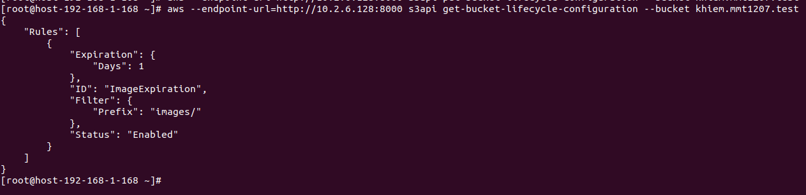
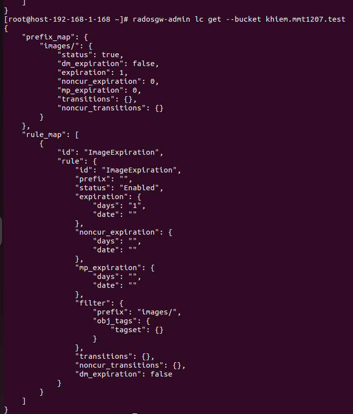
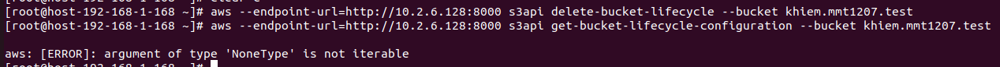
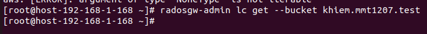

# Bucket Lifecycle
## Khái niệm 
- Là tính năng tự động quản lý các file/object trong một bucket dựa trên nguyên tắc mà người dùng định nghĩa
- Sử dụng bucket lifecycle ta có thể tự động di chuyển hoặc xóa file sau khoảng thời gian nhất định
## Triển khai

1. Tạo policy cho bucket

```sh
{
        "Rules": [
        {
                    "Filter": {
                            "Prefix": "images/"
                    },
                    "Status": "Enabled",
                    "Expiration": {
                            "Days": 1
                    },
                    "ID": "ImageExpiration"
            }
    ]
}
```

Giải thích:
  - Prefix: phần đầu key (object) ở trong bucket
  - Expiration, Days: thời gian xóa sau khi upload

2. Áp dụng policy vào bucket

```sh
aws --endpoint-url=_RADOSGW_ENDPOINT_URL_:PORT s3api put-bucket-lifecycle-configuration --bucket _BUCKET_NAME_ --lifecycle-configuration file:/path_file_policy.json
```

3. Truy xuất xem cấu hình vòng đời đúng chưa

```sh

aws --endpoint-url=_RADOSGW_ENDPOINT_URL_:PORT s3api get-bucket-lifecycle-configuration --bucket _BUCKET_NAME_

```

 

hoặc nếu dùng Cephadm ta có thể xem bằng radosgw-admin

```sh
radosgw-admin lc get --bucket=BUCKET_NAME
```

 

4. Xóa cấu hình policy bucket lifecycle

```sh
aws --endpoint-url=_RADOSGW_ENDPOINT_URL_:PORT s3api delete-bucket-lifecycle --bucket _BUCKET_NAME_
```

 

hoặc dùng radosgw-admin

```sh
radosgw-admin lc get --bucket=BUCKET_NAME
```

 
