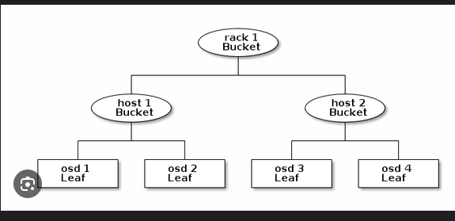
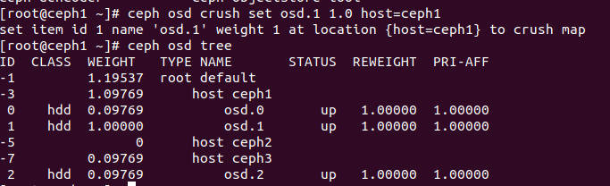

# CRUSH
## Khái niệm 
- CRUSH là một thuật toán giúp Ceph tính toán các vị trí lưu trữ để xác định cách lưu trữ và truy xuất dữ liệu.
## Cấu trúc và cách hoạt động
### Luồng đi của dữ liệu
- Để hiểu rõ hơn về CRUSH ta cần phải hiểu rõ hơn về luồng đi của dữ liệu
                           File --> Object --> PGs --> OSDs
- Khi đó CRUSH sẽ nhận 2 tham số là ID của PGs và CRUSH MAP. Khi đó OUTPUT sẽ là các OSD cụ thể chứa dữ liệu
### CRUSH MAP



1. Các thành phần chính trong MAP
   A. Buckets: Là nút trung gian trong cây. Ceph định nghĩa sẵn các loại buckets từ to tới bé:
      - root: Cả cluster máy
      - region/datacenter: Trung tâm dữ liệu
      - room: Phòng máy
      - row: Dãy tử
      - rack: Tủ rack
      - host: máy chủ vật lý
   B. Devices: Là các OSD chứa dữ liệu cuối cùng. Mỗi OSD sẽ chứa 1 trọng số (weight)
   C. Rules: Là phần quan trọng nhất cấu hình. Crush Rules sẽ bảo hệ thống chọn ổ OSD
2. Failure Domain
- Failure Domain sẽ giúp chúng ta có thể chia dữ liệu backup của ta vào các host khác nhau. 
- Ví dụ như ta có 3 bản sao lưu dữ liệu:
  - Nếu Failure Domain = osd thì các bản sao của chúng ta giả sử sẽ lưu vào osd.1, osd.2, osd.3 . Chẳng may HOST_A chứa OSD đó cháy thì sẽ mât hết dữ liệu 
  - Nếu Failure Domain = host thì các bản sao sẽ được CRUSH phân chia vào osd.1 của HOST_A,  osd.2 của HOST_B, osd.3 của HOST_C. Khi chẳng may dữ liệu HOST_A mất thì dữ liệu vẫn còn trên HOST_B và HOST_C
  - Nếu Failure Domain = rack thì các bản sao sẽ được CEPH chọn OSD trên từng RACK_1, RACK_2, RACK_3. Chẳng may RACK_1 mất điện thì dữ liệu vẫn trên RACK_2 và RACK_3
3. Device Classes
- Từ bản Luminous, CRUSH MAP thông minh hơn, nó sẽ tự diện loại ổ cứng hdd, ssd, nvme
- Tính năng này giúp bạn tạo các rule riêng biệt: 
  - hot_storage (Cho Database): Tạo rule chỉ định chỉ ghi vào SSD
  - cold_storage (Cho Backup): Tạo rule chỉ định ghi vào HDD
4. Một số câu lệnh về CRUSH MAP
- Xem sơ đồ osd
```sh
ceph osd tree
```


- Di chuyển OSD vào đúng vị trí host
```sh 
ceph osd crush set osd.0 1.0 host=host-a
```


- Tạo một bucket mới và di chuyển host vào bucket đó
```sh
ceph osd crush add-bucket rack01 rack
ceph osd crush move host-a rack=rack01
```


