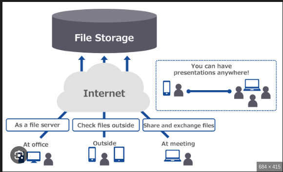
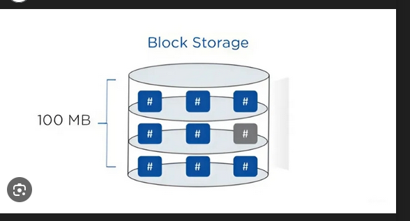

# Cloud Storage
  ## File Storage 

  

  1. Khái niệm
   - Là loại lưu trữ sử dụng cấu trúc thư mục truyền thống như trên máy tính hoặc server để lưu trữ, dược truy cập thông qua giao thức Server Message Block (SMB) trên Window hoặc NFS (Network File System) trên Linux
   - Trên Cloud đây là dịch vụ NAS (Network Attached Storage), thay vì bạn tự lập 1 con Linux cài NFS để mount vào thì nhà cung cấp Cloud đã làm hết cho bạn, bạn chỉ cần vào và dùng
  2. Ưu điểm 
   - Dễ chia sẻ tài nguyên cho nhiều người cùng lúc
   - Dễ sử dụng vì cấu trúc cây quen thuộc với người dùng
   - Sử dụng giao thức mạng phổ biến, không cần thêm client phúc tạp
  3. Nhược điểm
   - Tốc độ chậm, khi lên tới hành triệu file thì tìm kiếm sẽ khó khăn nên lúc đấy tốc độ sẽ rất chậm
   - Khó mở rộng khi hết dung lượng 
  ## Block Storage

   

  1. Khái niệm 
    - Là phương pháp lưu trữ cấp thấp. Block storage sẽ quản lý và luư trữ một cụm đơn vị gọi là các khối. Các khối này sẽ được gán 1 đia chỉ duy nhất, lưu trữ trảu đều ra máy và mỗi khối sẽ lưu một phần dữ liệu của file. Khi Client gửi thông tin request tới và muỗn truy xuất tệp, Khi requst đã được duyệt thánh block request, file sẽ tập hợp chúng lại và trả về máy

  2. Ưu  điểm
    - Hoạt động có độ trễ thấp 
    - Các block thường được sao chép trên các thiết bị nên đảm bảo rằng thiết bị dữ liệu có thể khôi phục được nếu bị hỏng
  3. Nhược điểm 
    - Có thể sẽ không mở rộng được quy mô sau khi đạt đến giới hạn của bộ nhớ
  ## Object Storage

  

  - Là dạng lưu trữ hiện đại trong Cloud, lưu trữ dữ liệu dưới dạng Object trong 1 không gian phẳng (Flat namespace), nơi mà không có phân cấp thư mục 
  - Khi đó mỗi dữ liệu sẽ được chia thành các đối tượng riêng lẻ và được gắn mã định danh duy nhất. Mỗi đối tượng (object) sẽ gồm 3 thành phần chính:
   - Dữ liệu
   - Metadata
   - ID định danh
  | Tiêu chí | Object Storage | File Storage | Block Storage |
|----------|----------------|--------------|---------------|
| Cách tổ chức dữ liệu | Dữ liệu được lưu trữ dưới dạng đối tượng, không có cấu trúc thư mục | Dữ liệu được tổ chức trong các thư mục và tệp tin | Dữ liệu được chia thành các khối (blocks) nhỏ, không phụ thuộc vào tệp |
| Khả năng mở rộng | Mở rộng linh hoạt, không giới hạn | Khó mở rộng khi dữ liệu tăng nhanh | Mở rộng dễ dàng nhưng chi phí cao |
| Cách truy cập | Truy cập thông qua mã định danh duy nhất của đối tượng | Truy cập qua hệ thống thư mục và đường dẫn tệp cụ thể | Truy cập trực tiếp vào từng khối thông qua hệ điều hành |
| Hiệu suất | Tốc độ truy cập không cao nhưng ổn định | Tốc độ truy cập nhanh, phù hợp với hệ thống chia sẻ nội bộ | Hiệu suất cao, phù hợp với các ứng dụng yêu cầu về tốc độ truy cập |
| Chi phí lưu trữ | Tiết kiệm chi phí cho dữ liệu lớn, phi cấu trúc | Chi phí cao hơn do cần quản lý nhiều tệp | Chi phí cao hơn Object Storage |
| Ứng dụng chính | Lưu trữ dữ liệu phi cấu trúc lớn (video, hình ảnh, IoT) | Lưu trữ tệp chia sẻ nội bộ, tài liệu | Lưu trữ cơ sở dữ liệu, hệ thống máy chủ ảo yêu cầu hiệu suất cao |
