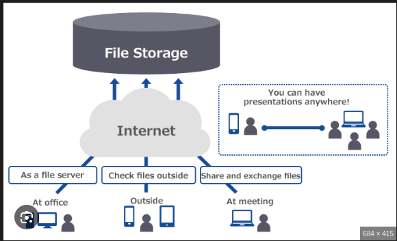
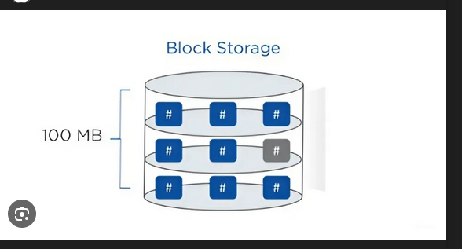
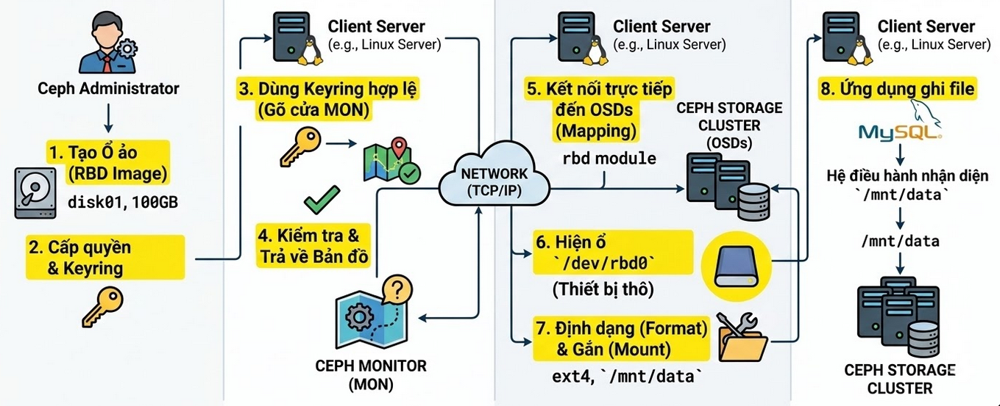
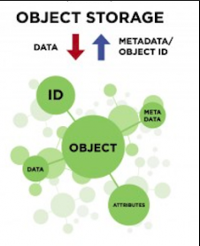
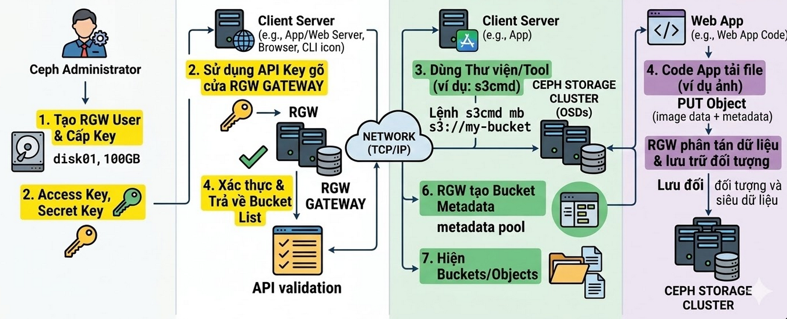
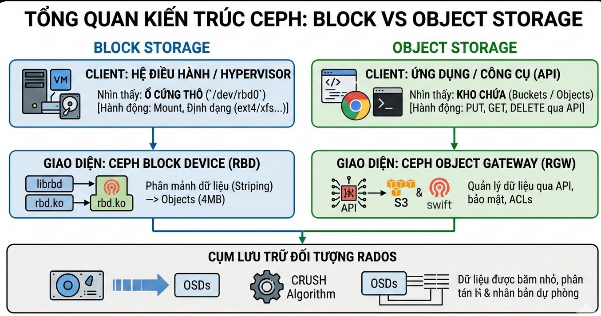

# Cloud Storage
  ## File Storage 

  

  1. Khái niệm
   - Là loại lưu trữ sử dụng cấu trúc thư mục truyền thống như trên máy tính hoặc server để lưu trữ, dược truy cập thông qua giao thức Server Message Block (SMB) trên Window hoặc NFS (Network File System) trên Linux
   - Trên Cloud đây là dịch vụ NAS (Network Attached Storage), thay vì bạn tự lập 1 con Linux cài NFS để mount vào thì nhà cung cấp Cloud đã làm hết cho bạn, bạn chỉ cần vào và dùng
  2. Ưu điểm 
   - Dễ chia sẻ tài nguyên cho nhiều người cùng lúc
   - Dễ sử dụng vì cấu trúc cây quen thuộc với người dùng
   - Sử dụng giao thức mạng phổ biến, không cần thêm client phúc tạp
  3. Nhược điểm
   - Tốc độ chậm, khi lên tới hành triệu file thì tìm kiếm sẽ khó khăn nên lúc đấy tốc độ sẽ rất chậm
   - Khó mở rộng khi hết dung lượng 
  ## Block Storage

   

  1. Khái niệm 
    - Là phương pháp lưu trữ cấp thấp. Block storage sẽ quản lý và luư trữ một cụm đơn vị gọi là các khối. Các khối này sẽ được gán 1 đia chỉ duy nhất, lưu trữ trảu đều ra máy và mỗi khối sẽ lưu một phần dữ liệu của file. Khi Client gửi thông tin request tới và muỗn truy xuất tệp, Khi requst đã được duyệt thánh block request, file sẽ tập hợp chúng lại và trả về máy

  2. Ưu  điểm
    - Hoạt động có độ trễ thấp 
    - Các block thường được sao chép trên các thiết bị nên đảm bảo rằng thiết bị dữ liệu có thể khôi phục được nếu bị hỏng
  3. Nhược điểm 
    - Có thể sẽ không mở rộng được quy mô sau khi đạt đến giới hạn của bộ nhớ
  4. Client trong Block Storage
    - Client thường là hệ điều hành hoặc hypervisor, nhìn thấy ổ cứng thô và thực hiện các thao tác mount, định dạng hệ thống tệp. Dữ liệu được băm nhỏ thành các object trước khi lưu trữ vào cụm RADOS.
    - Ví dụ cụ thể :
      - Hệ thống ảo hóa: QEMU, KVM dùng thư viện librbd để cắt không gian trên Ceph gắn trực tiếp vào VM làm ổ cứng
      - Openstack: Openstack Cinder và Openstack Nova đóng vai trò là client, gọi lệnh xuống Ceph để cấp phát ổ đĩa cho các instance
  5. Luồng để Client tới Disk

  
    
  -  Giai đoạn 1: Ceph sẽ tạo ổ đĩa ảo trống. Đê Client connect tới Ceph thì cần copy 2 file từ Ceph sang Client là file cấu hình `ceph.conf` chứa địa chỉ của các MON và file Keyring để cấp quyền hạn cho phép Client định danh và truy cập

  -  Giai đoạn 2: Khi đã có file cấu hình và Keyring, Client sẽ đọc cấu hình file `ceph.conf` để biết được địa chỉ các MON, sau đó sẽ gửi gói tin chứa Keyring hợp lệ để gửi đến MON, MON kiểm tra nếu Keyring hợp lệ sẽ gửi cho Client bản đồ CRUSH MAP

  -  Giai đoạn 3: Máy Client sẽ gọi module rbd thông qua Kernal Linux. Module này sẽ sử dụng CRUSH MAP để đọc và tính toán đường đi tới ổ đĩa ảo trống đã tạo trước đó. Thao tác này gọi là MAPPING và trên hệ điều hành sẽ nhận diện ổ cứng mới thường là `/dev/rbd0`
  
  -  Giai đoạn 4: Khi một ứng dụng được ghi xuống file `/dev/rbd0`, dữ liệu sẽ đi qua Block Layer của Linux đến module RBD. Lúc này RBD sẽ bắm nhỏ các luồng dữ liệu thành các object (có kích thước 4MB)

  - Giai đoạn 5: Khi file đã được băm nhỏ, Client sẽ chạy thuật toán CRUSH trực tiếp trên máy mình để thực hiện hàm băm `object --> PG --> OSD` để biết chính xác dữ liệu đang được OSD nào quản lý

  ## Object Storage

  

  1. Khái niệm
  - Là dạng lưu trữ hiện đại trong Cloud, lưu trữ dữ liệu dưới dạng Object trong 1 không gian phẳng (Flat namespace), nơi mà không có phân cấp thư mục 
  - Khi đó mỗi dữ liệu sẽ được chia thành các đối tượng riêng lẻ và được gắn mã định danh duy nhất. Mỗi đối tượng (object) sẽ gồm 3 thành phần chính:
   - Dữ liệu
   - Metadata
   - ID định danh
  2. Client trong Object Storage
   - Client là các ứng dụng, công cụ (API) tương tác trực tiếp qua API S3/Swift. Dữ liệu được quản lý dưới dạng các object trong các bucket, không sử dụng hệ thống tệp truyền thống.

  3. Luồng Client tới Disk của Object Storage
  
  
  
  - Giai đoạn 1: Ceph sẽ sử dụng RGW tạo một người dùng RGW User mới và tạo ra cặp chìa khóa API (access-key và secret-key)

  - Giai đoạn 2: Client (aws, swift, s3cmd) sẽ đi qua cổng 80 hoặc 443 (thường RGW sẽ đứng sau LB để đảm bảo tính HA).Client sử dụng cặp Access/Secret Key này để gọi đến RGW GATEWAY. RGW Gateway sẽ sử dụng giao thức RESTful API để nhận yêu cầu từ Client. Mỗi yêu cầu từ Client sẽ gôm 1 dãy số được tạo ra từ Secret-key. RGW sẽ kiểm tra chìa khóa và nếu hợp lệ, nó sẽ cho Client thực thi các lệnh trên nó

  - Giai đoạn 3: Client sử dụng một công cụ S3 hoặc một thư viện code (ví dụ Boto3) để gửi lệnh. Nó gửi lệnh tạo một Bucket. RGW Gateway xử lý lệnh, tạo siêu dữ liệu (metadata) của bucket và lưu trữ nó. Client sẽ thấy các Buckets/Objects (Folder và File) thông qua API.

  - Giai đoạn 4: Khi tải dữ liệu lên sử dụng thư viện API để gửi lệnh tải file lên (PUT Object) với dữ liệu ảnh và siêu dữ liệu đi kèm. Dữ liệu chạy qua mạng đến RGW Gateway. RGW Gateway tự động tiếp nhận dữ liệu, băm nhỏ và phân tán (nhân bản hoặc erasure coding) xuống các OSDs của Ceph Storage Cluster. Client không giao tiếp trực tiếp với OSD như Block Storage.

   

  ## So sánh
   | Tiêu chí | Object Storage | File Storage | Block Storage |
| :--- | :--- | :--- | :--- |
| **Cách tổ chức dữ liệu** | Dữ liệu được lưu trữ dưới dạng đối tượng (objects), cấu trúc phẳng (flat), không có thư mục. | Dữ liệu được tổ chức phân cấp trong các thư mục và tệp tin (hierarchical). | Dữ liệu được chia thành các khối (blocks) nhỏ, thô, quản lý bởi hệ điều hành máy chủ. |
| **Khả năng mở rộng** | Mở rộng linh hoạt, gần như không giới hạn (Scale-out). | Khó mở rộng khi dữ liệu tăng nhanh, thường giới hạn bởi thiết bị phần cứng. | Mở rộng dễ dàng nhưng chi phí cao, thường giới hạn bởi controller/mảng đĩa. |
| **Cách truy cập** | Truy cập thông qua API (RESTful) bằng mã định danh (ID) duy nhất. | Truy cập qua giao thức chia sẻ file (NFS, SMB) theo đường dẫn cụ thể. | Truy cập trực tiếp ở cấp độ khối thông qua hệ điều hành (như một ổ đĩa vật lý). |
| **Hiệu suất** | Tốc độ truy cập không cao bằng Block, độ trễ cao hơn nhưng băng thông lớn. | Tốc độ truy cập nhanh, phù hợp với hệ thống chia sẻ nội bộ, user truy cập đồng thời. | Hiệu suất rất cao (IOPS cao, độ trễ thấp), phù hợp giao tiếp trực tiếp với CPU. |
| **Chi phí lưu trữ** | Thấp nhất. Tiết kiệm chi phí cho dữ liệu lớn, khổng lồ. | Chi phí trung bình đến cao (do phần cứng NAS chuyên dụng). | Chi phí cao nhất (High performance SAN/SSD). |
| **Ứng dụng chính** | Lưu trữ backup, archive, static web, dữ liệu phi cấu trúc (video, ảnh, IoT). | Lưu trữ tệp chia sẻ văn phòng, thư mục home directory, repository code. | Cơ sở dữ liệu (Database), ổ đĩa boot cho máy ảo (VM), ứng dụng mission-critical. |
