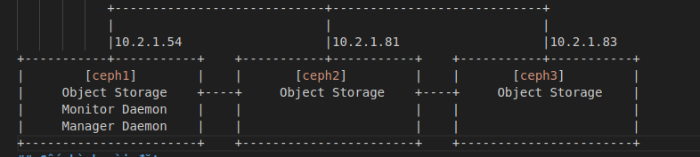
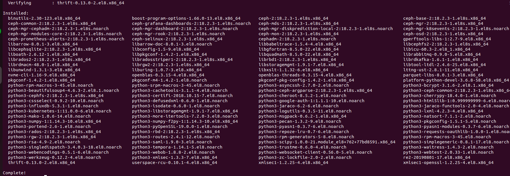
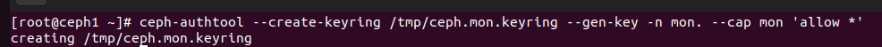
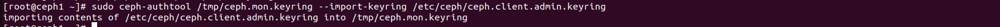
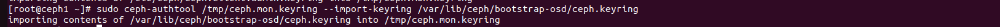
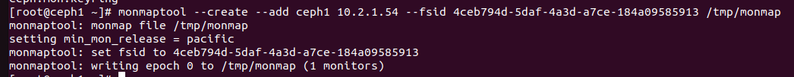

# Triển khai cụm Ceph (ceph-manual)
## Chuẩn bị 

 

## Cấu hình cài đặt
- Tạo ssh key trên ceph1:
```sh
ssh-keygen
```
- Chỉnh sửa file ~/.ssh/config để đăng nhập không cần pass root
```sh
Host ceph1
    Hostname ceph1
    User root
Host ceph2
    Hostname ceph2
    User root
Host ceph2
    Hostname ceph2
    User root
```
- Chỉnh quyền cho file config 
```sh
  chmod 777 ~/.ssh/config
```
- Copy SSH sang máy khác:
```sh
ssh-copy-id ceph1
ssh-copy-id ceph2
ssh-copy-id ceph3
```
- Trên tất cả các node cài đặt Ceph:
```sh
dnf install centos-release-ceph-reef epel-release
dnf install ceph
```
 

- Tạo mã uuidgen (đây là mã để định danh cụm, uuidgen sẽ tạo ra một mã bất kì mà rất ít khả năng trùng trên thế giới) (ở bản 18 trở đi ceph sẽ tự tạo)
```sh
uuidgen
```
 

- Cấu hình file config trong /etc/ceph/config trên ceph1
```sh 
[global]
        fsid = 4ceb794d-5daf-4a3d-a7ce-184a09585913
        mon_host = [v2:10.2.1.54:3300/0,v1:10.2.1.54:6789/0] [v2:10.2.1.81:3300/0,v1:10.2.1.81:6789/0] [v2:10.2.1.83:3300/0,v1:10.2.1.83:6789/0]
        public_network = 10.2.1.0/24
        cluster_network = 10.2.1.0/24
        mon_initial_members = ceph1
        [mon.node01]
        host = node1
        mon_addr = 10.2.1.54
        mon allow pool delete = true

```
- Tạo keyring cho MON
```sh 
ceph-authtool --create-keyring /tmp/ceph.mon.keyring --gen-key -n mon. --cap mon 'allow *'
```

 

- Tạo keyring cho ADMIN (Một số phiên bản sẽ tự tạo keyring admin. Vào ls /etc/ceph để xem có không):
```sh
sudo ceph-authtool --create-keyring /etc/ceph/ceph.client.admin.keyring --gen-key -n client.admin --cap mon 'allow *' --cap osd 'allow *' --cap mds 'allow *' --cap mgr 'allow *'
```
- Tạo keyring cho bootstrap
```sh
sudo ceph-authtool --create-keyring /var/lib/ceph/bootstrap-osd/ceph.keyring --gen-key -n client.bootstrap-osd --cap mon 'profile bootstrap-osd' --cap mgr 'allow r'
```

 

- Tạo keyring cho mgr
```sh
ceph auth get-or-create mgr.ceph1 mon 'allow profile mgr' osd 'allow *' mds 'allow *'
```
- Tạo thư mục cho Manager và cấp quyền thư mục
```sh
mkdir /var/lib/ceph/mgr/ceph-ceph1
chmod 777 -R /var/lib/ceph/mgr/ceph-ceph1
```
- Tạo và chuyển keyring của mgr vào trong thư mục /etc/ceph/ceph.mgr.admin.keyring
```sh
ceph auth get-or-create mgr.ceph1 > /etc/ceph/ceph.mgr.admin.keyring
```
- Chuyển ceph.mgr.admin.keyring thành keyring trong /var/lib/ceph/mgr/ceph-ceph1/
```sh
cp /etc/ceph/ceph.mgr.admin.keyring /var/lib/ceph/mgr/ceph-ceph1/keyring
```

- Import keyring của MON vào 1 file duy nhất trong thư mục /etc/ceph/ceph.client.admin.keyring
```sh
sudo ceph-authtool /tmp/ceph.mon.keyring --import-keyring /etc/ceph/ceph.client.admin.keyring
```

 

- Import keyring của MON vào file bootstrap để khi xin tạo OSD không cần xin key:
```sh
sudo ceph-authtool /tmp/ceph.mon.keyring --import-keyring /var/lib/ceph/bootstrap-osd/ceph.keyring
```
 

- Tạo monmaptool để có thể quản lý và liên lạc được với các monitor trong cụm 
```sh
monmaptool --create --add ceph1 10.2.1.54 --fsid 4ceb794d-5daf-4a3d-a7ce-184a09585913 /tmp/monmap
```

 

- Tạo thư mục cho Monitor Daemon và cấp quyền thư mục
```sh
mkdir /var/lib/ceph/mon/ceph-ceph1
chmod 777 -R /var/lib/ceph/mon/ceph-ceph1
```
- Khởi tạo MON 
```sh 
ceph-mon  --mkfs -i ceph1 --monmap /tmp/monmap --keyring /tmp/ceph.mon.keyring 
```
- Bật mgr2
```sh
ceph mon enable-msgr2 
```

TRÊN TẤT CẢ CÁC NODES
- Cài đặt ceph-volume
```sh
dnf -y install ceph-volume --nobest
```

 


- Làm sạch ổ đĩa 
```sh
sudo lsblk -f /dev/vdb
sgdisk --zap-all /dev/vdb
```
- Add ổ đĩa vào cụm
```sh
ceph-volume lvm create --data /dev/vdb
```

 

- Copy file /var/lib/ceph/bootstrap-osd/ceph.keyring từ node 1 sang các node còn lại:
```sh 
scp /var/lib/ceph/bootstrap-osd/ceph.keyring root@10.2.1.81:/var/lib/ceph/bootstrap-osd
scp /var/lib/ceph/bootstrap-osd/ceph.keyring root@10.2.1.83:/var/lib/ceph/bootstrap-osd
```
- Copy file /etc/ceph/ceph.conf và /etc/ceph/ceph.client.admin.keyring từ node 1 sang các node còn lại:
```sh 
scp /etc/ceph/ceph.conf root@10.2.1.81:/etc/ceph/
scp /etc/ceph/ceph.conf root@10.2.1.83:/etc/ceph/
scp /etc/ceph/ceph.client.admin.keyring root@10.2.1.81:/etc/ceph/
scp /etc/ceph/ceph.client.admin.keyring root@10.2.1.83:/etc/ceph/
```
-Bật chức năng Dashboard:
```sh
   ceph mgr module enable dashboard --force   
```
-Tạo chứng chỉ HTTPS:
```sh
    ceph dashboard create-self-signed-cert 
```
-Đặt tài khoản và password cho Ceph:
```sh
    echo 'Kh12072004@' > dashboard-pwd.txt 
    ceph dashboard set-login-credentials admin -i dashboard-pwd.txt
```
-Restart lại dịch vụ ceph-mrg:
```sh
    systemctl restart ceph-mgr@ceph1  
    systemctl restart ceph-mgr@ceph2
    systemctl restart ceph-mgr@ceph3
