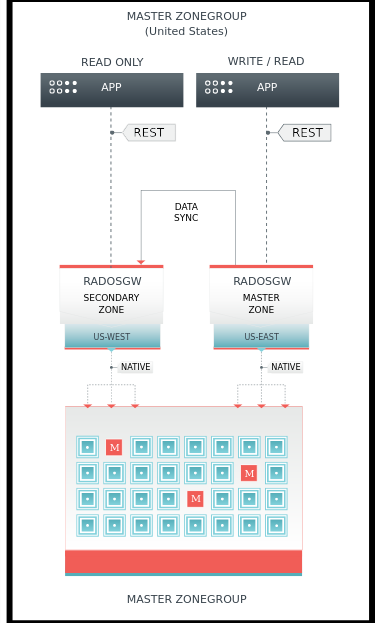
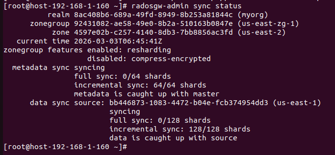

# Triển Khai Ceph Multisite



## 1. Trên Zone A 
Bước 1: Thiết lập Realm và Master Zonegroup
```sh
  # 1. Tạo realm
  radosgw-admin realm create --rgw-realm=myorg --default

  # 2. Tạo zonegroup (Đúng tên us-east-zg-1 mà log đang báo thiếu)
  radosgw-admin zonegroup create --rgw-zonegroup=us-east-zg-1 --endpoints=http://192.168.1.70:8000 --master --default

  # 3. Tạo zone
  radosgw-admin zone create --rgw-zonegroup=us-east-zg-1 --rgw-zone=us-east-1 --master --default

```
Bước 2: Tạo System User để đồng bộ dữ liệu
```sh
radosgw-admin user create --uid=ADMIN --display-name="sync-user " --system
```
Bước 3: Nhập access_key và secret_key vào Zone và ZoneGroup
```sh
radosgw-admin zonegroup modify --rgw-zonegroup=myzonegroup --access-key=ACCESS_KEY --secret=SECRET_KEY
radosgw-admin zone modify --rgw-zone=zone-a --access-key=ACCESS_KEY --secret=SECRET_KEY
```
Bước 4: Update áp dụng thay đổi
```sh
  radosgw-admin period update --commit
```
Bước 5: Trên Zone B cấu hình Pull Realm từ Zone A và tạo Secondary Zone
- Pull Realm:
```sh
radosgw-admin realm pull --url=http://10.2.6.128:8000 --access-key=ACCESS_KEY --secret-key=SECRET_KEY --default
```
- Tạo Secondary Zone:
```sh
radosgw-admin zone create --rgw-zonegroup=myzonegroup --rgw-zone=zone-b --endpoints=http://10.2.6.129:8000 --access-key=ACCESS_KEY --secret-key=SECRET_KEY --default
```
- Restart
```sh
  radosgw-admin period update --commit
```
Bước 6: Kiểm tra xem hoạt động của 2 Zone
- Xem trạng thái:
```sh
radosgw-admin sync status
```


