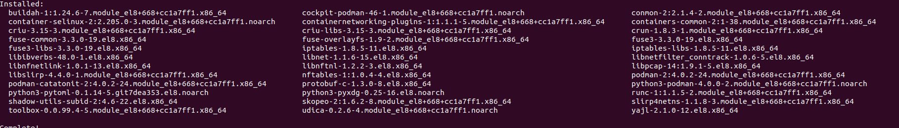
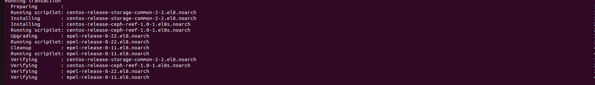
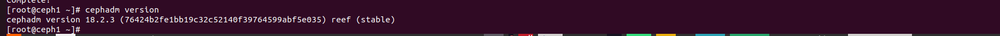
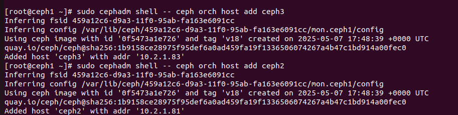

# Triển khai cụm Ceph (cephadm)
## Chuẩn bị 
 
 

## Cấu hình cài đặt
- Trên tất cả các node:
```sh
   dnf install -y python3 python3-pip git
```
-Cài đặt chrony trên tất cả các node để đồng bộ thời gian
```sh
   yum install chrony -y
```
-Trên tất cả các node thêm cấu hình file /etc/hosts:
```sh
   10.2.1.54 ceph1
   10.2.1.81 ceph2     
   10.2.1.83 ceph3
```
- Cài đặt Podman để triển khai container trên tất cả các nodes:
```sh
dnf module -y reset container-tools #Tắt module đang enable
dnf module -y enable -y container-tools:4.0 #stream 4.0 cho container-tools
dnf module -y install container-tools:4.0/common #Cài container tool
```



- Thêm repo để cài cephadm 
```sh
dnf install centos-release-ceph-reef epel-release 
```



- Cài đặt Cephadm
```sh
dnf install cephadm
```


- Khởi tạo cụm Ceph
```sh
cephadm bootstrap --mon-ip 10.2.1.54 --allow-fqdn-hostname #dqdn cho phép dạng hostname ngắn  
```
- Trên ceph1 tạo ssh-keygen
```sh
   ceph shell #Lệnh này để vào container
   ceph cephadm get-pub-key > /etc/ceph/ceph.pub #Tạo key 
   ssh-copy-id -f -i /etc/ceph/ceph.pub root@10.2.1.81 
   ssh-copy-id -f -i /etc/ceph/ceph.pub root@10.2.1.83

```
- Add node ceph2 và ceph3 vào cụm 
```sh
  cephadm shell -- ceph orch host add ceph2
  cephadm shell -- ceph orch host add ceph3
```



- Làm sạch phân vùng ổ đĩa trên tất cả các node
```sh
sudo lsblk -f /dev/vdb
sgdisk --zap-all /dev/vdb
```
- Add osd
```sh
cephadm shell ceph orch daemon add osd ceph1:/dev/vdb
cephadm shell ceph orch daemon add osd ceph2:/dev/vdb
cephadm shell ceph orch daemon add osd ceph3:/dev/vdb
```


- Check cụm
```sh
cephadm shell ceph -s
```


- Truy cập trang 10.2.1.54:8443


