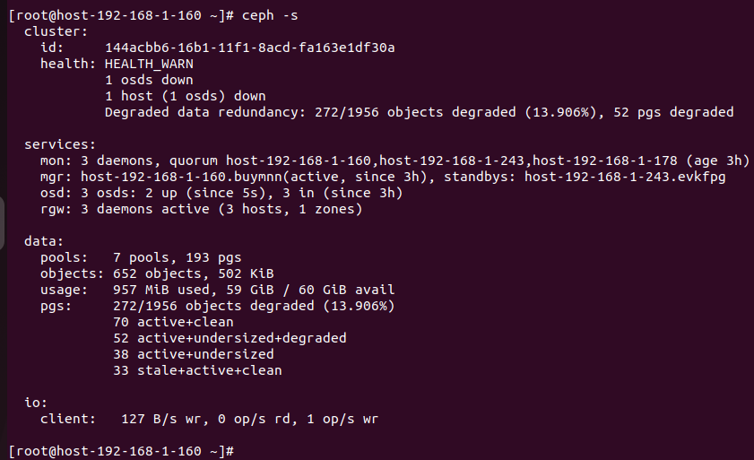
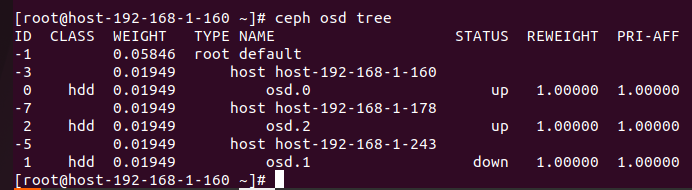
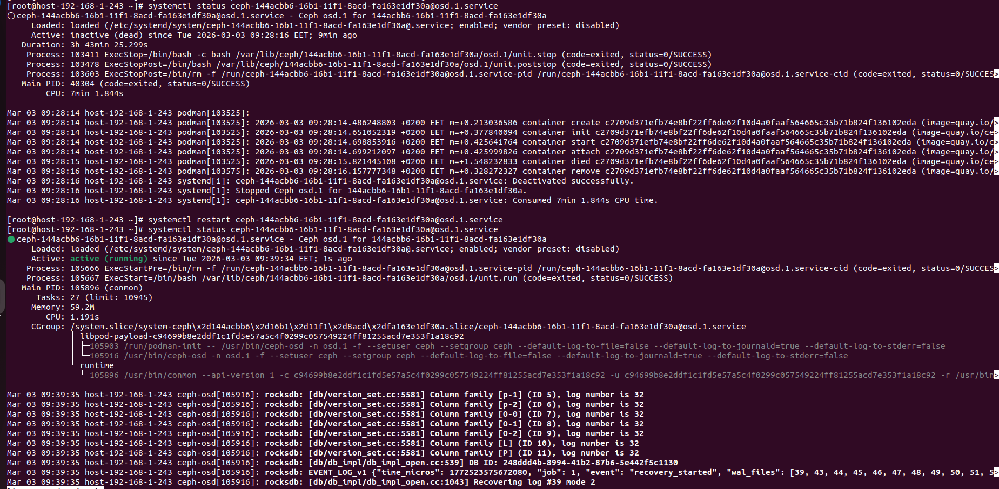
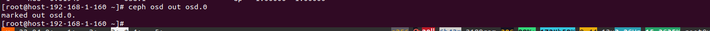
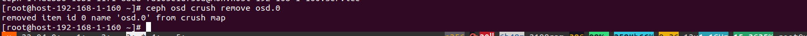
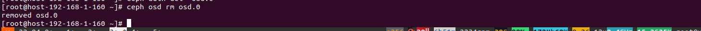

# Quy trình xử lý, các bước thực hiện khi có OSD lỗi

Bước 1: Kiểm tra trạng thái trước
```sh
ceph -s
```


Bước 2: Khi thấy báo lỗi osd down, phải xác định được osd down đấy nằm trên máy nào
```sh
ceph osd tree
```


Bước 3: Khi đã xác định được osd nằm trên server nào, vào server đấy để kiểm tra. Sẽ có 2 trường hợp:
- TH1: Hỏng phần mềm (Lỗi các dịch vu, OOM Killer)
  - Check xem dịch vụ chạy osd có bị tắt hay lỗi gì không, nếu có xem log và bật lại
```sh
  systemctl status ceph-144acbb6-16b1-11f1-8acd-fa163e1df30a@osd.1.service
  systemctl restart ceph-144acbb6-16b1-11f1-8acd-fa163e1df30a@osd.1.service
```


- TH2: Lỗi phần cứng 
  - Bước 1: Đánh dấu out vào osd bị lỗi
```sh
ceph osd out <osd_id>
```


  - Bước 2: Dừng dịch vụ osd lại
```sh
systemctl stop status ceph-144acbb6-16b1-11f1-8acd-fa163e1df30a@osd.0.service
```
  - Bước 3: Xóa osd ra khỏi CRUSH MAP
```sh
ceph osd crush remove <osd_id>
```


  - Bước 4: Xóa auth của osd
```sh
ceph auth del <osd_id>
```
  - Bước 5: Xóa osd
```sh
ceph osd rm <osd_id>
```


  - Bước 6: Cắm lại osd mới, xác định tên của ổ đĩa mới bằng `lsblk` 
  - Bước 7: Tạo OSD mới 
```sh
sudo ceph-volume lvm zap /dev/vdc --destroy # zap lại ổ đĩa
ceph orch daemon add osd host-192-168-1-160:/dev/vdc
```