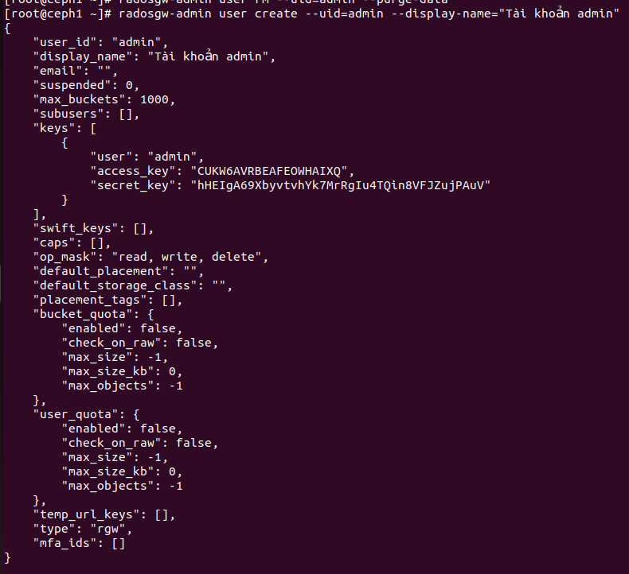
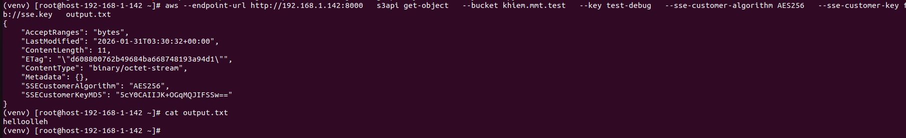
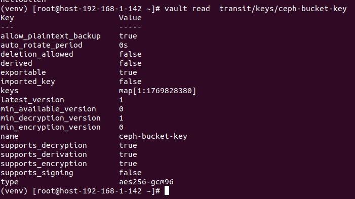

# Xây dựng hệ thống lưu trữ đối tượng an toàn: Tích hợp mã hóa SSE (Server-Side Encryption) trên Ceph RGW với Backend Vault.

## SSE-S3
1. Khái niệm
- SSE-S3 (Server-Side Encryption with S3-Managed Keys) là phương thức mã hóa phía máy chủ trong đó hệ thống lưu trữ (Object Storage Service) chịu trách nhiệm toàn trình về việc quản lý khóa, thực hiện mã hóa dữ liệu trước khi lưu xuống đĩa cứng (Data at Rest) và giải mã dữ liệu khi có yêu cầu truy xuất hợp lệ.
- Trong mô hình này, người dùng (Client) không cần phải quản lý hoặc lưu trữ các khóa mã hóa. Thay vào đó, mỗi đối tượng (Object) khi được tải lên (PUT) sẽ được hệ thống tự động mã hóa bằng một khóa duy nhất.
- SSE-S3 sử dụng thuật toán AES-256 
2. Cơ chế hoạt động 
- Hệ thống sử dụng hai cấp độ khóa chính:
  - Data Key (Khóa dữ liệu): Khóa dùng để mã hóa trực tiếp dữ liệu của đối tượng (Object payload). Mỗi đối tượng sẽ có một Data Key riêng biệt.
  - Master Key (Khóa chủ): Khóa dùng để mã hóa chính cái Data Key đó. Master Key được quản lý nội bộ bởi hệ thống lưu trữ và thường được xoay vòng (rotated) định kỳ để tăng cường bảo mật.
- Quá trình ghi dữ liệu: 
  - Khi một yêu cầu PUT được gửi kèm header x-amz-server-side-encryption: AES256, hệ thống sẽ thực hiện các bước sau:
    - Tạo khóa: Hệ thống sinh ra một Data Key ngẫu nhiên (dạng plaintext).
    - Mã hóa dữ liệu: Sử dụng Data Key plaintext để mã hóa dữ liệu người dùng tải lên thông qua thuật toán AES-256 GCM hoặc CBC.
    ```sh
                        Ciphertext=EDataKey​(Plaintext)
    ```
    - Mã hóa khóa: Sử dụng Master Key của hệ thống để mã hóa Data Key.
    ```sh
                        EncryptedDataKey=EMasterKey​(DataKey)
    ```
    - Xóa khóa tạm: Data Key dạng plaintext bị xóa ngay lập tức khỏi bộ nhớ (memory) sau khi quá trình mã hóa hoàn tất.
    - Lưu trữ: Hệ thống lưu trữ Ciphertext (dữ liệu đã mã hóa) cùng với EncryptedDataKey (dưới dạng metadata của đối tượng) xuống hạ tầng vật lý.
- Quá trình đọc dữ liệu:
  - Khi người dùng có quyền truy cập gửi yêu cầu GET:
    - Truy xuất: Hệ thống tìm kiếm đối tượng và đọc metadata để lấy EncryptedDataKey.
    - Giải mã khóa: Hệ thống sử dụng Master Key nội bộ để giải mã EncryptedDataKey, khôi phục lại Data Key plaintext.
    - Giải mã dữ liệu: Sử dụng Data Key plaintext để giải mã phần dữ liệu Ciphertext.
                        Plaintext=DDataKey​(Ciphertext)
    - Trả về: Dữ liệu dạng plaintext được trả về cho người dùng qua đường truyền.
## SSE-KMS
1. Khãi niệm 
- SSE-KMS là phương thức mã hóa dữ liệu tại máy chủ (Server-Side Encryption), trong đó việc quản lý các khóa mã hóa được thực hiện bởi một dịch vụ quản lý khóa (KMS) riêng biệt.
  - Server-Side: Quá trình mã hóa và giải mã diễn ra hoàn toàn tại Gateway (ví dụ: RGW). Client gửi dữ liệu thô qua HTTPS, và Gateway sẽ xử lý phần còn lại.
  - KMS: Các khóa mã hóa không được lưu trữ cùng với dữ liệu mà nằm trong một hệ thống bảo mật chuyên dụng như HashiCorp Vault.
2. Cơ chế hoạt động
- Quy trình mã hóa dữ liệu thường tuân theo kỹ thuật Envelope Encryption (Mã hóa phong bì):
  - Gửi yêu cầu: Client gửi lệnh PUT object kèm header yêu cầu mã hóa SSE-KMS (ví dụ: x-amz-server-side-encryption: aws:kms).
  - Yêu cầu khóa: RGW gửi yêu cầu đến Vault để lấy một khóa mã hóa dữ liệu (Data Key).
  - Tạo khóa: Vault sử dụng Khóa chính (Master Key) để tạo ra Data Key.
  - Mã hóa: RGW nhận Data Key, dùng nó để mã hóa Object.
  - Lưu trữ: Dữ liệu đã mã hóa được lưu vào OSD, trong khi bản thân Data Key cũng được mã hóa (bằng Master Key của Vault) và lưu trữ cùng metadata của Object.
    Lưu ý: Khi cần đọc dữ liệu (GET), RGW sẽ gửi Data Key đã mã hóa quay lại Vault để giải mã trước khi có thể dùng nó để giải mã Object gốc.
3. Thành phần trong SSE-KMS
- Secrets Engine (Công cụ lưu trữ)
  - KV (Key/Value) Engine: RGW truy cập trực tiếp vào các secret được lưu dưới dạng key-value.
  - Transit Engine: Đây là phương thức được khuyến nghị. Vault đóng vai trò là "Encryption as a Service", RGW gửi dữ liệu cần mã hóa/giải mã cho Vault mà không bao giờ trực tiếp cầm khóa gốc.
- Cơ chế xác thực (Authentication)
  - Token: Sử dụng một chuỗi token cố định (ít bảo mật hơn vì token có thể hết hạn hoặc bị lộ).
  - Vault Agent: Chạy như một sidecar hoặc daemon trên node RGW để tự động lấy và làm mới token (Auto-auth), tăng tính an toàn và ổn định.
## SSE-C
1. Khái niệm
- SSE-C cho phép bạn tự quản lý các khóa mã hóa của mình. Khi upload hoặc download dữ liệu, bạn phải gửi kèm khóa mã hóa trong yêu cầu HTTP. Hệ thống lưu trữ (như Ceph RGW) sẽ sử dụng khóa đó để thực hiện mã hóa/giải mã và sau đó tự hủy khóa khỏi bộ nhớ tạm, không lưu trữ khóa trong hệ thống.
2. Cách hoạt động 
- Quá trình Upload (PUT)
  - Client: Gửi đối tượng (Object) kèm theo khóa mã hóa (256-bit AES key) qua kết nối HTTPS bảo mật.
  - RGW: Nhận khóa từ header, thực hiện mã hóa dữ liệu.
  - Lưu trữ: Dữ liệu đã mã hóa được lưu vào OSD. RGW tính toán mã hash (salted HMAC) của khóa để đối chiếu sau này nhưng không lưu bản thân cái khóa đó.
  - Hủy khóa: RGW xóa khóa khỏi bộ nhớ sau khi hoàn tất.
- Quá trình Download (GET)
  - Client: Gửi yêu cầu lấy Object kèm đúng khóa đã dùng khi upload.
  - RGW: Kiểm tra mã hash của khóa gửi lên có khớp với metadata lưu kèm Object không.
  - Giải mã: Nếu khớp, RGW giải mã dữ liệu và trả về cho Client.
3. Yêu cầu về Header
- Khi làm việc SSE-C, Client phải cung cấp 3 header bắt buộc:
  - x-amz-server-side-encryption-customer-algorithm: Phải là AES256.
  - x-amz-server-side-encryption-customer-key: Khóa mã hóa dạng Base64.
  - x-amz-server-side-encryption-customer-key-MD5: Mã MD5 của khóa để đảm bảo khóa không bị lỗi trong quá trình truyền tải.
## Hashicorp Vault
1. Khái niệm
- Là một công cụ mã nguồn mở được thiết kế để quản lý các thông tin bí mật (Secrets) và bảo vệ dữ liệu nhạy cảm trong các hạ tầng hiện đại. 
Tức là thay vì lưu trữ mật khẩu hay khóa mã hóa rải rác trong mã nguồn hoặc file cấu hình, Vault đóng vai trò là một "pháo đài số" tập trung, nơi mọi truy cập đều được xác thực và ghi nhật ký (audit log) nghiêm ngặt. 
- Các chức năng chính của Vault:
  - Quản lý bí mật (Secrets Management): Lưu trữ an toàn các token, mật khẩu, khóa API và chứng chỉ.
  - Mã hóa như một dịch vụ (Encryption as a Service): Cung cấp API để ứng dụng gửi dữ liệu lên và nhận lại dữ liệu đã mã hóa mà không cần ứng dụng phải trực tiếp xử lý khóa.
  - Bí mật động (Dynamic Secrets): Tự động tạo ra các tài khoản/mật khẩu có thời hạn (ví dụ cho AWS hoặc Database) và tự hủy khi hết hạn, giúp giảm thiểu rủi ro lộ lọt thông tin.
  - Quản lý khóa (Key Management): Lưu trữ và thực hiện các thao tác xoay vòng khóa (rotation) cho các hệ thống như Ceph hoặc các nền tảng đám mây khác. 
## Triển khai và tạo dịch vụ RGW
Bước 1: Tạo user cho bucket và lấy access_key và secret_key
 - Tạo tài khoản, xem access_key và secret_key:
```sh
radosgw-admin user create --uid=admin --display-name="Tài khoản admin"
```


 - Lưu thông tin của access_key và secret_ket
 - Nếu quên ta có thể  lấy `access_key` và `secret_key`:
  - Liệt kê user:
```sh 
  radosgw-admin user list
  ```
  - Xem chi tiết từng user và lấy `access_key`, `secret_key`
```sh
  rgwosgw-admin user info --uid=admin
  ```
Bước 2: Khởi động và tạo dịch vụ RGW của Ceph
 - Enable service rgw
```sh
ceph mgr module enable rgw
```
 - Tạo tên miền, vùng
```sh
ceph orch apply rgw sse --realm=myorg --zonegroup=us-east-zg-1 --zone=us-east-1 --placement="3 ceph1 ceph2 ceph3" --port=8000
```
Bước 3: Cài đặt, configure aws-cli để config bucket
** Lưu ý cài bản aws-cli v2 trở lên trong môi trường python3.9 trở lên để hỗ trợ đầy đủ thư viện boto3
- Cài đặt aws-cli
```sh
sudo yum remove awscli
curl "https://awscli.amazonaws.com/awscli-exe-linux-x86_64.zip" -o "awscliv2.zip"
unzip awscliv2.zip
sudo ./aws/install
aws --version
```

- Configure aws-cli (Điền access_key và secret_key như trên đã lưu lại)
```sh
aws configure
```


- Cài đặt 
Bước 4: Tạo bucket với aws-cli tại endpoint cụ thể: 
```sh
aws --endpoint-url http://10.2.1.54:8000 s3api create-bucket --bucket khiem.mmt204.test --region us-east-1
aws s3 mb --endpoint http://10.2.1.54:8000 s3://khiem.mmt204.test --region us-east-1 
```


Bước 5: Tạo policy để bucket có thể truy cập public
```sh
vi public.json
{
  "Version":"2012-10-17",
  "Statement":[{
    "Sid":"PublicRead",
    "Effect":"Allow",
    "Principal":"*",
    "Action":["s3:GetObject","s3:ListBucket"],
    "Resource":[
      "arn:aws:s3:::khiem.mmt204.test",
      "arn:aws:s3:::khiem.mmt204.test/*"
    ]
  }]
}

```
Bước 6: Áp dụng policy cho bucket
```sh
aws   --endpoint-url http://10.2.6.110:8000   s3api put-bucket-policy   --bucket khiem.mmt204.test  --policy file://public-bucket.json
```
Bước 5: Tạo, put, get file vừa tạo qua dịch vụ S3
- Put dữ liệu lên
```sh
echo "hihi" >> test.txt
aws --endpoint http://10.2.6.110:8000 s3 cp test.txt s3://khiem.mmt204.test/test
aws s3api head-object --bucket khiem.mmt204.test --key test.txt --endpoint-url http://10.2.6.110:8000
 ```

- GET dữ liệu về: 
```sh
aws s3 cp s3://khiem.mmt204.test/test test.txt --endpoint-url http://10.2.6.110:8000
```


## Triển khai SSE-C
Bước 1: Tạo key mã hóa ngẫu nhiên 256 bits
```sh
openssl rand 32 > sse.key # mỗi byte có 8 bits thì 32*8=256 bits
```


Bước 2: Upload file
```sh
aws --endpoint-url http://10.2.6.110:8000 s3api put-object --bucket khiem.mmt204.test --key test-debug --body test.txt --sse-customer-algorithm AES256 --sse-customer-key fileb://sse.key ## không cần --sse-customer-key-md5 do khi dùng AWS CLI thì nó sẽ tự thêm header này vào request HTTP gửi cho RGW
```


Bước 3: Tải file về cần file có đúng file chứa key khi upload
```sh
aws --endpoint-url http://192.168.1.142:8000   s3api get-object   --bucket khiem.mmt.test   --key test-debug   --sse-customer-algorithm AES256   --sse-customer-key fileb://sse.key   output.txt
```


## Cài đặt và config Hashicorp Vault
Bước 1: Cài đặt
```sh
yum install yum-utils
yum-config-manager --add-repo https://rpm.releases.hashicorp.com/RHEL/hashicorp.repo
yum -y install vault
```
Bước 2: Cấu hình Vault trong `/etc/vault.d/vault.hcl`:
```sh
storage "file" {
  path = "/opt/vault/data"
}

listener "tcp" {
  address     = "10.2.1.54:8200"
  tls_disable = 1
}
api_addr = "http://10.2.1.54:8200"
ui = true
disable_mlock = true
```
Bước 3: Kiểm tra
```sh
export VAULT_ADDR="http://10.2.6.110:8200"
vault status
```


Bước 4: Lấy Unseal và root token
```sh
vault operator init
```


Bước 5: Nhập Unseal Vaule (3 lần) và mỗi lần nhập 1 loại Unseal khác nhau để giá trị unsteal process trả về 3/3
```sh
vault operator unseal
```

Bước 6: Đăng nhập và bật chế độ transit secret 
```sh
vault login
vault secrets enable transit
``` 


## Triển khai SSE-S3 và SSE-KMS 
Bước 1: Tạo key và policy để Ceph có quyền truy cập và export
```sh
vault write -f vault write -f transit/keys/ceph-bucket-key exportable=true allow_plaintext_backup=true ## Bật exportable và allow_plaintext_backup để cho phép export và cho phép backup plaintext
```


Bước 2: Tạo file `rgw-policy.hcl` policy cho phép Ceph gọi Vault để tìm đc Key để mã hóa
```sh
path "transit/export/encryption-key/ceph-bucket-key" {
  capabilities = ["read"]
}
path "transit/export/encryption-key/ceph-bucket-key/1" {
  capabilities = ["read", "update"]
}

# Cho phép encrypt
path "transit/encrypt/ceph-bucket-key" {
  capabilities = ["update"]
}
# Cho phép decrypt
path "transit/decrypt/ceph-bucket-key" {
  capabilities = ["update"]
}
# Cho phép đọc metadata của key
path "transit/keys/ceph-bucket-key" {
  capabilities = ["read"]
}
```
Bước 3: Áp dụng policy cho Vault
```sh
vault policy write rgw-policy rgw-policy.hcl
```
Bước 4: Cấu hình Ceph để có thể sử dụng dịch vụ SSE-S3 lưu trữ trên Vault
```sh
*** LƯU Ý TÊN SET: client.rgw + tên container ***
ceph config set client.rgw.sse.host-192-168-1-142.gcrljh rgw_crypt_default_encryption_key ceph-bucket-key
ceph config set client.rgw.sse.host-192-168-1-142.gcrljh rgw_crypt_sse_s3_backend vault
ceph config set client.rgw.sse.host-192-168-1-142.gcrljh rgw_crypt_sse_s3_vault_addr http://192.168.1.142:8200
ceph config set client.rgw.sse.host-192-168-1-142.gcrljh rgw_crypt_sse_s3_vault_auth token
ceph config set client.rgw.sse.host-192-168-1-142.gcrljh rgw_crypt_sse_s3_vault_prefix /v1/transit 
ceph config set client.rgw.sse.host-192-168-1-142.gcrljh rgw_crypt_sse_s3_vault_secret_engine transit 
ceph config set client.rgw.sse.host-192-168-1-142.gcrljh rgw_crypt_sse_s3_vault_token_file /etc/ceph/vault-root.token   
ceph config set client.rgw.sse.host-192-168-1-142.gcrljh rgw_crypt_sse_s3_kms_backend vault
ceph config set client.rgw.sse.host-192-168-1-142.gcrljh rgw_crypt_vault_addr http://192.168.1.142:8200
ceph config set client.rgw.sse.host-192-168-1-142.gcrljh rgw_crypt_vault_auth token
ceph config set client.rgw.sse.host-192-168-1-142.gcrljh rgw_crypt_vault_prefix /v1/transit 
ceph config set client.rgw.sse.host-192-168-1-142.gcrljh rgw_crypt_vault_secret_engine transit 
ceph config set client.rgw.sse.host-192-168-1-142.gcrljh rgw_crypt_vault_token_file /etc/ceph/vault-root.token  
```
Bước 5: Kiểm tra cấu hình
```sh
ceph config dump | grep rgw_crypt
```


Bước 6: Reset lại dịch vụ 
```sh
ceph orch restart rgw.sse
```
Bước 7: Vào container chứa dịch vụ rgw tạo file `/etc/ceph/vault-root.token`, copy token vào đó và chỉnh quyền 600 + own là ceph:ceph (quyền 600 quan trọng)

Bước 8 Upload file sử dụng sse-s3 và sse-ks
- Sử dụng aws-cli 
```sh
aws --endpoint-url http://192.168.1.142:8000 s3 cp test.txt s3://khiem.mmt.test/test   --sse AES256 #sse-s3
aws --endpoint-url http://192.168.1.142:8000 s3 cp test.txt s3://khiem.mmt.test/test   --sse aws:kms   --sse-kms-key-id ceph-bucket-key #sse-kms
```
- Sử dụng python boto3 (Sử dụng bản 3.11 trở lên)
```sh
*** SSE-S3 ***
import boto3
s3_client = boto3.client(
    's3',
    endpoint_url='http://192.168.1.142:8000',
    aws_access_key_id='4Z0I11STI5YXIHC4PCX2',
    aws_secret_access_key='mLaKyEA6t9YzzqaMRwLpZXLnQ4IOyYMrOx4z21fa',
    region_name='us-east-1'
)
def upload_with_sse_s3(bucket, key, data):
    response = s3_client.put_object(
        Bucket=bucket,
        Key=key,
        Body=data,
        ServerSideEncryption= 'AES256'
    )
    return response
upload_with_sse_s3('khiem.mmt.test', 'test.txt', 'Nội dung bảo mật')
```
```sh
*** SSE-KMS ***
import boto3
s3_client = boto3.client(
    's3',
    endpoint_url='http://10.2.1.54:8000',
    aws_access_key_id='EADBJIHZ3INBHZ9S73WA',
    aws_secret_access_key='45H2flJh9yy8bJSlhm02WAwWWXRpWivwCodritLv',
    region_name='us-east-1'
)
def upload_with_sse_s3(bucket, key, data):
    response = s3_client.put_object(
        Bucket=bucket,
        Key=key,
        Body=data,
        ServerSideEncryption= 'aws:kms',
        SSEKMSKeyId='ceph-bucket-key'
    )
    return response
upload_with_sse_s3('khiem.mmt2004.test', 'test1.txt', 'Nội dung bảo mật')
```
