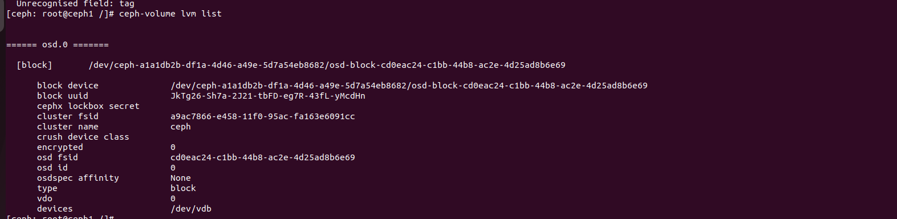

# LVM TAG
## 1. Khái niệm
 - Là sử dụng các tags của LVM để Ceph có thể tự động nhận diện, quản lý và kích hoạt các thiết bị lưu trữ tạo thành OSD
## 2. Thành phần của LV trong OSD và Tags của chúng
 - Trong OSD, `ceph-volume` sẽ tạo thành các LV riêng lẻ, đánh dấu từng thành phần trong nó 
 - Các thành phần:
   - LV dữ liệu (Block data): là nơi lưu trữ dữ liệu thật nằm trên HDD
     - Tags: 
       - ceph.type = block #Vai trò đóng data
       - ceph.osd.id 0     #Thuộc về osd.0
       - ceph.db_device= /dev/ceph-vg/db-lv # Chỉ đường dẫn tới DB của nó
   - LV chứa Metadata (RocksDB): là nơi lưu trữ metadata của BlueStore để truy xuất nhanh và nằm trên SSD
     - Tags:
       - ceph.type = db # Vai trò làm Database 
       - ceph.osd_id = 0  #Thuộc về osd.0
       - ceph.osd_fsid = <UUID giống hệt block>
   - LV chứa WAL: nằm trên NVMe
     - Tags:
       - ceph.type = wal
       - ceph.osd_id = 0

