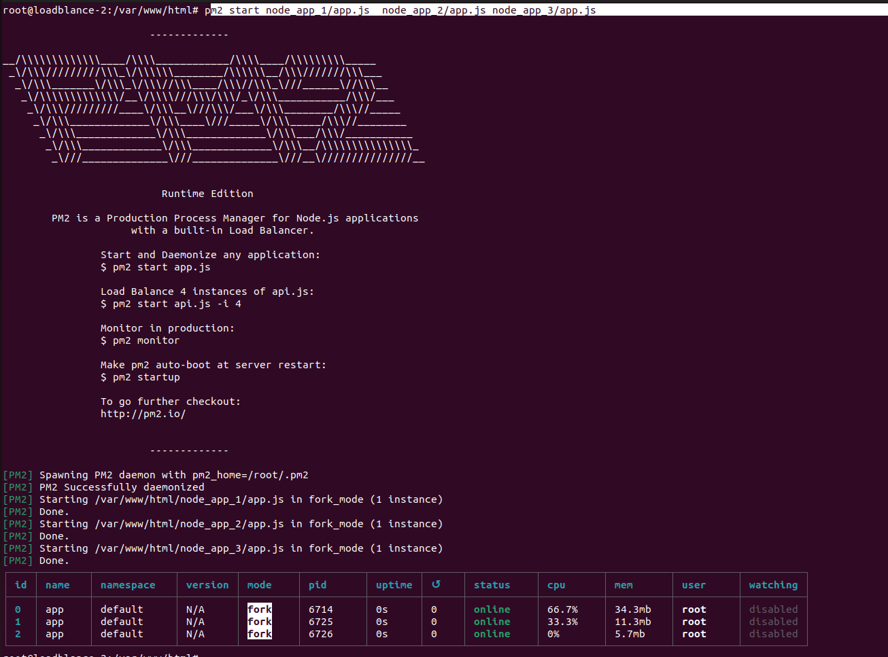
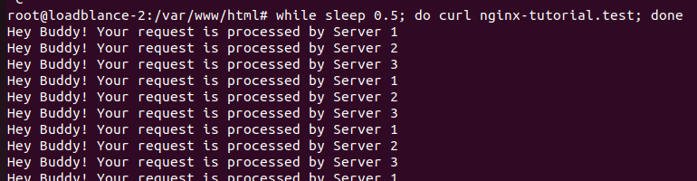

# Load balancer
## Khái niệm
### 1. Nginx
- Là một mã nguồn mở dùng để làm máy chủ web, proxy ngược, cân bằng tải và bộ nhớ đệm HTTP
- Có thể xử lý được hàng chục triệu kết nối với mức sử dụng bộ nhớ cực thấp nhờ kiến trúc hướng sự kiện (event-driven)
- Chức năng chính:
  - Web Server: Phục vụ nội dung tĩnh với tốc độ rất cao
  - Reverse Proxy: Đóng vai trò trung gian để gửi yêu cầu từ người dùng về các máy chủ ứng dụng
  - Cân bằng tải: Phân phối lưu lượng truy cập cho nhiều máy khác nhau để tránh quá tải và tăng độ tin cậy 
### 2. Haproxy
- Là phần mềm mã nguồn mở dùng để cân bằng tải, reverse proxy cho các ứng dụng dựa trên HTTP, TCP
- Là máy chủ trung gian đứng giữa người dùng và các máy chủ backend giúp điều phối lưu lượng truy cập đều giữa các máy chủ để đảm bảo không quá tải
- Có thể xử lý được tới 2 triệu yêu cầu mỗi giây
- Tính năng cốt lỗi: 
 - Cân bằng tải lớp 4 và 7: Điều hướng lưu lượng dựa trên thông tin kết nối hoặc nội dung ứng dụng
 - Health Check nâng cao: Liên tục kiểm tra trạng thái máy chủ backend và tự động loại bỏ các máy chủ lỗi ra khỏi hệ thống
 - Bảo mật: Giới hạn tốc độ và chống DDOS
### 3. Các thuật toán trong load balancer
- Round Robin: Các request sẽ được phân phối tuần tự cho 1 nhóm server
- Weighted Round Robin: Dựa trên thuật toán Round Robin, người quản trị có thể cấu hình và dựa vào khả năng sử lý request của từng server,đánh thứ tự ưu tiên cho từng server và request sẽ gửi tới từng server theo độ ưu tiên của chúng
- Least Connection: Request sẽ được gửi tới server ít được kết nối nhất 
- Weighted Least Connection: Request sẽ được gửi cho server có tốc độ phản hồi response cao nhất và ít kết nối nhất
- IP Hash: Phân phối request dựa trên địa chỉ IP của Client (Các request từ Client có cùng IP luôn được chuyển tới cùng 1 backend server)
### So sánh

| Tiêu chí | HAProxy | Nginx |
| :--- | :--- | :--- |
| **Chức năng chính** | Load Balancer TCP/HTTP, reverse proxy chuyên sâu | Web server, reverse proxy, caching, load balancing cơ bản |
| **Layer** | Layer 4 (TCP) & Layer 7 (HTTP/HTTPS) | Layer 7 (HTTP/HTTPS) |
| **Tối ưu traffic** | Tối ưu cho **load balancing**, phân phối request đều, hỗ trợ sticky session, failover | Tối ưu cho **web content**: tĩnh, caching, SSL termination |
| **Hiệu suất** | Xử lý hàng trăm nghìn kết nối đồng thời, latency thấp | Hiệu suất tốt cho HTTP nhưng nếu high concurrent TCP traffic → không bằng HAProxy |
| **Health check** | Hỗ trợ kiểm tra trạng thái backend rất mạnh, realtime | Hỗ trợ cơ bản, ít tùy chỉnh |
| **SSL/TLS** | Termination hoặc passthrough, nhưng không cache file | Termination, cache file, dễ cấu hình HTTPS |
| **Use case phổ biến** | - Load balance OpenStack API, database proxy, mail servers, TCP services | - Web server, Static content serving, API Gateway, Kubernetes Ingress |

# Triển khai loadbalance
## Nginx 
### Mô tả
- Tạo ra 3 web server và cấu hình Nginx để cân bằng tải chúng
### Cấu hình 
- Dùng npm tạo mô phỏng 3 web server
```sh
apt install npm -y
cd /var/html/www
mkdir node_app_1
cd node_app_1
npm install express
nano app.js
cd ..
mkdir node_app_2
cd node_app_2
npm install express
nano app.js
cd ..
mkdir node_app_3
cd node_app_3
npm install express
nano app.js
```
- Trong `app.js` cấu hình:
```sh
#app_1
app.get('/', (req, res) => res.send('Hey Buddy! Your request is processed by Server 1\n'));
app.listen(3000, () => console.log('Server is running on port 3000!'));
#app_2
app.get('/', (req, res) => res.send('Hey Buddy! Your request is processed by Server 1\n'));
app.listen(3000, () => console.log('Server is running on port 3001!'));
#app_3
app.get('/', (req, res) => res.send('Hey Buddy! Your request is processed by Server 1\n'));
app.listen(3000, () => console.log('Server is running on port 3002!'));
```
- Vào lại thư mục `/var/html/www`
```sh
npm install pm2
pm2 start node_app_1/app.js  node_app_2/app.js node_app_3/app.js 
```


- Cấu hình cân bằng tải trên Nginx
  - Round Robin: 
    - Vào chỉnh `/etc/hosts`
    ```sh
    127.0.0.1 nginx-tutorial.test
    ```
    - Vào file cấu hình `/etc/nginx/nginx.conf`
    ```sh
            upstream backend_server {
          server localhost:3000;
          server localhost:3001;
          server localhost:3002;
        }
        server {
          listen 80;
          server_name nginx-tutorial.test;
          location / {
            proxy_pass http://backend_server;
          }
    ```
    - Test 
    ```sh
    while sleep 0.5; do curl nginx-tutorial.test; done
    ```
    
    - Weighted Round Robin: 
      - Vào file cấu hình `/etc/nginx/nginx.conf`
      ```sh
              upstream backend_server {
            server localhost:3000 weight = 1;
            server localhost:3001 weight = 3;
            server localhost:3002 weight = 2;
          }
          server {
            listen 80;
            server_name nginx-tutorial.test;
            location / {
              proxy_pass http://backend_server;
            }
      ```
    - Test 
    ```sh
    while sleep 0.5; do curl nginx-tutorial.test; done
    ```

    

    - Least Connection:
      - Vào file cấu hình `/etc/nginx/nginx.conf`
        ```sh
            upstream backend_server {
              least_conn;
              server localhost:3000;
              server localhost:3001;
              server localhost:3002;
            }
            server {
              listen 80;
              server_name nginx-tutorial.test;
              location / {
                proxy_pass http://backend_server;
              }
        ```
      - Test 
      ```sh
      while sleep 0.5; do curl nginx-tutorial.test; done
      ```
          
    - IP Hash: 
      - Vào file cấu hình `/etc/nginx/nginx.conf`
        ```sh
            upstream backend_server {
              ip_hash;
              server localhost:3000;
              server localhost:3001;
              server localhost:3002;
            }
            server {
              listen 80;
              server_name nginx-tutorial.test;
              location / {
                proxy_pass http://backend_server;
              }
        ```
      - Test 
      ```sh
      while sleep 0.5; do curl nginx-tutorial.test; done
      ``` 
                

## Keepalived + HAProxy 
###  1. Khai niệm
- Keepalived là một phần mềm mã nguồn mở dùng để cung cấp tính năng High Availability (HA) cho các dịch vụ mạng, đặc biệt là trong môi trường Linux. Nó thường được sử dụng kết hợp với HAProxy để đảm bảo rằng các dịch vụ web hoặc ứng dụng luôn sẵn sàng và có thể chịu lỗi.
- HAProxy là một phần mềm cân bằng tải (load balancer) mã nguồn mở, được thiết kế để phân phối lưu lượng mạng đến nhiều máy chủ backend nhằm tối ưu hiệu suất và độ tin cậy của ứng dụng.
###  2. Cách hoạt động
- Keepalived sử dụng giao thức VRRP (Virtual Router Redundancy Protocol) để tạo ra một địa chỉ IP ảo (VIP - Virtual IP) mà các máy chủ trong cụm có thể chia sẻ. Khi một máy chủ chính (master) gặp sự cố, Keepalived sẽ tự động chuyển quyền điều khiển VIP sang máy chủ dự phòng (backup), đảm bảo rằng dịch vụ vẫn tiếp tục hoạt động mà không bị gián đoạn.
- HAProxy sẽ lắng nghe trên VIP và phân phối lưu lượng đến các máy chủ backend dựa trên các thuật toán cân bằng tải như round-robin, least connections, v.v. Khi một máy chủ backend không phản hồi, HAProxy sẽ tự động loại bỏ nó khỏi danh sách phân phối lưu lượng cho đến khi nó trở lại hoạt động.
###  3. Cấu hình
- Ta sẽ cấu hình Keepalived và HAProxy trên hai máy chủ Linux để thiết lập một hệ thống cân bằng tải với tính năng High Availability.
- Giả sử ta có hai máy chủ web backend với địa chỉ IP là 10.40.3.201 va 10.40.3.17
- Cài đặt Keepalived và HAProxy trên các máy chủ Linux.
```sh
   sudo -i
   apt install keepalived haproxy -y
```
- Cấu hình HAProxy để thiết lập các backend server và các quy tắc cân bằng tải.
```sh
  /etc/haproxy/haproxy.cfg
```
- Ví dụ cấu hình HAProxy:
```sh
      global
      log /dev/log    local0
      maxconn 4096
      daemon

      defaults
      log     global
      mode    http
      retries 3
      timeout connect 5s
      timeout client  50s
      timeout server  50s

      frontend http_frontend
      bind *:80
      default_backend http_backend

      backend http_backend
      balance roundrobin
      option httpchk GET /
      server web1 10.40.3.201:80 check
      server web2 10.40.3.17:80 check
```
- Cấu hình Keepalived để thiết lập VIP và các tham số VRRP.
  /etc/keepalived/keepalived.conf
- Ví dụ cấu hình Keepalived:
```sh
    global_defs {
    router_id LVS_DEVEL
    enable_script_security
    }
    vrrp_script check_haproxy {
    script "/etc/keepalived/check_haproxy.sh"
    fall 3
    rise 2
    weight -20
    user root
    }

    vrrp_instance VI_1 {
    state MASTER
    interface ens3
    virtual_router_id 51
    priority 110
    advert_int 1
    authentication {
        auth_type PASS
        auth_pass 123456
    }

    virtual_ipaddress {
        192.168.1.100/24
    }
    track_script {
        check_haproxy
    }
    }
```
- Tạo script kiểm tra trạng thái của HAProxy.
  /etc/keepalived/check_haproxy.sh
```sh
    #!/bin/bash

    LOG_FILE="/var/log/haproxy.log"

    LAST_LINES=20

    if tail -n $LAST_LINES $LOG_FILE | grep -q -E "Connection refused|143|unable to connect"; then

    exit 1

    else

    exit 0

    fi
  ```
- Cấp quyền thực thi cho script.
```sh
   chmod +x /etc/keepalived/check_haproxy.sh
```
- Khởi động và kích hoạt dịch vụ Keepalived và HAProxy.
```sh
   systemctl start keepalived haproxy
   systemctl enable keepalived haproxy
```   
4. Kiểm tra và giám sát
- Kiểm tra trạng thái của dịch vụ Keepalived và HAProxy.
```sh
   systemctl status keepalived haproxy
```
- Sử dụng lệnh `ip addr` để xác nhận rằng VIP đã được gán đúng trên máy chủ chính.
- Kiểm tra cân bằng tải bằng cách truy cập VIP từ trình duyệt web hoặc sử dụng công cụ như `curl` để gửi yêu cầu HTTP và xác nhận rằng lưu lượng được phân phối đều đến các máy chủ backend.
- Giám sát log của HAProxy để theo dõi hiệu suất và các lỗi có thể xảy ra.
```sh
   tail -f /var/log/haproxy.log
``` 