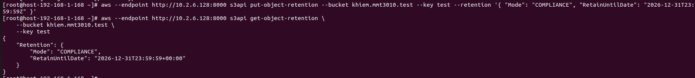
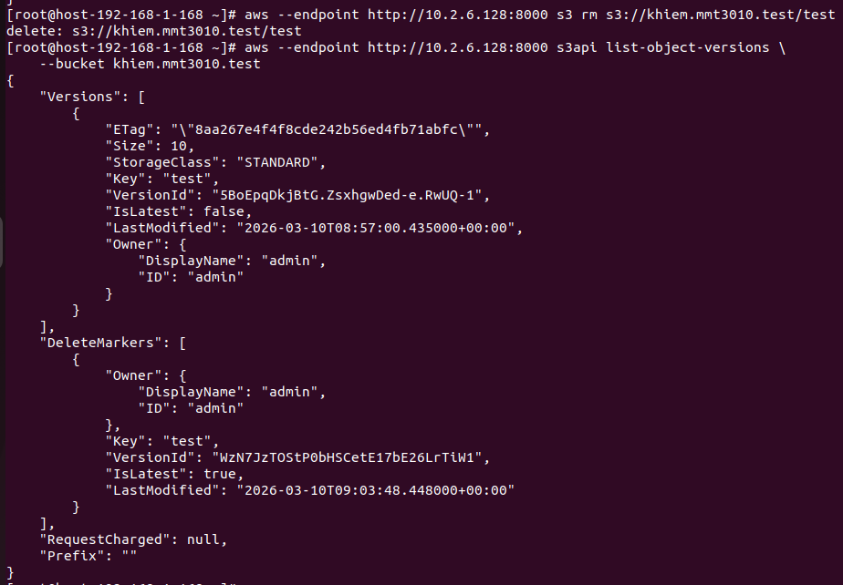
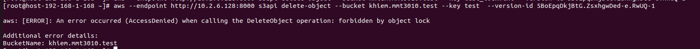
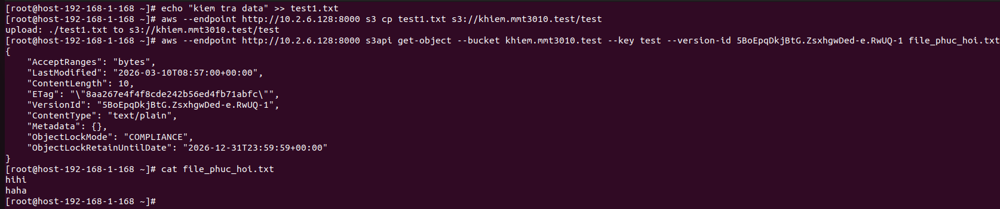

# Object_lock

## Khái niệm

- Là cơ chế ngăn cho object không bị xóa hoặc ghi đè trong khoảng thời gian nhất định nhằm đảm bảo dữ liệu không thể thay đổi

- Để có thể kích hoạt object lock, hệ thống lưu trữ pháp lý đáp ứng yêu cầu kỹ thuật sau: 
  - Chỉ được bật khi tạo Bucket mới: Object lock phải được kích hoạt sau khi dùng lệnh `mb`

  - Bucket Versioning: Khi tạo object lock tính năng Versioning sẽ tự động được tạo để khi xóa 1 object trong bucket 
  thì chỉ bị đánh dấu DeleteMarker, còn dữ liệu vẫn sẽ được bảo toàn dưới dạng object lock
  
  - Object-Level Configuration : Ta cần phải cấu hình cho object lock cho từng Version ID cụ thể cho từng 
  đối tương 
  
## Triển khai

1.  Tạo bucket mới và khởi tạo Object lock

```sh
aws --endpoint=<địa_chỉ_ip> s3api create-bucket --bucket <tên_bucket_mới> --object-lock-enabled-for-bucket
```

2. Tạo file Json để chỉ định khóa

```sh
vi lock-config.json

{
    "ObjectLockEnabled": "Enabled",
    "Rule": {
        "DefaultRetention": {
            "Mode": "COMPLIANCE",
            "Days": 7
        }
    }
}'
```
Giải thích:
  - ObjectLockEnabled: "Enabled"  : Bật chế độ Object lock
  
  - DefaultRetention: Cho phép tự động tính toán và đóng dấu khóa trên mọi file mới
  
  - Mode: Compliance: Cấp độ bảo mật cao nhất, ngay cả tài khoản root cũng không thể xóa object cho đến ngày hết hạn

  - Days: Số lượng ngày thực thi tính từ thời điểm tạo 

3. Áp dụng cho bucket   

```sh 

  aws --endpoint-url=_RADOSGW_ENDPOINT_URL_:PORT s3api put-object-lock-configuration --bucket _BUCKET_NAME_ --object-lock-configuration file:/path_file_policy.json

```

4. Tạo khóa cho 1 file quan trọng

```sh
# Tạo 1 key mới với object lock
aws --endpoint http://10.2.6.128:8000 s3api put-object-retention --bucket khiem.mmt3010.test --key test --retention '{ "Mode": "COMPLIANCE", "RetainUntilDate": "2026-12-31T23:59:59Z" }'
# Kiểm tra
aws --endpoint http://10.2.6.128:8000 s3api get-object-retention --bucket khiem.mmt3010.test --key test
```


 Giải thích: 
  - `--key`: File muốn áp dụng object lock
  - `--retention`: chế độ lưu giữ 
5. Kiểm thử
- Xóa và check version
```sh
# Xóa 

aws --endpoint http://10.2.6.128:8000 s3 rm s3://khiem.mmt3010.test/test

# Check Version ID

aws --endpoint http://10.2.6.128:8000 s3api list-object-versions --bucket khiem.mmt3010.test 

```


- Xóa hẳn version đấy đi

```sh
aws --endpoint http://10.2.6.128:8000 s3api delete-object --bucket khiem.mmt3010.test --key test --version-id 5BoEpqDkjBtG.ZsxhgwDed-e.RwUQ-1
```



---> Lệnh trả về `AccessDenied`

- Kiểm tra tính bất biến của data

```sh

aws --endpoint http://10.2.6.128:8000 s3api get-object --bucket khiem.mmt3010.test --key test --version-id <ID_CUA_VERSION_GOC> file_phuc_hoi.txt

cat file_phuc_hoi.txt

```
