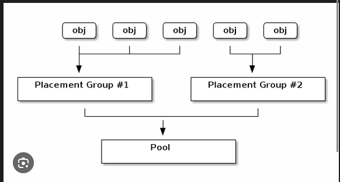

# PG
## Khái niệm 
- PG (Placement Group) là một nhóm logic dùng để gom các Objects lại với nhau. Thay vì ánh xạ trực tiếp vào Object trong OSD giờ đây Ceph sẽ ánh xạ vào các PG rồi từ PG mới ánh xạ vào OSD. Công thức dòng chảy dữ liệu: File -> Objects -> PGs -> OSDs
## Cơ chế hoạt động
- Việc xác định các Object nào thuộc PG nào và PG thuộc OSD nào hoàn toàn nhờ vào tính toán chứ không tra cứu bảng lookup table
- Bước 1: Object sẽ PG:  Ceph lấy tên Object rồi băm ra thành con số rồi chia lấy dư cho tổng số PG: `PG_ID=hash(Object_Name)%Total_PGs`
- Bước 2: PG vào OSD: Thuật toán CRUSH sẽ tính toán xác định chính xác xem PG nào nằm trên OSD nào
## Tính toán số lượng của PG (pg_num)
- Giả sử trong cụm OpenStack 9 node của bạn, bạn dành ra 3 Node làm Storage chuyên biệt. Mỗi Node có 4 ổ cứng OSD.
- Tổng OSD: 3×4=12 OSDs.
- Replica Size: 3 (Tiêu chuẩn an toàn).
Bước 1: Áp dụng công thức:
  Total_PGs=3(12×100)​=31200​=400
Bước 2: Quy tắc Lũy thừa của 2 (Power of 2) Ceph hoạt động tốt nhất khi số lượng PG là lũy thừa của 2 (2n). Điều này giúp thuật toán băm (Bitwise masking) chạy nhanh hơn.
- Các mốc gần 400 là: 256 và 512.
- Ta nên chọn 512. (Thà dư một chút để dữ liệu rải đều hơn là thiếu).
=> Vậy Tổng số PG cho cả cụm nên là 512.
## Các trạng thái của PG:
  - Active + Clean (Lý tưởng): PG đang hoạt động bình thường, dữ liệu đã được sao chép đủ số bản sao (Clean).
  - Degraded (Suy thoái): Một OSD chứa PG này bị chết. PG vẫn hoạt động (Active) nhưng thiếu bản sao (chưa Clean). Ceph vẫn cho phép ghi, nhưng đang ở chế độ rủi ro.
  - Peering (Đang nhìn nhau): Các OSD đang giao tiếp để thống nhất xem ai giữ bản dữ liệu mới nhất của PG này. Trong lúc Peering, I/O bị chặn (Client không ghi được).
  - Down (Sập): Thảm họa! Dữ liệu của PG này không còn bản sao nào khả dụng. Dữ liệu coi như không thể truy cập (Data offline).
  - Inconsistent (Không nhất quán): Quá trình Scrubbing phát hiện checksum giữa các bản sao không khớp nhau (Lỗi file hỏng). Cần admin can thiệp sửa chữa.

  

