# Tổng quan về RADOS
1. Khái niệm
- RADOS viết tắt của Reliable Autonomic Distributed Object Store (Kho lưu trữ đối tượng phân tán, tự trị và tin cậy). Nó là  một hệ thống lưu trữ object thông minh có khả năng tự quản lý, tìm kiếm và mở rộng vô hạn


## Thành phần của RADOS
### OSD (Object Storeage Daemon)
#### 1. Khái niệm
- Là tiến trình cốt lõi, chịu trách nghiệm quản lý lưu trữ cục bộ, lưu dữ liệu dưới dạng object, xử lý sao chép, khôi phục, cân bằng dữ liệu đồng thời báo cáo trạng thái cho tiến trình giám sát 
#### 2. Vai trò của OSD
- Quản lý dữ liệu và lưu trữ: Mỗi OSD quản lý một ổ đĩa vật lý hoặc logic, trực tiếp thực hiện thao tác ghi đọc và lưu trữ đối tượng này
- Sao chép và phục hồi: Quản lý các bản sao của dữ liệu để có tính sẵn sàng cao, khi OSD lỗi nó sẽ tự động lấy bản sao của OSD khác
- Cân bằng lại: Phân phối lại dữ liệu treenn OSD mỗi khi có thêm OSD mới hoặc lỗi OSD để đảm bảo tải được cân bằng đều
- Giám sát và báo cáo: Gửi các tín hiệu heartbeat và thông tin trạng thái tới các MON để duy trì một cái nhìn tổng thể về sức khỏe lưu trữ
#### 3. Thành phần cấu tạo 
- Ngày nay OSD sử dụng BlueStore làm hệ thống lưu trữ mặc định cho OSD, cho phép OSD ghi trực tiếp vào ổ đĩa vật lý
#### 4. Mối liên hệ giữa OSD và các thành phần khác
- OSD và Monitor (MON):
   - Báo cáo trạng thái: Các OSD định kỳ gửi "nhịp đập" (heartbeat) đến Monitor để xác nhận chúng vẫn đang hoạt động (trạng thái up).
   - Cập nhật bản đồ cụm (Cluster Map): Nếu một OSD bị lỗi hoặc một OSD mới được thêm vào, Monitor sẽ cập nhật OSD Map và gửi bản sao mới nhất cho toàn bộ hệ thống.
   - Cơ chế giám sát chéo: Các OSD cũng tự giám sát lẫn nhau. Nếu OSD A nhận thấy OSD B không phản hồi, nó sẽ báo cáo lên Monitor để đánh dấu OSD B là down. 
- OSD và Manager (MGR):
  - Thu thập chỉ số: OSD gửi các số liệu thống kê về hiệu suất, dung lượng sử dụng và tải hệ thống cho Manager.
  - Quản trị và Dashboard: Manager sử dụng dữ liệu từ OSD để hiển thị trạng thái hệ thống trên giao diện web (Ceph Dashboard) và hỗ trợ các mô-đun tự động hóa như cân bằng dữ liệu (balancer). 
- OSD và Metadata (MDS): 
  - Phân tách dữ liệu và siêu dữ liệu: Trong dịch vụ CephFS, MDS quản lý cấu trúc cây thư mục và tên file (metadata), nhưng không lưu trữ nội dung file.
  - Truy xuất thực tế: Khi người dùng muốn đọc file, MDS chỉ cho khách hàng biết dữ liệu nằm ở đâu, sau đó khách hàng sẽ làm việc trực tiếp với OSD để lấy nội dung thực tế. 
#### 5. Một số câu lệnh cơ bản 
 1. Trạng thái OSD
  - Danh sách OSD
```sh
 ceph -s
 ceph osd stat
 ```
 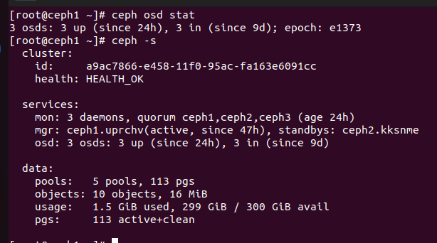
  - Xem cây osd (CRUSH tree)
```sh
 ceph osd tree
 ```
 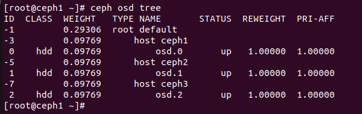
  - Xem trạng thái của từng osd
```sh
 ceph osd dump 
 ```
 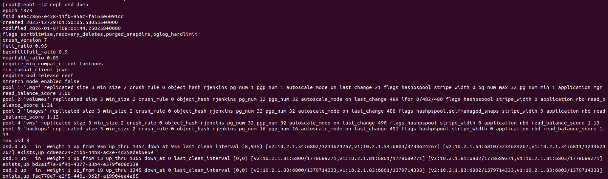

  - Xem OSD up/in
```sh
ceph osd status
```
 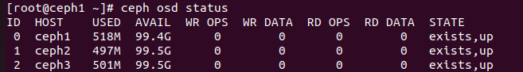

 2. OSD UP/DOWN/IN/OUT
  - Đưa OSD out 
```sh 
ceph osd out osd.<số>
```
 - Đưa OSD in 
```sh 
ceph osd in osd.<số>
```
 - Đưa OSD down 
```sh 
ceph osd down osd.<số>
```
- Đưa OSD up
```sh
ceph osd up osd.<số>
```
 3. OSD & CEPHADM 
  - Xem osd daemon
```sh
ceph orch ps --daemon-type osd 
```
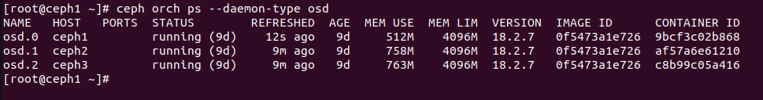

  - Thêm osd 
```sh
 ceph orch daemon add osd <host>:/dev/disk
```
  - Zap disk (xóa OSD cũ)
```sh
 ceph orch device zap <host> /dev/disk --force
```
  - Xem disk khả dụng 
```sh
 ceph orch device ls
```
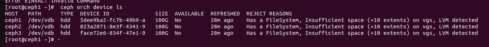
 4. Các bước xóa OSD
  - Bước 1: Đưa OSD out trước
```sh
ceph osd out osd.<số>
```
  - Bước 2: Remove khỏi cụm
```sh
ceph osd rm osd.<số>
```
  - Bước 3: Xóa auth
```sh
ceph auth del osd.<số>
```
  - Bước 4: Xóa khỏi CRUSH MAP
```sh
ceph osd crush remove osd.<số>
```
 5. Xem hiệu suất của OSD
  - Xem tổng quan
```sh
ceph healthy detail
```
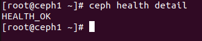

  - Xem I/O latency
```sh
ceph osd perf
```
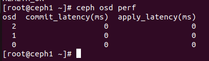

 6. LOG và DEBUG
  - Log OSD 
```sh
ceph log --name osd.<số>
```
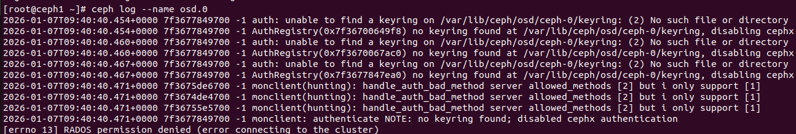

  - Debug OSD
```sh
ceph debug --name osd.<số>
```
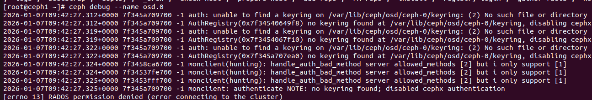

### MON (Ceph Monitor)

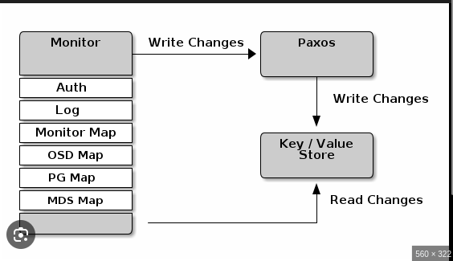

#### Khái niệm 
- MON là bộ não quản lý trạng thái và sự đồng thuận của cả hệ thống. MON không lưu trữ dữ liệu người dùng mà lưu trữ bản đồ của hệ thống
2. Thành phần và cách thức hoạt động  
#### Thành phần
- Cluster Maps: là một tập hợp các bản đồ chung. Các client và các OSDs khác sẽ tải bản đồ này về để có thể giao tiếp với nhau
- Các loại Maps bao gồm:  
  - Monitor MAP: Chứa các thông tin về các node MON (IP,PORT,ID). Để biết ai là MON bạn cần MON MAP
  - OSD MAP: Quan trọng nhất, chứa trạng thái của các OSD (Up/Down,Out/In), trọng số (weight)và địa chỉ IP của chúng
  - PG MAP: Theo dõi trạng thái của các PG, thống kê dung lượng sử dụng 
  - CRUSH MAP: Chứa sơ đồ vật lý của hệ thống (Rack, Host, Disk) và các quy tắc (rules) để xác định dữ liệu được lưu ở đâu.
  - MDS MAP: Chỉ dùng cho CephFS, chứa trạng thái của các Metadata Server.
- Epoch: Là một số nguyên đại diện cho phiên bản của một trạng thái hoặc một bản đồ (MAP) cụ thể trong cluster. Mỗi khi có thay đổi cấu trúc hoặc trạng thái bất kì, Ceph sẽ thay đổi và cập nhật lại bản đồ của cụm. Mỗi lần thay đổi Epoch sẽ tăng thêm 1

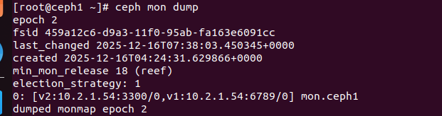

#### Cách thức hoạt động
- Trong 1 cụm MON nó sẽ bắt đầu bầu ra Lead là nodes nào để có quyền thức thi và viết các thay dổi trong Cluster. Nếu Lead chết nó sẽ dùng Paxon để bầu ra được Lead mới. 
- Để cụm Ceph hoạt động thì các MON phải đạt được trạng thái Quorum nghĩa là đa số (hơn 50%) các MON phải nhìn thấy nhau. Tất cả các cụm phải có tổng các nodes MON là số lẻ để tránh tranh nhau quyền làm Lead của các nodes.Vì thế nó tuân theo công thức:
                                                N>= (N/2)+1 (N là số nodes MON)
- Quy trình giao tiếp giữa Client và MON:
  - Kết nối: Client sẽ kết nối tới MON
  - Lấy Map: Client sẽ xin MON về bản đồ Cluster Map mới nhất và lưu lại
  - Ngắt kết nối và ghi dữ liệu: Khi đã có bản đồ cụm, Client sẽ không kết nối tới MON nữa mà dùng thuật toán CRUSH để có thể tìm và ghi thẳng trực tiếp dữ liệu lên OSD

#### Các lệnh cơ bản 
1. Lệnh về trạng thái MON
 - Xem trạng thái tổng thể của MON:
```sh
 ceph -s
```

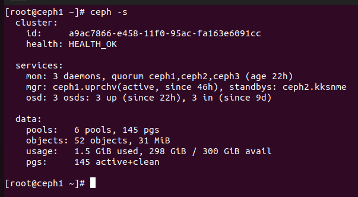

 - Xem chi tiết MON:
 ```sh
  ceph mon stat
  ```
 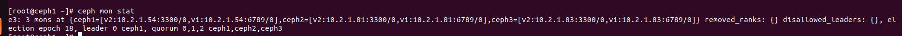
 
 - Danh sách MON+IP
 ```sh
  ceph mon dump
  ```
 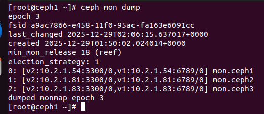

 - Xem quorum (MON nào đang active)
 ```sh
ceph quorum_status --format json-pretty

 ```
  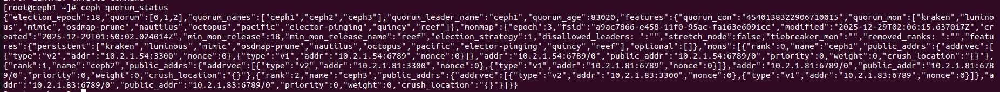
 2. Quản lý MON
  - Xem MON đang chạy:
```sh
ceph orch ps --daemon-type mon
```
 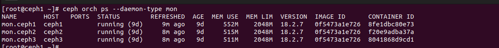

  -Thêm MON:
```sh
  ceph orch daemon add mon < hostname >
  ```
  - Xóa MON:
```sh 
  ceph orch daemon rm mon.< hostname >
  ```
  - Redeploy MON:
```sh 
  ceph orch redeploy mon
  ```
 3. Cấu hình MON
  - Xem cấu hình MON: 
```sh
 ceph config dump | grep mon
```
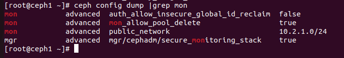

  - Xem config MON cụ thể
```sh
 ceph config get mon
 ```
  - Set config cho MON:
```sh 
 ceph config set mon <name> <value>
```

 4. Auth/Keyring của MON
  - Liệt kê auth
```sh
  ceph auth list
```
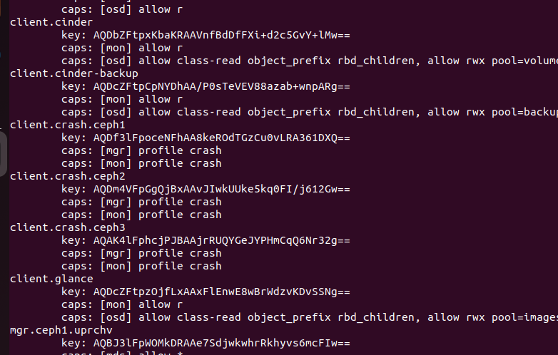
  - Lấy auth
```sh
 ceph auth get <tên trong auth list>
 ```
 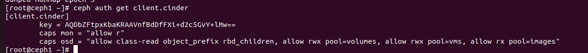
 5. Xem log của MON
 ```sh
 ceph log --name mon.ceph1
 ```
 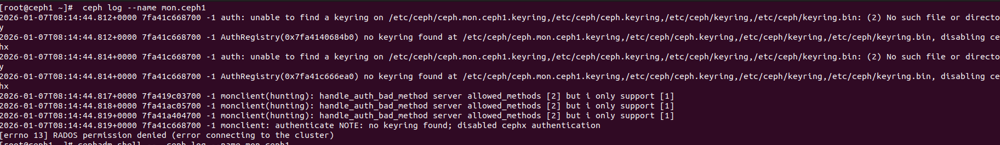

### MGR (Ceph Manager)


#### 1. Khái niệm 
- MGR (Ceph Manager) được tạo ra nhằm mục đích giảm tải cho MON về các việc như thống kê, vẽ biểu đồ, tính toán cần bằng tải và tạo giao diện dashboard
- Khác với MON (dùng theo Quorum) thì MGR sẽ dùng theo kiến trúc Active-Standby. Kiến trúc này sẽ cho tại 1 thời điểm chỉ có 1 MGR được chạy, các nodes khác cũng có MGR nhưng không hoạt động, khi nào nodes MGR Active chết thì nốt MGR khác mới lên thay thế. Nếu tất cả node chạy MGR đều chết thì cụm vẫn sẽ hoạt động nhưng chỉ có nó sẽ không có dashboard và cân bằng tải.
#### 2. Module
- MGR được viết bằng python, điều này cho phép nó sẽ gắn các module vào cụm ceph thay vì phải thay đổi phần core trong nó
- Một số module của MGR:
  - Ceph Dashboard (GUI): Cái giao diện web xanh xanh bạn hay vào để xem Cluster khỏe hay yếu, tạo RBD image, xem log... chính là một module chạy bên trong MGR.
  - Prometheus Exporter : MGR sẽ tổng hợp metrics từ hàng nghìn OSD và "phơi" (expose) ra một cổng (thường là 9283) để Prometheus đến lấy (scrape).
  - Balancer: Cân bằng dung lượng trong các OSD
  - Giao tiếp trong hệ thống
#### 3. Một số câu lệnh cơ bản 
 1. Xem trạng thái MGR
  - Trạng thái riêng của mgr
```sh 
 ceph mgr stat
 ```
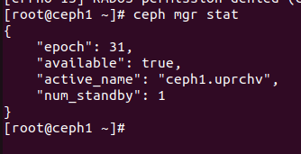

 - Xem các mgr đang chạy 
 ```sh
  ceph orch ps --daemon-type mgr
 ```
 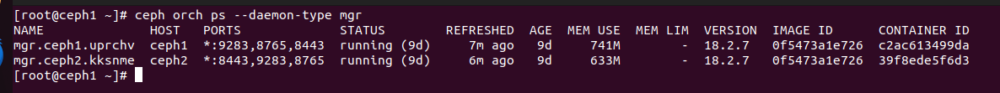

 - Xem mgr nào đang active/standby
 ```sh
 ceph mgr dump
 ```
 2. Quản lý mgr
  - Thêm mgr
```sh
ceph orch daemon add mgr <hostname>
```
  - Xóa mgr
```sh
ceph orch daemon delete mgr.<hostname>
```
  - Redeploy toàn bộ mgr
```sh
ceph orch redeploy mgr
```
  - Ép failover
```sh
ceph mgr fail
```
3. MGR Module
 - Xem các module đang bật 
```sh 
 ceph mgr module ls
 ```
  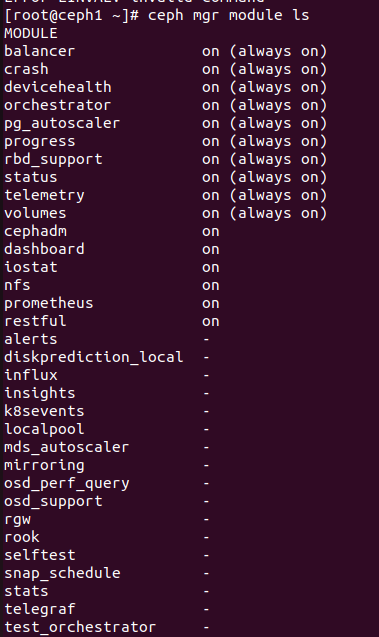
 - Bật module
 ```sh
 ceph mgr module enable <module>
 ```
 - Tắt module
 ```sh
 ceph mgr module disable <module>
 ```
### MDS
 


1. Khái niệm
- Metadata: là dữ liệu dùng để mô tả dữ liệu khác. Ví dụ: ta có file.txt, bên trong file.txt là data, metadata là các dữ liệu để mô tả cái file đó như: tên file, kích thước, ngày tạo, quyền truy cập, chủ sở hữu, nằm ở trong thư mục nào,... . Trong Ceph, khi một dữ liệu được đua vào nó sẽ được chia nhỏ thành các object và rải đểu lên các OSD, khi đó Metadata của chúng sẽ được lưu vào trong các folder để dễ tìm kiếm. 
- Khi cần thiết Client sẽ hỏi MDS và MDS sẽ đưa ra đường dẫn để Client có thể truy cập vào file
2. Khả năng mở rộng: Active/Active và Subtree Partitioning
- Nếu bạn có hàng tỷ file, 1 MDS Active sẽ bị quá tải (CPU/RAM). Ceph cho phép chạy nhiều MDS Active cùng lúc (Multi-MDS).
- Cơ chế Dynamic Subtree Partitioning (Phân chia cây thư mục động):
   - Các MDS sẽ tự động chia nhau quản lý cây thư mục.
   - Nếu /home bớt nóng và /var/log nóng lên, MDS sẽ tự động cân bằng lại tải.
3. HA
- MDS cũng chạy theo mô hình Active / Standby (thường là active-standby-replay).

  -  Active: Đang phục vụ Client.

  -  Standby-replay: Đây là chế độ chờ thông minh. Node này liên tục "đuổi theo" (tail) nhật ký của thằng Active. Nếu thằng Active chết, thằng Replay thay thế ngay lập tức (chỉ mất vài giây) vì nó đã có sẵn dữ liệu trong RAM (hot standby).
