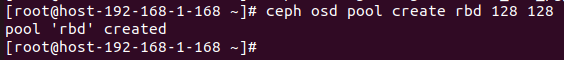
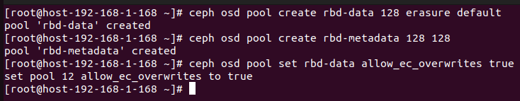
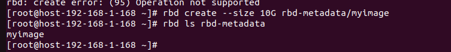
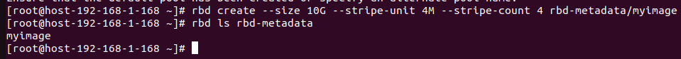

# Ceph RBD (RADOS Block Device) 

## 1. Tổng quan về RBD

### Định nghĩa và chức năng chính

- **RBD (RADOS Block Device)** là một thành phần của Ceph cung cấp block storage phân tán, có thể mở rộng.
- Cho phép tạo ổ đĩa ảo (virtual disks) được truy cập qua mạng, tương tự như iSCSI hoặc local disks.
- Dữ liệu được lưu trữ dưới dạng objects trong RADOS, đảm bảo độ bền, khả năng mở rộng và hiệu năng cao.
- Phù hợp cho: máy ảo (VM), container, database, và các ứng dụng cần block storage.

### Lợi ích chính

- **Khả năng mở rộng**: Tự động mở rộng dung lượng mà không gián đoạn.
- **Độ bền cao**: Dữ liệu được sao chép trên nhiều OSD.
- **Hiệu năng**: I/O song song trên nhiều OSD.
- **Tính năng nâng cao**: Snapshot, cloning, mirroring, thin provisioning.

### So sánh với RGW và RADOS

- **RADOS**: Lớp lưu trữ cơ bản, quản lý objects.
- **RGW**: Object storage (S3/Swift) trên RADOS.
- **RBD**: Block storage trên RADOS, cung cấp disks ảo.

## 2. Kiến trúc RBD

### Cách hoạt động

- RBD chia dữ liệu thành các block nhỏ (mặc định 4MB) và lưu dưới dạng RADOS objects.
- Mỗi RBD image được ánh xạ tới một tập hợp objects trong pool RADOS.
- Client (kernel module hoặc librbd) giao tiếp trực tiếp với OSDs qua RADOS protocol.

```
Client (VM/Container)
    ↓
RBD Kernel Module / librbd
    ↓
RADOS Protocol
    ↓
OSDs (Lưu trữ objects)
```

### Thành phần cốt lõi

#### Head Object

- Mỗi RBD image có một head object chứa metadata (kích thước, snapshot info, v.v.).
- Tên head object: `<pool-name>.<image-name>`

#### Data Objects

- Dữ liệu được chia thành các stripe và lưu trong data objects.
- Tên data objects: `<pool-name>.<image-name>.<offset>`

### Striping và Thin Provisioning

- **Striping**: Dữ liệu được phân tán song song trên nhiều OSD để tăng hiệu năng I/O.
- **Thin Provisioning**: Chỉ cấp phát dung lượng khi cần, không phải trước.

### Snapshot và Clone

- **Snapshot**: Bản sao chép tại thời điểm của image, không chiếm dung lượng thêm (copy-on-write).
- **Clone**: Tạo image mới từ snapshot, chia sẻ dữ liệu ban đầu.

### Erasure Coding

- **Erasure Coding**: là kĩ thuật bảo vệ dữ liệu nâng cao được sử dụng thay thế cho Replication để tối ưu dung lượng lưu trữ vật lý và đảm bảo chịu lỗi tối đa. Cơ chế hoạt động là sẽ chia các dữ liệu thành nhiều mảnh khác nhau và lưu trữ rải rác trên các OSD. Khi 1 ổ bị lỗi, dữ liệu sẽ được tính toán ngược lại để tự sinh ra.

## 3. Cấu hình RBD

### Tạo Pool cho RBD

```bash
# Tạo pool replicated
ceph osd pool create rbd 128 128 # pg và pgp 
```


```bash
# Erasure-coded pool
ceph osd pool create rbd-data 128 erasure default
ceph osd pool create rbd-metadata 128 128
ceph osd pool set rbd-data allow_ec_overwrites true
```



## 4. Quản lý RBD Images

### Tạo RBD Image

```bash
# Tạo image 10GB
rbd create --size 10G rbd/myimage
```


```bash
# Tạo với striping
rbd create --size 10G --stripe-unit 4M --stripe-count 4 rbd/myimage #--stripe-count 4 là số object chỉ định 
```



```bash
# Tạo từ snapshot
rbd clone rbd/myimage@snap1 rbd/myimage-clone
```


### Liệt kê và Xem thông tin

```bash
# Liệt kê images
rbd ls rbd

# Thông tin chi tiết
rbd info rbd/myimage

# Dung lượng sử dụng
rbd du rbd/myimage
```

### Resize Image

```bash
# Mở rộng
rbd resize --size 20G rbd/myimage

# Thu nhỏ (cẩn thận, có thể mất dữ liệu)
rbd resize --size 5G --allow-shrink rbd/myimage
```

### Xóa Image

```bash
rbd rm rbd/myimage
```

---

## 5. Mapping và Mounting RBD

### Mapping trên Linux

```bash
# Map image thành device
sudo rbd map rbd/myimage
# Output: /dev/rbd0

# Kiểm tra
lsblk | grep rbd

# Format (nếu cần)
sudo mkfs.ext4 /dev/rbd0

# Mount
sudo mkdir /mnt/rbd
sudo mount /dev/rbd0 /mnt/rbd
```

### Unmapping

```bash
# Unmount trước
sudo umount /mnt/rbd

# Unmap device
sudo rbd unmap /dev/rbd0
```

## 6. Snapshot và Cloning

### Tạo Snapshot

```bash
# Tạo snapshot
rbd snap create rbd/myimage@snap1

# Liệt kê snapshots
rbd snap ls rbd/myimage

# Bảo vệ snapshot (để clone)
rbd snap protect rbd/myimage@snap1
```

### Clone từ Snapshot

```bash
# Clone
rbd clone rbd/myimage@snap1 rbd/myimage-clone

# Map và sử dụng clone
sudo rbd map rbd/myimage-clone
```

### Quản lý Snapshots

```bash
# Unprotect snapshot
rbd snap unprotect rbd/myimage@snap1

# Xóa snapshot
rbd snap rm rbd/myimage@snap1

# Rollback image về snapshot
rbd snap rollback rbd/myimage@snap1
```

---

## 7. Mirroring và Disaster Recovery

### Cấu hình Mirroring

```bash
# Bật mirroring cho pool
rbd mirror pool enable rbd pool

# Bật mirroring cho image
rbd mirror image enable rbd/myimage

# Kiểm tra trạng thái
rbd mirror pool status rbd
rbd mirror image status rbd/myimage
```

### Peer Cluster

```bash
# Thêm peer cluster
rbd mirror pool peer add rbd client.admin@remote

# Đồng bộ
rbd mirror pool peer bootstrap import rbd --direction rx-only <token>
```

### Failover và Failback

```bash
# Demote primary
rbd mirror image demote rbd/myimage

# Promote secondary
rbd mirror image promote rbd/myimage
```

---

## 8. Tối ưu hóa Hiệu năng

### Cấu hình Striping

```bash
# Tạo image với striping tùy chỉnh
rbd create --size 100G --stripe-unit 4M --stripe-count 8 rbd/large-image
```

### Caching

```bash
# Bật write-back cache
rbd feature enable rbd/myimage exclusive-lock journaling

# Cấu hình cache size
echo "rbd_cache = true" >> /etc/ceph/ceph.conf
echo "rbd_cache_size = 134217728" >> /etc/ceph/ceph.conf  # 128MB
```

### QoS (Quality of Service)

```bash
# Giới hạn IOPS
rbd config image set rbd/myimage rbd_qos_iops_limit 1000

# Giới hạn bandwidth
rbd config image set rbd/myimage rbd_qos_bps_limit 104857600  # 100MB/s
```

### PG Tuning

```bash
# Tăng PG cho pool RBD
ceph osd pool set rbd pg_num 256
ceph osd pool set rbd pgp_num 256
```

---

## 9. Troubleshooting RBD

### Vấn đề thường gặp

#### Không thể map image

```bash
# Kiểm tra cluster health
ceph health

# Kiểm tra pool
ceph osd pool stats rbd

# Kiểm tra permissions
ceph auth list | grep client.admin
```

#### Hiệu năng chậm

```bash
# Kiểm tra OSD I/O
ceph osd perf

# Kiểm tra network latency
ping <osd-ip>

# Tăng objecter timeout
echo "rados_mon_op_timeout = 10" >> /etc/ceph/ceph.conf
```

#### Image corrupted

```bash
# Kiểm tra và sửa chữa
rbd export rbd/myimage /tmp/backup
rbd import /tmp/backup rbd/myimage-fixed
```

### Logs và Debugging

```bash
# RBD logs
sudo dmesg | grep rbd

# Ceph logs
sudo tail -f /var/log/ceph/ceph-client.log

# Debug mode
echo "debug rbd = 20" >> /etc/ceph/ceph.conf
echo "debug rados = 20" >> /etc/ceph/ceph.conf
sudo systemctl restart ceph.target
```

---

## 10. Tích hợp với Công cụ Ảo hóa

### OpenStack Cinder

```yaml
# cinder.conf
[DEFAULT]
enabled_backends = ceph
[ceph]
volume_driver = cinder.volume.drivers.rbd.RBDDriver
rbd_pool = rbd
rbd_ceph_conf = /etc/ceph/ceph.conf
rbd_user = cinder
rbd_keyring = /etc/ceph/ceph.client.cinder.keyring
```

## 11. Kiến trúc Nội bộ và Data Path

### Object Layout trong RBD

Mỗi RBD image được chia thành các RADOS objects với cấu trúc như sau:

- **Head Object**: `<pool>.<image>` – Chứa metadata, kích thước, features, snapshots.
- **Data Objects**: `<pool>.<image>.<object_number>` – Chứa dữ liệu thực tế, mỗi object thường 4MB.

Ví dụ với image 10GB:

```bash
rbd info rbd/myimage
# Output: size 10 GiB in 2560 objects
```

- Tổng số objects = kích thước / object size (mặc định 4MB).

### Striping Chi tiết

- **Stripe Unit**: Kích thước mỗi stripe (mặc định 4MB).
- **Stripe Count**: Số OSD để stripe (mặc định 1, không stripe).

Với stripe-count > 1, dữ liệu được phân tán trên nhiều OSD để tăng I/O parallelism.

```bash
# Tạo image với striping
rbd create --size 100G --stripe-unit 4M --stripe-count 4 rbd/striped-image
```

### Data Path

```
Application I/O
    ↓
Filesystem (ext4/xfs)
    ↓
RBD Kernel Module / QEMU Block Driver
    ↓
librbd (RBD Library)
    ↓
RADOS Operations (read/write objects)
    ↓
OSD Handling
```

- **Read Path**: Client tính toán object offset từ block offset, gửi RADOS read.
- **Write Path**: Tương tự, nhưng có thể cache và batch writes.

### Features và Extensions

RBD hỗ trợ các features:

- **layering**: Cho phép snapshots và clones.
- **exclusive-lock**: Đảm bảo chỉ một client ghi tại một thời điểm.
- **object-map**: Theo dõi allocated objects để tăng hiệu năng.
- **fast-diff**: Tính toán diff nhanh giữa snapshots.
- **deep-flatten**: Flatten clones độc lập.

```bash
# Bật features
rbd feature enable rbd/myimage layering exclusive-lock

# Kiểm tra features
rbd info rbd/myimage | grep features
```

---

## 12. Bảo mật và Authentication

### Ceph Authentication

RBD sử dụng CephX cho authentication:

```bash
# Tạo user cho RBD
ceph auth get-or-create client.rbd-user mon 'allow r' osd 'allow rwx pool=rbd'

# Xuất keyring
ceph auth get client.rbd-user > /etc/ceph/ceph.client.rbd-user.keyring
```

### Encryption

RBD hỗ trợ LUKS encryption:

```bash
# Tạo encrypted image
sudo cryptsetup luksFormat /dev/rbd0
sudo cryptsetup luksOpen /dev/rbd0 rbd-encrypted
sudo mkfs.ext4 /dev/mapper/rbd-encrypted
```

### SELinux và AppArmor

Trên systems với SELinux:

```bash
# Cho phép RBD access
sudo setsebool -P virt_use_samba 1
```

### Network Security

- Sử dụng TLS cho RADOS traffic (nếu bật msgr2).
- Firewall: Mở port 6789 (monitors), 6800-7300 (OSDs).

---

## 13. Monitoring và Metrics

### Ceph Metrics

Sử dụng ceph-mgr với prometheus:

```bash
# Cài đặt prometheus module
ceph mgr module enable prometheus

# Metrics cho RBD
curl http://mgr-node:9283/metrics | grep rbd
```

### RBD-Specific Metrics

- **IOPS**: Số operations per second.
- **Throughput**: Bandwidth usage.
- **Latency**: Thời gian phản hồi.

### Monitoring Tools

#### ceph-dashboard

```bash
# Truy cập dashboard
# Pools > rbd > Images
```

#### Grafana Dashboards

Import dashboard Ceph từ Grafana community.

### Alerts

```yaml
# Prometheus alert rule
groups:
- name: rbd
  rules:
  - alert: RBDImageUnhealthy
    expr: rbd_image_status{status="unhealthy"} > 0
    for: 5m
    labels:
      severity: warning
```

---

## 14. Benchmarks và Performance Analysis

### Công cụ Benchmark

#### rbd bench

```bash
# Benchmark write
rbd bench --io-type write --io-size 4K --io-threads 16 --io-total 1G rbd/myimage

# Benchmark read
rbd bench --io-type read --io-size 4K --io-threads 16 --io-total 1G rbd/myimage
```

#### fio

```bash
# Fio với RBD
fio --name=rbd-test --rw=randwrite --bs=4k --size=1G --numjobs=4 --runtime=60 --filename=/dev/rbd0
```

### Phân tích Hiệu năng

#### Factors ảnh hưởng

- **Network**: Latency và bandwidth giữa client và OSDs.
- **OSD Performance**: CPU, disk I/O của OSDs.
- **Striping**: Tăng parallelism.
- **Caching**: RBD cache và OSD cache.

#### Tuning Tips

- **Increase PGs**: Cho parallelism cao hơn.
- **Use SSDs**: Cho OSD DB và WAL.
- **Tune OSD**: `osd_op_threads`, `filestore_queue_max_ops`.

### So sánh với Local Disk

RBD thường chậm hơn local SSD nhưng tốt hơn HDD. Với tuning, có thể đạt 80-90% hiệu năng của local storage.

## 15. Troubleshooting Nâng cao

### Vấn đề Phức tạp

#### Watchdog Errors

```bash
# Kiểm tra kernel logs
dmesg | grep rbd

# Tăng watchdog timeout
echo "rbd_watchdog_timeout = 60" >> /etc/ceph/ceph.conf
```

#### Split-Brain trong Mirroring

```bash
# Force resync
rbd mirror image resync rbd/myimage
```

### Recovery Scenarios

#### Image Corruption

```bash
# Export good parts
rbd export rbd/good-image /tmp/good.raw --offset 0 --length 50G

# Import lại
rbd import /tmp/good.raw rbd/recovered
```

#### Lost Snapshots

- Sử dụng `rbd-nbd` để mount và recover.

### Advanced Debugging

```bash
# Trace RADOS calls
export CEPH_ARGS="--debug-rados 20 --debug-ms 1"

# Use blktrace
blktrace -d /dev/rbd0 -o trace.out
blkparse trace.out
```

### CephFS Integration

RBD có thể kết hợp với CephFS cho hybrid storage.

## Các lệnh RBD hữu ích

```bash
# Quản lý images
rbd create --size 10G rbd/myimage          # Tạo image
rbd ls rbd                                 # Liệt kê
rbd info rbd/myimage                       # Thông tin
rbd resize --size 20G rbd/myimage          # Resize
rbd rm rbd/myimage                         # Xóa

# Snapshots
rbd snap create rbd/myimage@snap1          # Tạo snap
rbd snap ls rbd/myimage                    # Liệt kê snaps
rbd snap protect rbd/myimage@snap1         # Bảo vệ snap
rbd clone rbd/myimage@snap1 rbd/clone      # Clone

# Mapping
sudo rbd map rbd/myimage                   # Map
sudo rbd unmap /dev/rbd0                   # Unmap
sudo rbd showmapped                        # Xem mapped devices

# Mirroring
rbd mirror pool enable rbd pool            # Bật mirroring
rbd mirror image enable rbd/myimage        # Bật cho image
rbd mirror pool status rbd                 # Trạng thái

# Benchmark
rbd bench --io-type write --io-size 4K --io-threads 16 --io-total 1G rbd/myimage

# Export/Import
rbd export rbd/myimage /tmp/image.raw      # Export
rbd import /tmp/image.raw rbd/newimage     # Import
```


