# Ceph RBD (RADOS Block Device) 

## 1. Tổng quan về RBD

### Định nghĩa và chức năng chính

- **RBD (RADOS Block Device)** là một thành phần của Ceph cung cấp block storage phân tán, có thể mở rộng.
- Cho phép tạo ổ đĩa ảo (virtual disks) được truy cập qua mạng, tương tự như iSCSI hoặc local disks.
- Dữ liệu được lưu trữ dưới dạng objects trong RADOS, đảm bảo độ bền, khả năng mở rộng và hiệu năng cao.
- Phù hợp cho: máy ảo (VM), container, database, và các ứng dụng cần block storage.

### Lợi ích chính

- **Khả năng mở rộng**: Tự động mở rộng dung lượng mà không gián đoạn.
- **Độ bền cao**: Dữ liệu được sao chép trên nhiều OSD.
- **Hiệu năng**: I/O song song trên nhiều OSD.
- **Tính năng nâng cao**: Snapshot, cloning, mirroring, thin provisioning.

### So sánh với RGW và RADOS

- **RADOS**: Lớp lưu trữ cơ bản, quản lý objects.
- **RGW**: Object storage (S3/Swift) trên RADOS.
- **RBD**: Block storage trên RADOS, cung cấp disks ảo.

## 2. Kiến trúc RBD

### Cách hoạt động

- RBD chia dữ liệu thành các block nhỏ (mặc định 4MB) và lưu dưới dạng RADOS objects.
- Mỗi RBD image được ánh xạ tới một tập hợp objects trong pool RADOS.
- Client (kernel module hoặc librbd) giao tiếp trực tiếp với OSDs qua RADOS protocol.

```
Client (VM/Container)
    ↓
RBD Kernel Module / librbd
    ↓
RADOS Protocol
    ↓
OSDs (Lưu trữ objects)
```

### Thành phần cốt lõi

#### Head Object

- Mỗi RBD image có một head object chứa metadata (kích thước, snapshot info, v.v.).
- Tên head object: `<pool-name>.<image-name>`

#### Data Objects

- Dữ liệu được chia thành các stripe và lưu trong data objects.
- Tên data objects: `<pool-name>.<image-name>.<offset>`

### Striping và Thin Provisioning

- **Striping**: Dữ liệu được phân tán song song trên nhiều OSD để tăng hiệu năng I/O.
- **Thin Provisioning**: Chỉ cấp phát dung lượng khi cần, không phải trước.

### Snapshot và Clone

- **Snapshot**: Bản sao chép tại thời điểm của image, không chiếm dung lượng thêm (copy-on-write).
- **Clone**: Tạo image mới từ snapshot, chia sẻ dữ liệu ban đầu.

### Erasure Coding

- **Erasure Coding**: là kĩ thuật bảo vệ dữ liệu nâng cao được sử dụng thay thế cho Replication để tối ưu dung lượng lưu trữ vật lý và đảm bảo chịu lỗi tối đa. Cơ chế hoạt động là sẽ chia các dữ liệu thành nhiều mảnh khác nhau và lưu trữ rải rác trên các OSD. Khi 1 ổ bị lỗi, dữ liệu sẽ được tính toán ngược lại để tự sinh ra.

## 3. Cấu hình RBD

### Tạo Pool cho RBD

```bash
# Tạo pool replicated
ceph osd pool create rbd 128 128 # pg và pgp 
```


```bash
# Erasure-coded pool
ceph osd pool create rbd-data 128 erasure default
ceph osd pool create rbd-metadata 128 128
ceph osd pool set rbd-data allow_ec_overwrites true
```


## 4. Quản lý RBD Images

### Tạo RBD Image

```bash
# Tạo image 10GB
rbd create --size 10G rbd/myimage
```


```bash
# Tạo với striping
rbd create --size 10G --stripe-unit 4M --stripe-count 4 rbd/myimage 
```
- **Stripe Unit**: Kích thước mỗi stripe (mặc định 4MB).
- **Stripe Count**: Số OSD để stripe (mặc định 1, không stripe).


```bash
# Tạo từ snapshot
rbd clone rbd/myimage@snap1 rbd/myimage-clone
```
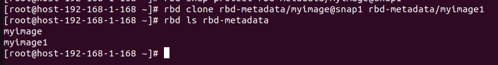

```bash
# Map và sử dụng clone
sudo rbd map rbd/myimage-clone
```
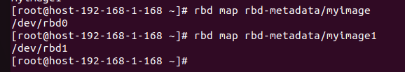

### Liệt kê và Xem thông tin

```bash
# Thông tin chi tiết
rbd info rbd/myimage
```
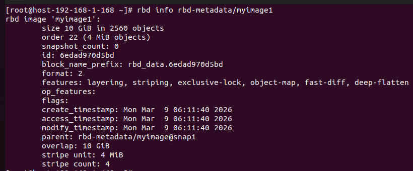

```bash
# Dung lượng sử dụng
rbd du rbd/myimage
```
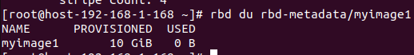

### Resize Image

```bash
# Mở rộng
rbd resize --size 20G rbd/myimage
```
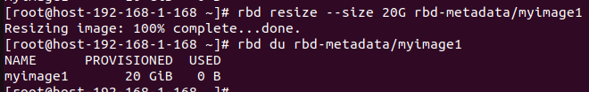

```bash
# Thu nhỏ (cẩn thận, có thể mất dữ liệu)
rbd resize --size 5G --allow-shrink rbd/myimage
```
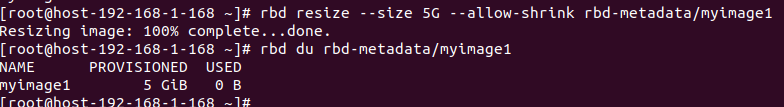

### Xóa Image

```bash
rbd unmap /dev/rbd0
rbd rm rbd/myimage
```
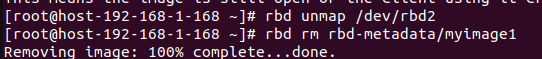

## 5. Mapping và Mounting RBD

### Mapping trên Linux

```bash
# Map image thành device
sudo rbd map rbd/myimage
# Output: /dev/rbd0

# Kiểm tra
lsblk | grep rbd

# Format (nếu cần)
sudo mkfs.ext4 /dev/rbd0

# Mount
sudo mkdir /mnt/rbd
sudo mount /dev/rbd0 /mnt/rbd
```
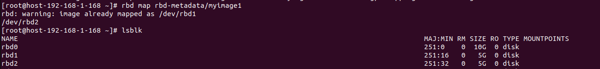

### Unmapping

```bash
# Unmount trước
sudo umount /mnt/rbd

# Unmap device
sudo rbd unmap /dev/rbd0
```

## 6. Snapshot và Cloning

### Tạo Snapshot

```bash
# Tạo snapshot
rbd snap create rbd/myimage@snap1
```
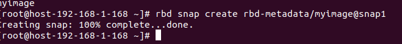

```bash
# Liệt kê snapshots
rbd snap ls rbd/myimage
```

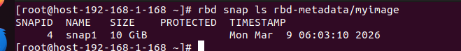

```bash
# Bảo vệ snapshot (để clone)
rbd snap protect rbd/myimage@snap1
```

### Quản lý Snapshots

```bash
# Unprotect snapshot
rbd snap unprotect rbd/myimage@snap1
# Xóa snapshot
rbd snap rm rbd/myimage@snap1
```
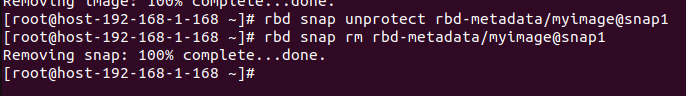

```bash
# Rollback image về thời điểm snapshot
rbd snap rollback rbd/myimage@snap1
```

## 7. Mirroring và Disaster Recovery

### Cấu hình Mirroring

```bash
# Bật mirroring cho pool
rbd mirror pool enable rbd pool

# Bật mirroring cho image
rbd mirror image enable rbd/myimage

# Kiểm tra trạng thái
rbd mirror pool status rbd
rbd mirror image status rbd/myimage
```
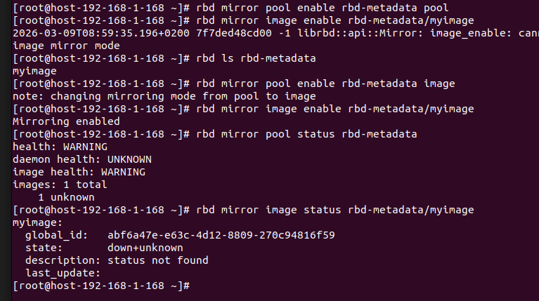

### Peer Cluster

```bash
# Thêm peer cluster
rbd mirror pool peer add rbd client.admin@remote

# Đồng bộ
rbd mirror pool peer bootstrap import rbd --direction rx-only <token>
```

### Failover và Failback

- Khi dữ liệu ở cụm A bị mất do mất điện hay dây cáp thì ta đã có dữ liệu ở cụm B nhờ mirror nhưng dữ liệu cụm B chỉ ở trạng thái read-only. Hành động Failover sẽ giúp cụm B lập tức bẻ khóa trở thành Primary và dữ liệu sử dụng bình thường. Sau khi đã khắc phục sự cố xong thì Failback sẽ giúp cụm A trở về Primary và cụm B trở về như ban đầu

```bash
# Demote primary
rbd mirror image demote rbd/myimage

# Promote secondary
rbd mirror image promote rbd/myimage
```

## 8. Tối ưu hóa Hiệu năng

### QoS (Quality of Service)

```bash
# Giới hạn IOPS
rbd config image set rbd/myimage rbd_qos_iops_limit 1000

# Giới hạn bandwidth
rbd config image set rbd/myimage rbd_qos_bps_limit 104857600  # 100MB/s
```

### PG Tuning

```bash
# Tăng PG cho pool RBD
ceph osd pool set rbd pg_num 256
ceph osd pool set rbd pgp_num 256
```

## 9. Kiến trúc Nội bộ và Data Path

### Object Layout trong RBD

Mỗi RBD image được chia thành các RADOS objects với cấu trúc như sau:

- **Head Object**: `<pool>.<image>` – Chứa metadata, kích thước, features, snapshots.
- **Data Objects**: `<pool>.<image>.<object_number>` – Chứa dữ liệu thực tế, mỗi object thường 4MB.

Ví dụ với image 10GB:

```bash
rbd info rbd/myimage
# Output: size 10 GiB in 2560 objects
```

- Tổng số objects = kích thước / object size (mặc định 4MB).

### Data Path

```
Application I/O
    ↓
Filesystem (ext4/xfs)
    ↓
RBD Kernel Module / QEMU Block Driver
    ↓
librbd (RBD Library)
    ↓
RADOS Operations (read/write objects)
    ↓
OSD Handling
```

- **Read Path**: Client tính toán object offset từ block offset, gửi RADOS read.
- **Write Path**: Tương tự, nhưng có thể cache và batch writes.

### Features và Extensions

RBD hỗ trợ các features:

- **layering**: Cho phép snapshots và clones.
- **exclusive-lock**: Đảm bảo chỉ một client ghi tại một thời điểm.
- **object-map**: Theo dõi allocated objects để tăng hiệu năng.
- **fast-diff**: Tính toán diff nhanh giữa snapshots.
- **deep-flatten**: Flatten clones độc lập.

```bash
# Bật features
rbd feature enable rbd/myimage layering exclusive-lock

# Kiểm tra features
rbd info rbd/myimage | grep features
```

## 10. Benchmarks và Performance Analysis

### Công cụ Benchmark

#### rbd bench

- Dùng khi ta tạo xong cụm Ceph mới muốn test xem các node có liên lạc với nhau ổn định không, ổ cứng có bị nghẽn cổ chai không

```bash
# Benchmark write
rbd bench --io-type write --io-size 4K --io-threads 16 --io-total 1G rbd/myimage
```

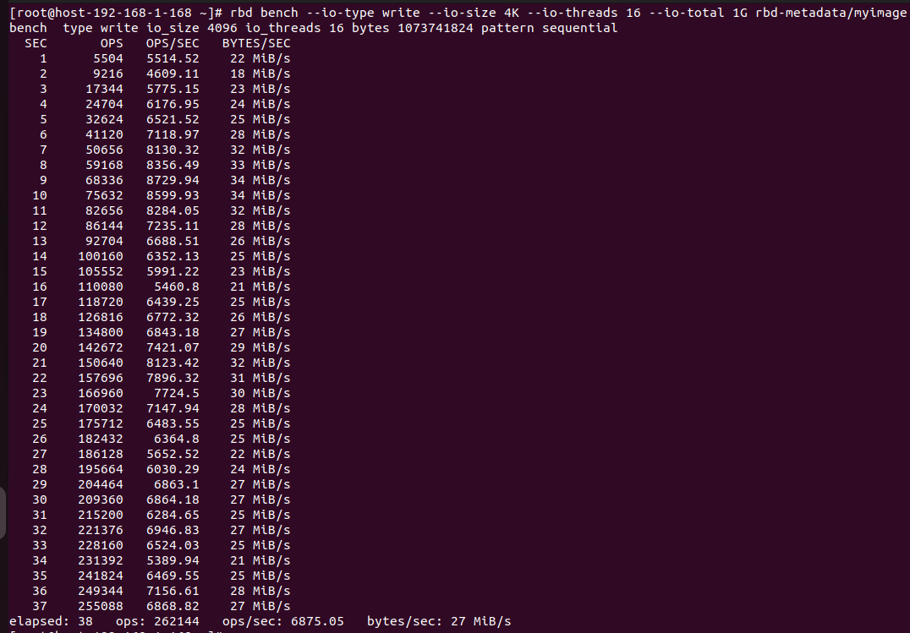

Giải thích:
- elapsed: 38: Toàn bộ quá trình ghi 1GB dữ liệu mất 38 giây.

- ops/sec: 6875.05 (Con số quan trọng nhất): Cụm Ceph của bạn xử lý trung bình được khoảng 6.875 lệnh ghi mỗi giây.

- bytes/sec: 27 MiB/s: Tốc độ băng thông (Throughput).

```bash 
# Benchmark read
rbd bench --io-type read --io-size 4K --io-threads 16 --io-total 1G rbd/myimage
```

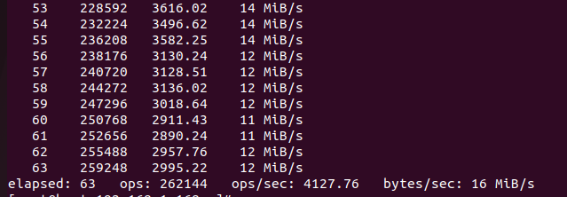

Giải thích:
- 
- elapsed: 63: Toàn bộ quá trình ghi 1GB dữ liệu mất 63 giây.

- ops/sec: 4127.6: Cụm Ceph của bạn xử lý trung bình được khoảng 4.127 lệnh đọc mỗi giây.

- bytes/sec: 16 MiB/s: Tốc độ băng thông (Throughput).
#### fio

- Dùng khi cụm Ceph đã chạy cùng với các máy ảo để xem có thể kéo được bao nhiêu IOPS để cam kết chất lượng máy ảo với khách hàng hoặc để tinh chỉnh tunning các tham số trong kernal Linux

```bash
# Fio với RBD
fio --name=rbd-test --rw=randwrite --bs=4k --size=1G --numjobs=4 --runtime=60 --filename=/dev/rbd0
```
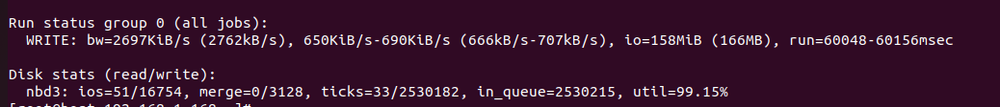

Giải thích:
- bw=2697KiB/s: 4 tiến trình numjobs gộp lại được 2.6 Mb/s
- util=99.15% : 99.15% thời gian ổ bận rộn
## Các lệnh RBD hữu ích

```bash
# Quản lý images
rbd create --size 10G rbd/myimage          # Tạo image
rbd ls rbd                                 # Liệt kê
rbd info rbd/myimage                       # Thông tin
rbd resize --size 20G rbd/myimage          # Resize
rbd rm rbd/myimage                         # Xóa

# Snapshots
rbd snap create rbd/myimage@snap1          # Tạo snap
rbd snap ls rbd/myimage                    # Liệt kê snaps
rbd snap protect rbd/myimage@snap1         # Bảo vệ snap
rbd clone rbd/myimage@snap1 rbd/clone      # Clone

# Mapping
sudo rbd map rbd/myimage                   # Map
sudo rbd unmap /dev/rbd0                   # Unmap
sudo rbd showmapped                        # Xem mapped devices

# Mirroring
rbd mirror pool enable rbd pool            # Bật mirroring
rbd mirror image enable rbd/myimage        # Bật cho image
rbd mirror pool status rbd                 # Trạng thái

# Benchmark
rbd bench --io-type write --io-size 4K --io-threads 16 --io-total 1G rbd/myimage

# Export/Import
rbd export rbd/myimage /tmp/image.raw      # Export
rbd import /tmp/image.raw rbd/newimage     # Import
```


