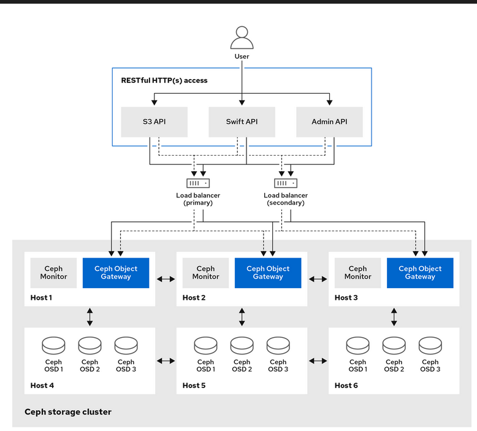
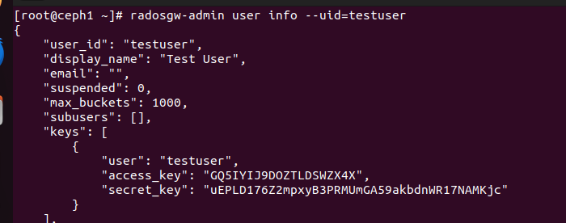
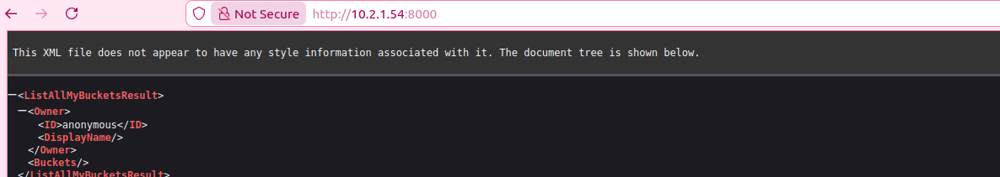
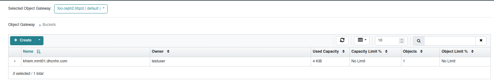
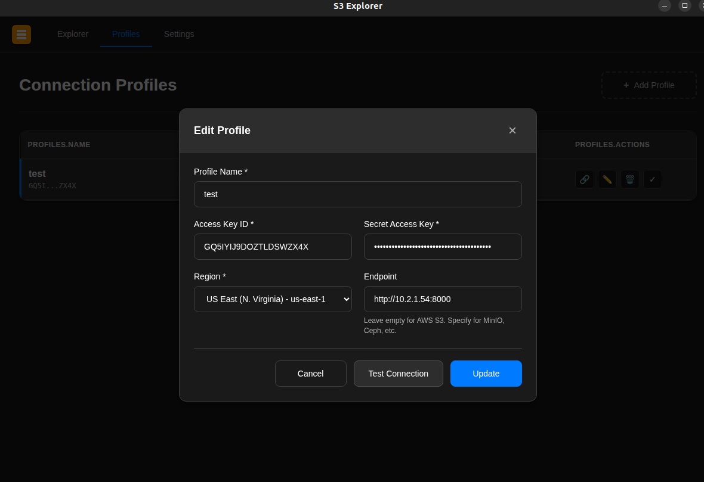
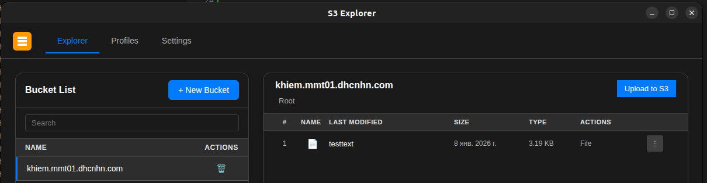

# Radosgateway
## Khái niệm 
- Là một giao diện lưu trữ đối tượng đóng vai trò là cầu nối để các ứng dụng giao tiếp vào bên trong cụm
- Là một web server giúp chuyển đổi các yêu cầu HTTP thành lệnh để chuyển xuống RADOS. Nó không hiện ra như thư mục mà có giao diện hỗ trợ AWS S3 và Swift mà giao tiếp trực tiếp qua API


## Chức năng chính 

## Ứng dụng
- Ứng dụng có thể bypass qua RADOS gateway và truy xuất trực tiếp tới librados, thường thấy trong các ứng dụng doanh nghiệp đòi hỏi hiệu năng cao. Ceph cho phép truy xuất trực tiếp tới cluster, điều khác biệt so với các hệ thống lưu trữ khác vốn giới hạn về các interface giao tiếp.


"access_key": "GQ5IYIJ9DOZTLDSWZX4X",
"secret_key": "uEPLD176Z2mpxyB3PRMUmGA59akbdnWR17NAMKjc"
## Tạo rgw trên Cephadm
 Bước 1: Tạo enable services rgw 
 ```sh
 ceph orch module enable rgw
 ceph orch apply rgw foo --placement="3 ceph1 ceph2 ceph3" --port=8000 # foo là tên có thể đổi, placement là các node muốn cài rgw
 ```
 Bước 2: Tạo tên miền, vùng 
 ```sh
ceph orch apply rgw east --realm=myorg --zonegroup=us-east-zg-1 --zone=us-east-1 --placement="3 ceph1 ceph2 ceph3"
```
Bước 3: Lấy `access_key` và `secret_key`:
 - Liệt kê user:
```sh 
rgwosgw-admin user list
```
 - Xem chi tiết từng user và lấy `access_key`, `secret_key`
```sh
rgwosgw-admin user info --uuid=testuser
```


 - Test truy cập: http://10.2.1.54:8000

 
 - Vào giao diện Ceph chọn Object Gateway --> Bucket --> Create. Điền Name và Owner rồi tạo

 

 - Tải ứng dụng S3 Explorer để test
 - Vào giao diện của S3 chọn Edit Profile --> Điền các thông tin của `access_key`, `secret_key`, `region`, `endpoint`

  
 
 - Chọn Bucket hiện sẵn và chọn `Upload to S3` để upload file
 
  
 - Trên máy chủ Ceph tải và cài aws-cli để config :
```sh
curl "https://awscli.amazonaws.com/awscli-exe-linux-x86_64.zip" -o awscliv2.zip
dnf install -y unzip
unzip awscliv2.zip
sudo ./aws/install
```
 - Tạo file policy `public.json` để có thể truy cập trên public
```sh
{
  "Version":"2012-10-17",
  "Statement":[{
    "Sid":"PublicRead",
    "Effect":"Allow",
    "Principal":"*",
    "Action":["s3:GetObject"],
    "Resource":["arn:aws:s3:::khiem.mmt01.dhcnhn.com/*"]
  }]
}
```
 - Chạy lệnh để kich hoạt:
 ```sh
 aws   --endpoint-url http://10.2.1.54:8000   s3api put-bucket-policy   --bucket khiem.mmt01.dhcnhn.com   --policy file://public.json

```
 - Giờ truy cập vào đường dẫn để có thể xem và tải được các file đã lưu
 ```sh
 http://10.2.1.54:8000/khiem.mmt01.dhcnhn.com/testtext
 ```
 - Tạo file yaml để có thể chạy bằng dịch vụ
 ```sh
 service_type: rgw
service_id: rgw.foo
placement:
  hosts:
    - ceph1
    - ceph2
    - ceph3
spec:
  rgw_frontend_port: 8081

service_type: ingress
service_id: rgw.foo
placement:
  hosts:
    - ceph1
    - ceph2
    - ceph3
spec:
  backend_service: rgw.foo
  frontend_port: 4443
  monitor_port: 1988
  virtual_ip: 10.2.1.101     
  ```


