# Ceph RGW (RADOS Gateway) 
## 1. Tổng quan RGW 
### Định nghĩa và chức năng chính

- **RGW (RADOS Gateway)** không chỉ là một proxy mà là một tầng trừu tượng cao cấp.
- Cung cấp các API RESTful compatible với **Amazon S3** và **OpenStack Swift** trên nền tảng RADOS.
- Dịch các HTTP requests thành các RADOS operations được thực thi trực tiếp trên cluster.

### Thiết kế không trạng thái (Stateless)

- **Nguyên lý cốt lõi**: RGW daemon không lưu trữ bất kỳ state nào liên quan đến client session.
- **Lợi ích**:
  - Cho phép horizontal scaling gần tuyến tính: chỉ cần thêm RGW instances phía sau load balancer.
  - Nếu một RGW daemon bị hỏng, load balancer tự động chuyển hướng traffic đến các instances còn lại (transparent failover).
  - Tất cả state quan trọng (user metadata, bucket definitions, ACLs, object data) được lưu trong RADOS pools.

---

## 2. RGW Frontends

### Hai loại Frontend chính

#### **Civetweb** (Legacy)

- Mô hình: đồng bộ, một thread per connection.
- Hiệu suất hạn chế với workload concurrency cao.

#### **Beast** (Hiện tại — Khuyên dùng)
- Mô hình: không đồng bộ, event-driven I/O.
- Dựa trên **Boost.Asio** C++ library.
- Sử dụng một pool worker threads nhỏ để service hàng ngàn kết nối đồng thời.
- **Ưu điểm**:
  - CPU và memory utilization cao hơn.
  - Threads không bị block đợi I/O.
  - Memory overhead per-connection giảm drastically.
- Thiết kế để đáp ứng cloud-native applications với high-concurrency, high-IOPS workloads.

### Frontend Configuration in Action (cephadm)

Khi deploy hoặc modify RGW service bằng cephadm, chỉ định frontend type trong service spec file:

```yaml
service_type: rgw
service_id: myrealm.myzone
spec:
  rgw_realm: myrealm
  rgw_zone: myzone
  ssl: true
  rgw_frontend_port: 1234
  rgw_frontend_type: beast
  rgw_frontend_ssl_certificate: ...
```

**Giải thích**:
- `rgw_realm`: xác định realm cho RGW.
- `rgw_zone`: xác định zone trong realm.
- `ssl: true`: bật SSL termination.
- `rgw_frontend_port`: cổng mà Beast lắng nghe (ví dụ 1234).
- `rgw_frontend_type: beast`: chọn Beast làm frontend mặc định.

---

## 3. Luồng xử lý Request

Một incoming client request đi qua nhiều tầng nội bộ:

```
HTTP Connection (Beast Frontend)
         ↓
    RGW Request Handler
         ↓
    RADOS Operations
         ↓
    RADOS Cluster (OSDs)
```

Beast frontend xử lý HTTP connection ban đầu, sau đó request được chuyển tiếp đến các tầng RGW xử lý logic và RADOS operations.

---

## 4. Kiến trúc RADOS Pools trong RGW

### Tại sao cần Multiple Pools?

- **Stateless design** yêu cầu: toàn bộ critical information, user data, metadata, logs phải được lưu trữ persistently trong RADOS.
- **Multi-pool architecture** cho phép:
  - Tách biệt các loại dữ liệu khác nhau trên các hardware tier khác nhau.
  - Tối ưu hóa tradeoff giữa performance và cost.

### Chiến lược Storage tối ưu

- **Latency-sensitive pools** (metadata, logs): replicated pools trên fast SSD media.
- **Capacity-heavy object data**: erasure-coded pools trên HDD hoặc QLC-class SSDs.
- **NVMe SSDs** được ưu tiên hơn legacy SAS/SATA SSDs (tốt hơn về performance, density, cost).

### Key RGW Pools and Their Purposes

| Pool Name | Chức năng | Protection Type | Recommended Media |
|-----------|-----------|-----------------|-------------------|
| `.rgw.root` | Global RGW configuration (realms, zonegroups, zones) | Replicated | SSD |
| `.rgw.control` | Internal RGW daemon coordination | Replicated | SSD |
| `.rgw.meta` | User and bucket metadata | Replicated | SSD |
| `.rgw.log` | Operation and replication logs | Replicated | SSD |
| `.rgw.buckets.index` | Bucket object listings (OMAPs) — **Critical** | Replicated | SSD/NVMe |
| `.rgw.buckets.data` | Main object data payload | Erasure Coded | HDD/QLC SSD |
| `.rgw.buckets.non-ec` | Auxiliary pool (EC-incompatible operations) | Replicated | SSD/HDD |

### Pool Naming Convention

Pool names specific to an RGW zone theo pattern: `<zone-name>.pool-name`

Ví dụ: zone `us-east` có pools:
```
.rgw.root
us-east.rgw.control
us-east.rgw.meta
us-east.rgw.log
us-east.rgw.buckets.index
us-east.rgw.buckets.data
```

### RADOS Namespaces

Nhiều logical pools được consolidate bằng RADOS namespaces trong một main RADOS pool.

Ví dụ: `.rgw.meta` pool chứa 3 RADOS namespaces:
```
root
users.keys
users.uid
```

Kiểm tra RADOS namespaces:
```bash
rados ls -p default.rgw.meta --all
```
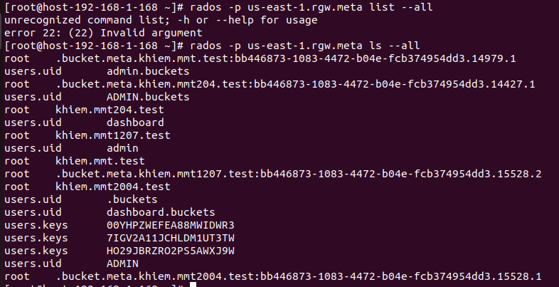

### Zone Configuration Example

Lấy thông tin zone bằng `radosgw-admin`:
```bash
radosgw-admin zone get --rgw-zone default
```
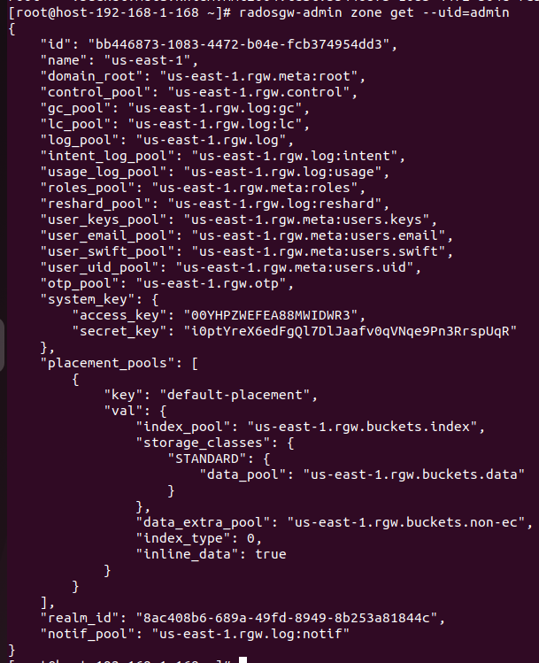

### PG Tuning Recommendations

Khi RGW tạo một pool lần đầu, nó dùng `osd_pool_default_pg_num` và `osd_pool_default_pgp_num`. Nhưng các pools này (đặc biệt index và data) cần tuning thêm.

Check xem PG autoscaler có bật không:
```bash
ceph osd pool autoscale-status
```
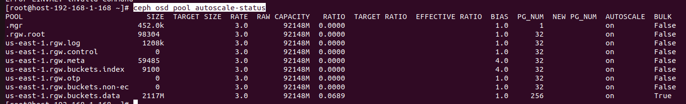

**Với PG autoscaler được bật**, recommend tăng:
```bash
ceph config set global mon_target_pg_per_osd 300
ceph config set global mon_max_pg_per_osd 600
```
Check lại cấu hình
```sh
ceph config dump | grep global
```

`BIAS` là hệ số ưu tiên. Index pools nên có **BIAS value = 4** để ép Ceph cấp nhiều hơn bình thường số PGs cho chúng

## 5. Bucket Index và OMAPs — Chi tiết toàn diện

### The Bucket Index là gì?

Bucket index là một structure dùng để:
- Listing bucket contents.
- Maintaining journal cho versioned operations.
- Storing quota metadata.
- Logging cho multi-zone synchronization.

### OMAPs (Object Maps) — Nền tảng của Bucket Index

- **OMAP**: key-value store được kết hợp với mỗi RADOS object.
- Mỗi bucket, RGW tạo một hoặc nhiều **index objects** trong `.rgw.buckets.index` pool.
- Listing information của objects trong bucket được lưu trong **OMAP** của các index objects.

### Tại sao OMAPs phải ở trên SSD?

- **Critical performance factor**: OMAPs được lưu trữ vật lý **trong RocksDB database** trên OSD's DB partition.
- **OMAP operations không compatible với erasure-coded pools** → index pools phải dùng replicated protection.
- **Đầu tư vào fast flash devices (SSDs, ideally NVMe)** cho OSD's DB partition là **paramount** để maximize bucket listing performance.

### Tuning Index Pool for Performance

#### PG Count và Parallelism

- Mỗi PG map tới một set OSDs (một là primary).
- Khi RGW perform bucket listing, nó gửi **parallel read requests** tới OMAPs của nhiều bucket index shard objects.
- **Higher PG count** → distribute shards across greater number of primary OSDs → tăng parallelism.
- **Low PG count** → bottleneck: nhiều requests funneled tới vài OSDs → saturation.

**Recommendation**: Mỗi index pool nên có **at least one PG for every OSD** mà nó được placed trên.

Với PG autoscaler, index pools tự động có BIAS value 4 để nhận PGs cao hơn.

### Visualizing Bucket Index

Xác nhận pool index và ID:
```bash
ceph osd lspools 
```
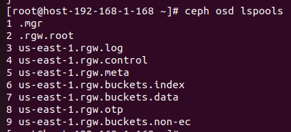

Lấy bucket name để thử nghiệm:
```bash
radosgw-admin bucket list
```
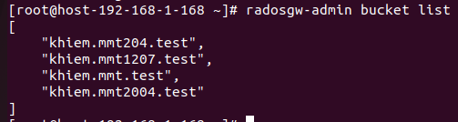

Kiểm tra xem cho bucket cụ thể:
```bash
radosgw-admin bi list --bucket khiem.mmt.test
```
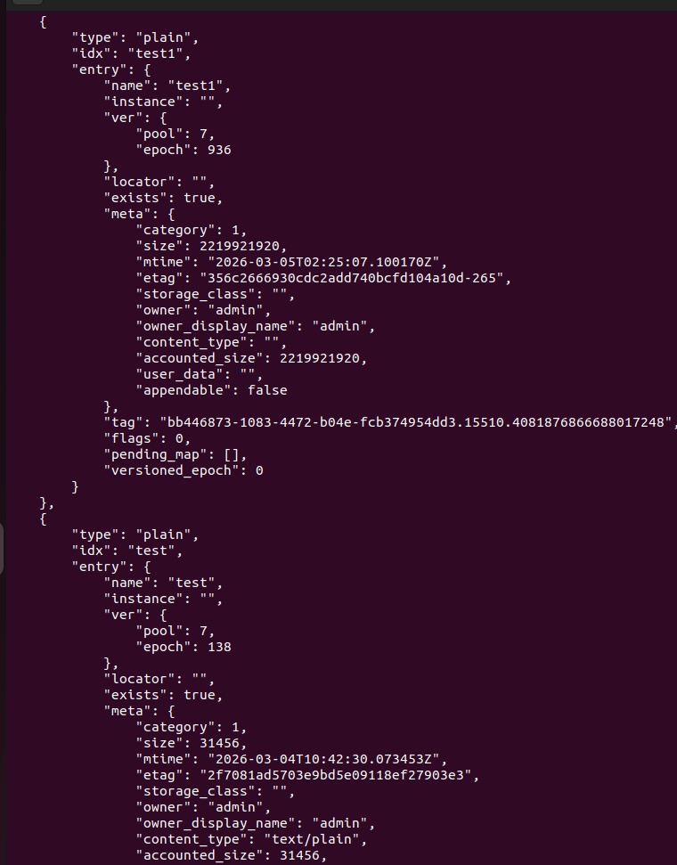

## 6. Bucket Sharding — Công cụ Scalability

### Vấn đề với Single-Shard Index

- Nếu bucket index được lưu trong một single RADOS object thì điều này tạo thắt cổ chai và khối lượng công việc cao

### Giải pháp: Bucket Index Sharding

**Bucket Index Sharding** chia bucket index thành nhiều phần (Mặc định là 11):
- Mỗi shard sẽ được đánh dấu từ 0 tới 10 (cấu hình mặc định) được lưu trên một **separate RADOS object** trong index pool.
- Khi object được write, update được directed đến shard cụ thể dựa trên **hash của object name**.
- **Multiple operations có thể happen concurrently** across different PGs và OSDs → improve overall scalability.

**Shard Configuration** 
- **Shard number**: nên là prime number.
- **Configurable via**: `bucket_index_max_shards` config option (default = 11).

Kiểm tra shard count:
```sh
radosgw-admin bucket stats --bucket bucket1 | grep shards
```
Cấu hình shared count (Chỉ có tác dụng cho bucket mới được tạo trong tương lai, không có tác dụng cho bucket đã được tạo):
```sh
# Set max shards to 5
ceph config set client.rgw rgw_override_bucket_index_max_shards 5
#check new shard count (bucket khiem.mmt1207.test là bucket mới được tạo sau khi config lệnh trên)
radosgw-admin bucket stats --bucket khiem.mmt1207.test  | grep shards 
```
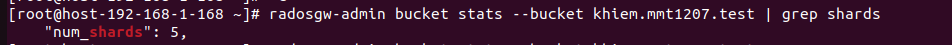

Sử dụng radosgw-admin cấu hình để bucket đó cấu trúc lại mục lục sau khi config trên
```sh
radosgw-admin bucket reshared --bucket=khiem.mmt2004.test --num-shareds=5 
``` 
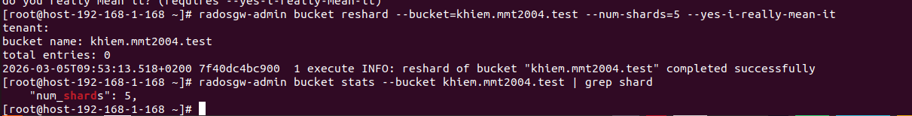

### Visualizing Shards at RADOS Level

List bucket index pool:
```bash
rados -p default.rgw.buckets.index ls
```
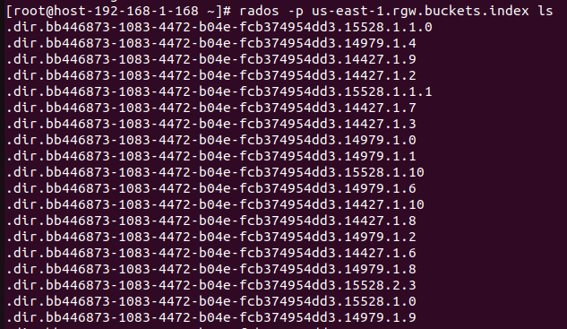

### Examining Shard Contents

Lấy bucket marker:
```bash
radosgw-admin bucket stats --bucket khiem.mmt.test | grep marker
```
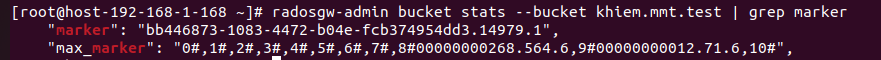

Ở đây Ceph đã dùng chuỗi số  `8#00000000268.564.6`,`9#00000000012.71.6` để làm mốc đánh dấu tiến trình đồng bộ dữ liệu nếu đang chạy cấu hình Multi-Site

Upload object và kiểm tra shard:
```bash
# Upload và xem pool
aws --endpoint http://10.2.6.128:8000 s3 cp test-kms.txt s3://khiem.mmt.test/TEST 
ceph osd lspools
```
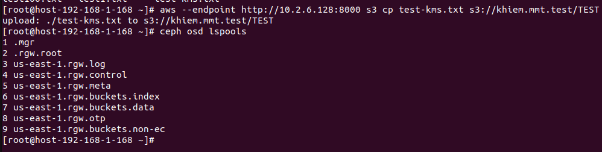

```sh
# Check bucket market của bucket khiem.mmt.test
rados -p us-east-1.rgw.meta ls --all
# Lọc lấy đúng market của bucket khiem.mmt.test
rados -p us-east-1.rgw.buckets.index ls | grep bb446873-1083-4472-b04e-fcb374954dd3.14979.1
# List OMAP keys trên shard 2
rados -p us-east-1.rgw.buckets.index listomapkeys .dir.bb446873-1083-4472-b04e-fcb374954dd3.14979.1.0
```
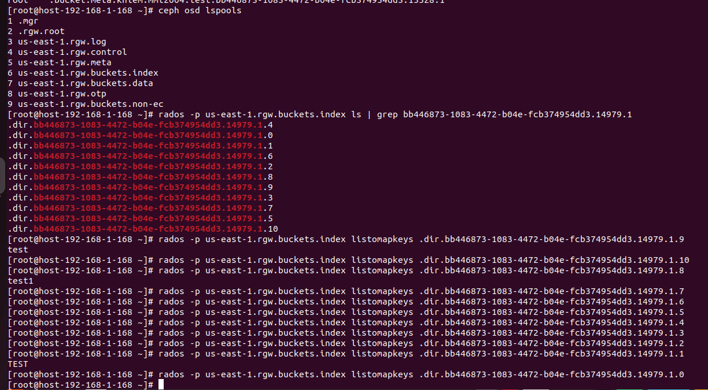

Kiểm tra value size:
```bash
rados -p us-east-1.rgw.buckets.index listomapvals .dir.bb446873-1083-4472-b04e-fcb374954dd3.14979.1.1
```
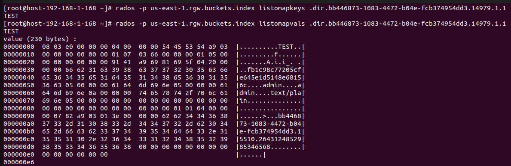

Xác nhận placement của shard:
```bash
ceph osd map us-east-1.rgw.buckets.index .dir.bb446873-1083-4472-b04e-fcb374954dd3.14979.1.1
```
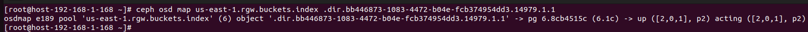

Giải thích: 
- `e189`: đây là epoch phiên bản 189 của Ceph
- `pool 'us-east-1.rgw.buckets.index' (6)`: đây là tên của pool và đang có pool_id là 6
- `object '.dir.bb446873-1083-4472-b04e-fcb374954dd3.14979.1.1`: tên của đối tượng đang xét
- `pg 6.8cb4515c (6.1c)`: đây là bước định tuyến cho PG, `6` là pool_id,  `8cb4515c` là mã hàm băm tên của đối tượng đang xét, `6.1c` là ID của PG
- `up ([2,0,1], p2)`: từ `up` chỉ danh sách osd đang hoạt động, `[2,0,1]` ý chỉ replicate đc lưu trên osd.2, osd.0, osd.1 và `p2` nghĩa là osd.2 là primary đang đc chọn làm ổ chính
- `acting ([2,0,1], p2)`: danh sách các ổ cứng thực tế đang tiếp nhận xử lý dữ liệu hiện tại
### The Zero-Byte Mystery

Khi query space usage của bucket index pool:
```bash
rados df -p us-east-1.rgw.buckets.index
```
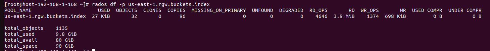

- Bản chất Bucket Index hoạt động không chứa các payload mà chỉ chứa các cặp Key-Value và được lưu trữ dưới dạng OMAP. Còn payload thực tế sẽ được lưu trực tiếp xuống block device

- Metadata và OMAP sẽ được lưu trong RocksDB được nhúng trong OSD

## 7. Tái phân đoạn Bucket động (DBR)

### Vấn đề

Khi bucket mở rộng đến hàng trăm nghìn hoặc hàng triệu đối tượng S3, chỉ mục có thể trở thành điểm nghẽn cổ chai.

Ngưỡng mặc định: 100.000 đối tượng S3 trên mỗi phân đoạn (có thể cấu hình).

### Giải pháp: DBR (Dynamic Bucket Resharding)

- Quy trình nền liên tục giám sát các mục trong mỗi phân đoạn chỉ mục bucket.
- Khi phân đoạn phát triển vượt quá ngưỡng đã cấu hình, DBR tự động kích hoạt thao tác tái phân đoạn.
- Quy trình:
  1. Tạo bộ chỉ mục mới với số lượng phân đoạn lớn hơn.
  2. An toàn di chuyển các mục từ bố cục cũ, nhỏ hơn sang bố cục mới, lớn hơn.
  3. Hầu hết hoạt động diễn ra trực tuyến (trong khi sản xuất đang chạy).

### Sự phát triển: Giảm thiểu việc đóng băng ghi

Lịch sử: thao tác tái phân đoạn trước đây yêu cầu tạm dừng I/O ghi.

**Cải tiến (phiên bản Tentacle sắp tới)**:
- Giảm đáng kể thời gian đóng băng ghi.
- Quy trình tái phân đoạn trở nên **gần như minh bạch**.
- Các thao tác ghi tiếp tục với **sự gián đoạn tối thiểu**.

### Hợp nhất phân đoạn

DBR không chỉ mở rộng quy mô lên, mà còn **thu hẹp quy mô xuống**:
- Tình huống: bucket đã lưu hàng triệu đối tượng, nhưng sau đó xóa số lượng lớn → các phân đoạn thưa thớt hoặc trống.
**Giải pháp**: DBR kích hoạt thao tác tái phân đoạn "thu hẹp" → di chuyển các mục từ nhiều phân đoạn thưa thớt vào bộ nhỏ hơn, dày đặc hơn.

## 10. Bố cục Metadata RGW: Bản thiết kế Control Plane

### Thiết kế Stateless và Metadata

Tương tự như dữ liệu của một đối tượng S3 được tổ chức cẩn thận trên RADOS, toàn bộ trạng thái của hệ thống RGW, bao gồm users, buckets và policies, cũng được lưu trữ bền vững trong các RADOS pools chuyên dụng. Thiết kế này là nền tảng cho tính stateless của RGW daemons; tất cả thông tin control plane tồn tại trong cluster, không phải trên gateways.

Metadata này chủ yếu được lưu trong pool `.rgw.meta`, trong khi logs hoạt động cho các quy trình như garbage collection và lifecycle management nằm trong pool `.rgw.log`.

Các đối tượng metadata được lưu trữ ở định dạng nhị phân nội bộ. Vì lý do này, việc sử dụng công cụ dòng lệnh `radosgw-admin` để quản trị và tương tác là rất quan trọng. Tiện ích này giải mã đáng tin cậy các bản ghi nhị phân thành JSON có thể đọc được và đảm bảo mọi sửa đổi được thực hiện an toàn.

**Lưu ý**: Không bao giờ sửa đổi trực tiếp các đối tượng trong pool `.rgw.meta` bằng công cụ `rados`.

### Các Danh mục Metadata Chính

Pool `.rgw.meta` sử dụng RADOS namespaces để tách biệt logic các loại thông tin khác nhau. Khi truy vấn metadata, bạn sẽ gặp các danh mục cấp cao sau:

- `user`: Lưu trữ bản ghi user S3, bao gồm access keys, capabilities, usage quotas và thông tin liên hệ như email.
- `bucket`: Bản ghi bucket có tên cấp cao. Chứa thông tin thiết yếu bao gồm chủ sở hữu bucket, chính sách placement (zone nào nó thuộc về) và các flags khác nhau.
- `bucket.instance`: Đại diện cho instance vật lý cụ thể của bucket. Bản ghi này theo dõi ID duy nhất của bucket, số lượng shards cho index, trạng thái versioning và timestamps tạo.
- `roles`: Chứa định nghĩa STS (Security Token Service) và IAM roles được sử dụng bởi policy evaluation engine để cấp temporary credentials.
- `group`: Định nghĩa user groups, có thể được sử dụng cho các hoạt động quản trị hoặc policy management.
- `topic`: Lưu trữ cấu hình cho S3 bucket event notifications.
- `otp`: Giữ one-time password credentials cho multi-factor authentication.
- `account`: Được sử dụng cho Swift account metadata nếu Swift API được bật.


### Kiểm tra Metadata bằng radosgw-admin

Công cụ `radosgw-admin` cung cấp cách an toàn và có cấu trúc để khám phá dữ liệu control plane này. Đầu tiên, bạn có thể liệt kê tất cả các danh mục metadata có sẵn:

```bash
radosgw-admin metadata list
```
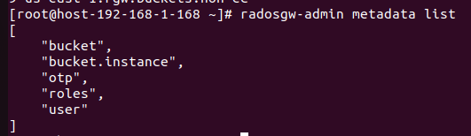

Sau đó, liệt kê các keys cụ thể trong một danh mục, chẳng hạn như `bucket` hoặc `bucket.instance`:

```bash
# Liệt kê tất cả tên bucket
radosgw-admin metadata list bucket

# Liệt kê tất cả instance bucket vật lý
radosgw-admin metadata list bucket.instance
```

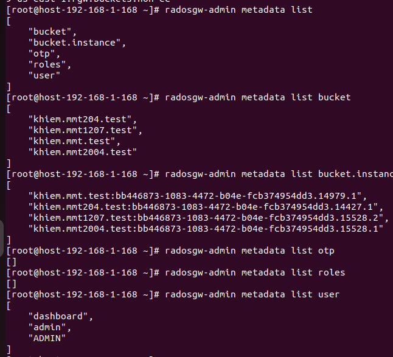

Cuối cùng, đây là ví dụ về việc truy xuất và giải mã một bản ghi cụ thể bằng key của nó. Đường ống output đến `jq` định dạng output JSON để dễ đọc:

```bash
# Lấy metadata bucket theo tên
radosgw-admin metadata get bucket:bucket1 | jq .

# Lấy bản ghi user theo UID
radosgw-admin metadata get user:my-user-id | jq .
```
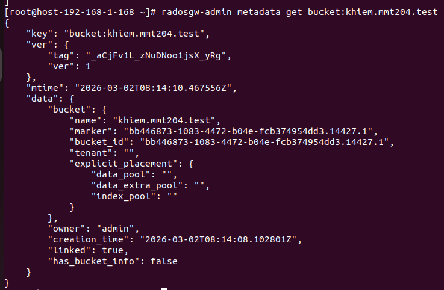

Quan trọng là `radosgw-admin` giúp cuộc sống dễ dàng hơn với các tham số CLI cụ thể để tương tác trực tiếp với metadata này. Ví dụ: `radosgw-admin user`, `radosgw-admin account`, `radosgw-admin bucket`, v.v.

### Liên kết Metadata với Usage

Để kết nối metadata trừu tượng với usage thực tế, `radosgw-admin` cung cấp các lệnh tổng hợp thông tin này:

```bash
# Lấy stats chi tiết cho bucket, bao gồm số shards, số objects và size
radosgw-admin bucket stats --bucket BUCKET_NAME | jq .
```
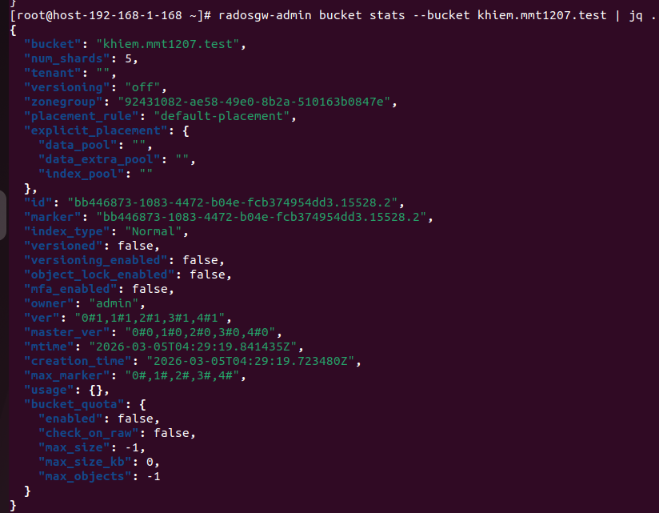

```bash
# Lấy metadata hoàn chỉnh cho một object duy nhất như RGW thấy
radosgw-admin object stat --bucket BUCKET_NAME --object OBJECT_KEY | jq .
```
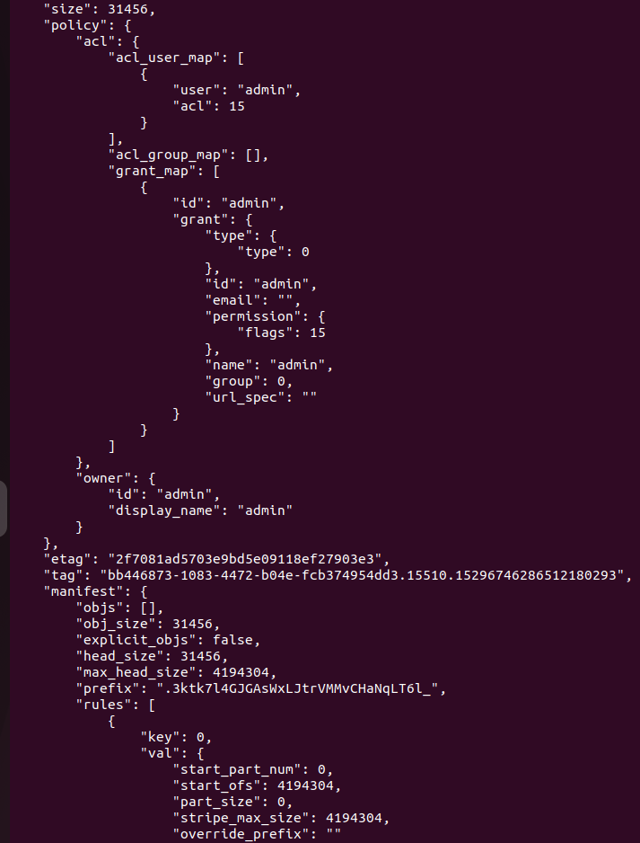


Lệnh `object stat` này hữu ích, vì nó hiển thị manifest, thông tin placement và tất cả attributes hệ thống cho một S3 object cụ thể, cung cấp view hoàn chỉnh từ góc nhìn của gateway.

## 11. Bố cục Dữ liệu RGW: Mô hình Đối tượng Head/Tail

Một đối tượng S3 logic thường bao gồm một số đối tượng RADOS vật lý. RGW sử dụng mô hình đối tượng head/tail linh hoạt để cho phép tối ưu hóa cho các kích thước file khác nhau và các hoạt động phức tạp bao gồm MultiPart Upload (MPU).

Đối tượng RADOS chính liên kết với bất kỳ S3 object nào là head object. Tên đối tượng RADOS của nó thường được tạo bằng cách nối marker nội bộ của bucket với key của object, được phân tách bằng dấu gạch dưới, ví dụ `<bucket_marker>_<object_key>`. Head object phục vụ hai mục đích chính. Đầu tiên, nó là kho lưu trữ có thẩm quyền cho tất cả metadata cấp object, bao gồm ACLs, content type HTTP, ETag và bất kỳ metadata do user định nghĩa nào. Thông tin này được lưu trữ hiệu quả dưới dạng RADOS extended attributes (xattrs) trên head object. Thứ hai, đối với các object nhỏ (theo mặc định, những object dưới `rgw_max_chunk_size`), toàn bộ payload dữ liệu của S3 object được lưu trữ trực tiếp trong phần dữ liệu của head object. Đây là tối ưu hóa hiệu suất quan trọng, vì nó cho phép cả dữ liệu và metadata liên quan được ghi vào cluster trong một thao tác RADOS nguyên tử duy nhất, giảm thiểu I/O amplification và độ trễ cho workloads file nhỏ.

Đối với các object vượt quá kích thước dữ liệu inline này, payload dữ liệu của head object được sử dụng để lưu trữ manifest. Manifest là cấu trúc metadata mô tả cách phần còn lại của dữ liệu object được bố trí vật lý trên cluster. Nó chứa danh sách có thứ tự của các đối tượng RADOS khác, được gọi là tail objects, giữ các chunk dữ liệu còn lại. Mỗi entry trong manifest chỉ định tên của tail object, kích thước và offset logic của nó trong S3 object hoàn chỉnh.

Nếu kích thước object vượt quá `rgw_max_chunk_size` (mặc định: 4MB), dữ liệu được striped trên nhiều RADOS objects: một head object (chứa chỉ metadata/manifest) và một hoặc nhiều tail objects (giữ bulk data).

Chúng ta có thể truy xuất kích thước striping mặc định, kiểm soát khi tách dữ liệu xảy ra:

```bash
 radosgw-admin object stat --bucket khiem.mmt.test --object test | grep "stripe_max_size"
# Output: 4194304 (4MB)
```
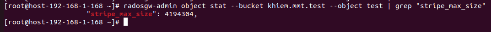

Tương tác giữa kích thước phần do client định nghĩa và kích thước striping nội bộ RGW (`rgw_obj_stripe_size`) có thể dẫn đến việc tạo các tail objects có tên cụ thể. Nếu client upload một phần (ví dụ: 5 MiB) lớn hơn kích thước stripe RGW (ví dụ: 4 MiB), RGW sẽ tự động stripe phần đó trên nhiều RADOS objects. Ví dụ, nó có thể tạo một object 4 MiB có tiền tố `__multipart` nếu MPU được sử dụng, và một object 1 MiB có tiền tố `__shadow` để giữ phần dư. Đây chỉ là tail objects có quy ước đặt tên cụ thể, và cả hai sẽ được tham chiếu chính xác trong manifest cuối cùng.

Ở đây, chúng ta quan sát head object cho một file lớn:

```bash
aws --endpoint=http://ceph-node02:8080 s3 cp awscliv2.zip s3://bucket1/bigfile
aws --endpoint=http://ceph-node02:8080 s3 ls s3://bucket1/bigfile
```
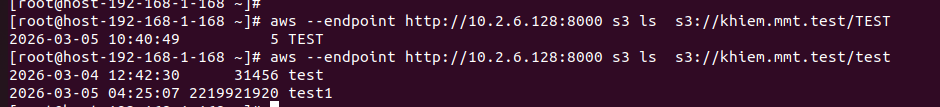

```bash 
rados -p default.rgw.buckets.data ls | grep bigfile$
# Output: 7fb0a3df-9553-4a76-938d-d23711e67677.34162.1_bigfile
```
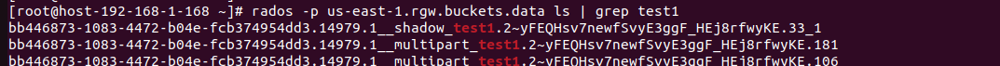

Đây là head object cho `bigfile`. Nó chứa xattrs metadata, bao gồm `user.rgw.manifest`, liệt kê vị trí của tất cả tail objects.

Head object lưu trữ metadata hiệu quả dưới dạng extended attributes:

```bash
rados -p default.rgw.buckets.data listxattr 7fb0a3df-9553-4a76-938d-d23711e67677.34162.1_bigfile
# Output: user.rgw.acl user.rgw.content_type user.rgw.etag user.rgw.idtag user.rgw.manifest user.rgw.pg_ver user.rgw.source_zone user.rgw.tail_tag user.rgw.x-amz-content-sha256 user.rgw.x-amz-date
```
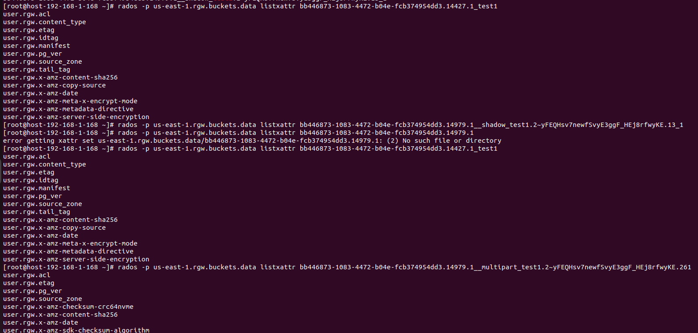

Các xattr được liệt kê xác nhận rằng head object lưu trữ metadata object quan trọng, đáng chú ý là `user.rgw.manifest`, mô tả cách payload dữ liệu của large object được chia thành tail objects.

## 12. S3 Multipart Upload: Thao tác Commit Nguyên tử

Tính năng S3 Multipart Upload (MPU) được thiết kế để upload hiệu quả các large objects bằng cách chia chúng thành các phần nhỏ hơn có thể được upload độc lập và song song. RGW triển khai điều này một cách tinh tế như một thao tác commit chỉ metadata.

Workflow bao gồm ba bước chính:

- **Multipart Upload Initiation**: Yêu cầu được gửi để lấy Upload ID duy nhất.
- **Parts Upload**: Các phần riêng lẻ được upload bằng cả Upload ID và Part ID duy nhất. Mỗi phần được lưu trữ như một RADOS object tạm thời riêng biệt. Nếu kích thước phần vượt quá kích thước stripe RGW (mặc định 4MB), nó được chia nội bộ.
- **Multipart Upload Completion (Atomic Commit)**: Khi tất cả các phần được upload, client gửi completion request. RGW tránh sao chép dữ liệu tốn kém. Thay vào đó, nó tạo head object cuối cùng và điền manifest nội bộ của nó với các con trỏ đến các RADOS objects tạm thời cấu thành các phần. Điều này dẫn đến việc hoàn thành gần như tức thì.

Thiết kế này làm cho việc hoàn thành upload của một large object gần như tức thì từ góc nhìn của cluster. Head object cuối cùng chứa không có user data trong trường hợp này, đó là lý do tại sao các công cụ low-level sẽ báo cáo kích thước của nó là 0 bytes; payload của nó là manifest, không phải nội dung object.

### Cấu trúc MPU trong RADOS

Khi một file được upload theo chunks (ví dụ: 5MB chunks) và RGW có stripe width là 4 MiB, RGW xử lý việc tách nội bộ: nó lấy 4 MiB đầu tiên để tạo một "multipart" RADOS object và 1 MiB còn lại để tạo một "shadow" tail RADOS object.

Hãy xem ví dụ. Chúng ta sẽ đặt kích thước chunk client thành 5 MiB, và upload một file 20 MiB:

```bash
aws configure set default.s3.multipart_chunksize 5MB
aws --endpoint=http://ceph-node02:8080 s3 cp text.txt s3://bucket1/5chuncks
```

Chúng ta gửi 5 MiB chunks đến RGW, và RGW có stripe width là 4 MiB, nghĩa là RGW sẽ lấy 4 MiB đầu tiên và tạo một "multipart" RADOS object và sau đó một 1 MiB "shadow" RADOS tail object.

```bash
rados -p default.rgw.buckets.data ls | grep 5chuncks
```

Output hiển thị việc tạo các thành phần khác nhau, bao gồm head object cuối cùng (...`_5chuncks`), cũng như nhiều multipart và shadow objects tương ứng với các phần striped.

Kích thước xác minh cho thấy logic tách RGW: multipart head RADOS object là 4 MiB, và tail (shadow) RADOS object là 1 MiB.

```bash
# Kiểm tra kích thước của chunk 4MB chính
rados -p default.rgw.buckets.data stat 7fb0a3df-9553-4a76-938d-d23711e67677.34162.1__multipart_5chuncks.2_r3yyxqL2hYs5DW32L9UXR3uawF4VEKL.2
# Output: ... size 4194304

# Kiểm tra kích thước của chunk 1MB còn lại
rados -p default.rgw.buckets.data stat 7fb0a3df-9553-4a76-938d-d23711e67677.34162.1__shadow_5chuncks.2_r3yyxqL2hYs5DW32L9UXR3uawF4VEKL.2_1
# Output: ... size 1048576
```
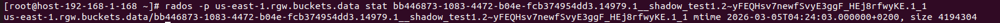

Các phần này không được assemble hoặc merge trong RADOS: đây là trạng thái cuối cùng của chúng.

Cuối cùng, head RADOS object của S3 object đã hoàn thành chứa chỉ manifest metadata, đó là lý do tại sao nó báo cáo kích thước 0 bytes ở cấp RADOS:

```bash
rados -p default.rgw.buckets.data stat 7fb0a3df-9553-4a76-938d-d23711e67677.34162.1_5chuncks
# Output: ... size 0
```

## 13. Bộ thu gom Rác Bất đồng bộ (GC)

Khi clients xóa S3 objects hoặc ghi đè chúng, các RADOS objects cơ bản không bị xóa ngay lập tức. Chức năng chính của việc xóa object là cập nhật bucket index (hoặc đặt delete marker, nếu versioning được kích hoạt). Một khi S3 object bị xóa khỏi index, các RADOS objects cơ bản của nó sẽ bị "mồ côi."

Các RADOS objects mồ côi này sau đó được chèn vào Garbage Collection (GC) queue. Garbage Collector là một quy trình nền quan trọng trong RGW chịu trách nhiệm thu hồi không đồng bộ không gian lưu trữ được tiêu thụ bởi các objects đã xóa. Thiết kế này đảm bảo rằng các yêu cầu `DELETE` của client trả về nhanh chóng mà không chờ quy trình chậm chạp của việc dọn dẹp dữ liệu vật lý.

Đối với workloads có object churn cao (nhiều tạo và xóa), quy trình GC có thể tụt hậu, gây tích tụ không gian reclaimable. Để chống lại điều này, administrators có thể điều chỉnh một số tham số chính để làm cho GC tích cực hơn:

- `rgw_gc_obj_min_wait`: Thời gian tối thiểu trước khi một object đã xóa đủ điều kiện để thu thập. Giảm điều này (mặc định là 2 giờ) tăng tốc độ thu hồi không gian.
- `rgw_gc_max_concurrent_io`: Số lượng thao tác xóa RADOS song song mà một GC thread có thể phát hành. Tăng điều này từ mặc định `10` cho phép GC xử lý nhiều objects hơn đồng thời, với chi phí I/O nền cao hơn trên cluster.
- `rgw_gc_processor_period`: Khoảng thời gian giữa các chu kỳ xử lý GC. Giá trị thấp hơn có nghĩa là GC thread chạy thường xuyên hơn.
- `rgw_gc_max_trim_chunk`: Số lượng log entries để xử lý trong một batch duy nhất.

Chúng ta có thể sử dụng các lệnh sau để liệt kê tất cả objects được lên lịch để xóa:

```bash
radosgw-admin gc list
radosgw-admin gc list --include-all
```

Theo mặc định, Ceph chờ 2 giờ giữa các chu kỳ GC. Để chạy thủ công quy trình xóa GC, chạy:

```bash
radosgw-admin gc process --include-all
```

Lệnh này có thể được thực thi để buộc Garbage Collector xử lý backlog của nó thủ công, đảm bảo thu hồi nhanh chóng không gian mà không chờ chu kỳ tiếp theo.

**Lưu ý**: `radosgw-admin` có thể chấp nhận switch `--bypass-gc` để xóa storage cơ bản ngay lập tức, nhưng chúng tôi khuyên mạnh mẽ không truyền option này.

Deployments với object churn S3 nặng có thể tìm thấy giá trị trong việc triển khai một cohort RGW daemons chuyên dụng chỉ xử lý GC events, trong khi chúng bị vô hiệu hóa trong cohort client-facing.

---

## 14. Quản lý Vòng đời (LC)

Lifecycle (LC) Management engine tự động hóa quản lý dữ liệu dựa trên các chính sách do user định nghĩa được áp dụng cho buckets. Các chính sách này bao gồm các rules kích hoạt actions dựa trên tuổi của object hoặc các tiêu chí khác. Các actions hàng ngày bao gồm `Expiration`, xóa một object, và `Transition`, di chuyển một object sang storage class khác. Lifecycle Transition có thể được định nghĩa giữa các storage classes tùy ý (Tiers) trong một cluster hoặc sang các endpoints S3 compatible bên ngoài, bao gồm AWS, IBM Cloud hoặc S3 Tape endpoints.

Bạn có thể tinh chỉnh S3 Lifecycle expiration trong RGW với các filters chi tiết:

- Current vs Noncurrent object versions
- Expire delete markers (`ExpiredObjectDeleteMarker`)
- Tự động abort incomplete multipart uploads (`AbortIncompleteMultipartUpload`)
- Giới hạn retained older versions qua `NewerNoncurrentVersions`
- Phạm vi rules theo object size bằng `ObjectSizeGreaterThan` và `ObjectSizeLessThan`

Các filters này, cùng với việc sử dụng S3 Tags, có thể trộn lẫn để kiểm soát hành vi cleanup ở quy mô với độ chi tiết đáng kinh ngạc.

LC engine được triển khai như một tập hợp các quy trình worker đa luồng. Các workers này định kỳ quét bucket indexes trên cluster. Đối với mỗi object chúng gặp, chúng đánh giá properties của nó so với lifecycle policy của bucket. Nếu điều kiện của rule được đáp ứng, action tương ứng được thực thi. Một `Expiration` action hiệu quả kích hoạt một delete tiêu chuẩn, loại bỏ entry index của object và enqueue dữ liệu của nó cho GC. Một `Transition` action liên quan đến việc sao chép dữ liệu object sang target storage pool (có thể trên media tier khác hoặc thậm chí là remote cloud tier), và sau đó cập nhật metadata của object để phản ánh vị trí mới. Để scale trên các clusters lớn, parallelism của LC engine's có thể điều chỉnh:

- `rgw_lc_max_worker`: Điều khiển số lượng main worker threads, xử lý nhiều bucket index shards song song. Điều này nên được tăng cho clusters với số lượng buckets rất lớn.
- `rgw_lc_max_wp_worker`: Xác định số lượng sub-threads trong mỗi pool worker, xử lý objects trong một shard duy nhất song song. Điều này nên được tăng cho clusters với một vài buckets mà mỗi bucket chứa số lượng S3 objects rất lớn.

Đây là lệnh `radosgw-admin` liệt kê các LC jobs đã cấu hình trong cluster:

```bash
radosgw-admin lc list | jq .
```

Chúng ta có thể lấy thông tin cho một bucket cụ thể bằng lệnh dạng sau. Rule này đang sử dụng object tags với k/v `processed`:`true` làm filter để expire objects cũ hơn 1 ngày.

```bash
radosgw-admin lc get --bucket ingest | jq .
```
## Lệnh hữu ích

```bash
# List pools
ceph osd lspools | grep rgw

# Get zone configuration
radosgw-admin zone get --rgw-zone default

# List buckets
radosgw-admin bucket list

# Bucket stats (shards, usage, etc.)
radosgw-admin bucket stats --bucket bucket1

# Bucket index listing
radosgw-admin bi list --bucket bucket1

# RADOS pool space usage
rados df -p <pool-name>

# List OMAP keys trong shard
rados -p <pool> listomapkeys <shard-object>

# List OMAP values
rados -p <pool> listomapvals <shard-object>

# Check shard placement
ceph osd map <pool> <shard-object>

# Configure PG tuning
ceph config set global mon_target_pg_per_osd 300
ceph config set global mon_max_pg_per_osd 600

# Metadata commands
radosgw-admin metadata list
radosgw-admin metadata get bucket:bucket1 | jq .
radosgw-admin bucket stats --bucket bucket1 | jq .
radosgw-admin object stat --bucket bucket1 --object file1 | jq .

# GC commands
radosgw-admin gc list
radosgw-admin gc process --include-all

# LC commands
radosgw-admin lc list | jq .
radosgw-admin lc get --bucket bucket1 | jq .
```
