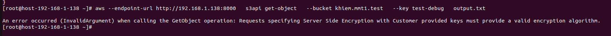
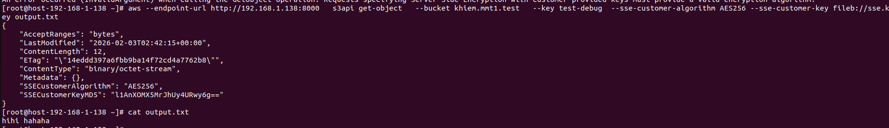

# Triển khai SSE-C
Bước 1: Tạo key mã hóa ngẫu nhiên 256 bits 
```sh
openssl rand 32 > sse.key # mỗi byte có 8 bits thì 32*8=256 bits
```


Bước 2: Upload file
```sh
aws --endpoint-url http://192.168.1.138:8000 s3api put-object --bucket khiem.mmt1.test --key test-debug --body test.txt --sse-customer-algorithm AES256 --sse-customer-key fileb://sse.key ## không cần --sse-customer-key-md5 do khi dùng AWS CLI thì nó sẽ tự thêm header này vào request HTTP gửi cho RGW
```


Bước 3: Tải file về cần file có đúng file chứa key khi upload
 - Khi upload file mà không có thêm key mã hóa, server sẽ trả về lỗi



 - Upload file có thêm trường phương thức mã hóa và key đã tạo dùng để upload file cần tải xuống
```sh
aws --endpoint-url http://192.168.1.142:8000   s3api get-object   --bucket khiem.mmt.test   --key test-debug   --sse-customer-algorithm AES256   --sse-customer-key fileb://sse.key   output.txt
```


***SSE-C không cấu hình vào hệ thống mặc định của Ceph nên ta vẫn có thể đọc và upload file 1 cách bình thường không cần mã hóa***
