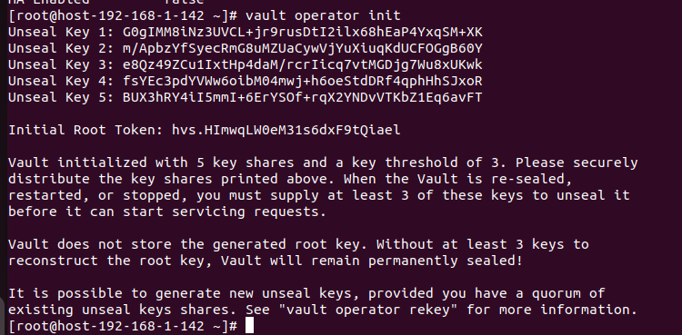
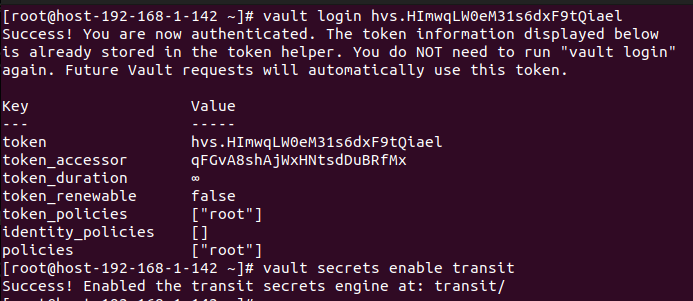
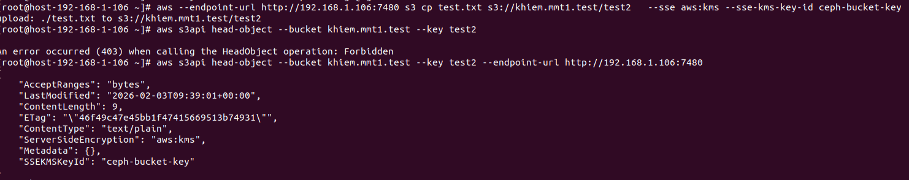

# Triển khai SSE-KMS
## Khái niệm và cơ chế hoạt động
1. Khãi niệm 
- SSE-KMS là phương thức mã hóa dữ liệu tại máy chủ (Server-Side Encryption), trong đó việc quản lý các khóa mã hóa được thực hiện bởi một dịch vụ quản lý khóa (KMS) riêng biệt.
  - Server-Side: Quá trình mã hóa và giải mã diễn ra hoàn toàn tại Gateway (ví dụ: RGW). Client gửi dữ liệu thô qua HTTPS, và Gateway sẽ xử lý phần còn lại.
  - KMS: Các khóa mã hóa không được lưu trữ cùng với dữ liệu mà nằm trong một hệ thống bảo mật chuyên dụng như HashiCorp Vault.
2. Cơ chế hoạt động
  - Client gửi dữ liệu kèm theo một Key ID cụ thể (định danh khóa trong Vault).
  - Ceph tạo DEK, sau đó gọi Vault yêu cầu mã hóa DEK này bằng đúng cái Key ID mà khách hàng yêu cầu. (KEY-ID trong Vault Transit gắn liền với một kiểu mã hóa)
  - Vault thực hiện mã hóa và trả lại DEK đã bị khóa.
  - Ceph mã hóa dữ liệu và cất vào kho cùng với DEK đã khóa đó.
3. Thành phần trong SSE-KMS
- Secrets Engine (Công cụ lưu trữ)
  - KV (Key/Value) Engine: RGW truy cập trực tiếp vào các secret được lưu dưới dạng key-value. Dùng để quản lý mật khẩu quản trị, API tokens, secret config và các chứng chỉ cert 
  - Transit Engine: Đây là phương thức được khuyến nghị. Vault đóng vai trò là "Encryption as a Service", RGW gửi dữ liệu cần mã hóa/giải mã cho Vault mà không bao giờ trực tiếp cầm khóa gốc. Dùng để mã hóa dữ liệu, bảo vệ dữ liệu trên Storage, kí số và xác thực và xoay vòng khóa.
- Cơ chế xác thực (Authentication)
  - Token: Sử dụng một chuỗi token cố định (ít bảo mật hơn vì token có thể hết hạn hoặc bị lộ).
  - Vault Agent: Chạy như một daemon trên node RGW để tự động lấy và làm mới token (Auto-auth), tăng tính an toàn và ổn định.

## Cài đặt Hashicorp Vault
Bước 1: Tải gói và cài đặt 
```sh
yum install yum-utils
yum-config-manager --add-repo https://rpm.releases.hashicorp.com/RHEL/hashicorp.repo
yum -y install vault
```
Bước 2: Cấu hình Vault trong `/etc/vault.d/vault.hcl`:
```sh
storage "file" {
  path = "/opt/vault/data"
}

listener "tcp" {
  address     = "192.168.1.138:8200"
  tls_disable = 1
}
api_addr = "http://192.168.1.138:8200"
ui = true
disable_mlock = true
``` 
Bước 3: Kiểm tra
```sh
export VAULT_ADDR="http://192.168.1.138:8200"
vault status
```


Bước 4: Lấy mã Unseal và root token 
```sh
vault operator init
```


***LƯU Ý: PHẢI LƯU LẠI CÁC KEY NÀY ĐỂ BƯỚC SAU UNSEAL***

Bước 6:  Khi chưa nhập mã Unseal, Vault luôn trong trạng thái sealed. Ở trạng thái này Vault không thể giải mã dữ liệu nào ở bên trong và mọi secret đều bị từ chối. Nhập Unseal Vaule (3 lần) và mỗi lần nhập 1 loại Unseal khác nhau để giá trị unseal process trả về 3/3.
```sh
vault operator unseal 
```


Bước 7: Đăng nhập và bật chế độ transit secret
```sh
vault login 
vault secrets enable transit
```


### Cấu hình SSE-KMS
#### Cephadm (RGW container)
- Trước hết ta cần tạo trên vault  một KEY ID để mã hóa
```sh
vault write -f transit/keys/ceph-bucket-key exportable=true allow_plaintext_backup=true ##Cấu hình exportable=true quan trọng để khi Ceph cần giải mã ở lớp Gateway, KMS gửi khóa này về bộ nhớ RAM để xử lý
```
- Khi đã tạo xong key kết nối tới transit, ta cần tạo file policy để có phép các bucket có quyền gì khi sử dụng key đó
```sh
#  Cho phép Ceph truy cập vào metadata và lấy thông tin về khóa có tên là ceph-bucket-key
path "transit/export/encryption-key/ceph-bucket-key" {
  capabilities = ["read"]
}
# Đây là quyền quan trọng nhất để lấy giá trị thực của khóa (phiên bản số 1).
path "transit/export/encryption-key/ceph-bucket-key/1" {
  capabilities = ["read", "update"]
}
# Cho phép encrypt
path "transit/encrypt/ceph-bucket-key" {
  capabilities = ["update"]
}
# Cho phép decrypt
path "transit/decrypt/ceph-bucket-key" {
  capabilities = ["update"]
}
# Cho phép đọc metadata của key
path "transit/keys/ceph-bucket-key" {
  capabilities = ["read"]
}
```
- Áp dụng policy đó cho vault 
```sh
vault policy write rgw-policy rgw-policy.hcl
```
- Để SSE-KMS hoạt động, ta cần cho cấu hình để Ceph có thể kết nối tới Vault và yêu cầu sử dụng SSE-KMS
- Cấu hình Ceph kết nối tới Vault (Cấu hình này cũng sẽ tự động lưu vào trong các container nên không cần phải vào các container chạy dịch vụ rgw cấu hình lại)
```sh
# Cấu hình nơi lưu trữ encryption key mắc địch là ở đâu
ceph config set client.rgw.sse.host-192-168-1-138.dovwzs rgw_crypt_default_encryption_key ceph-bucket-key
# Cấu hình backend cho sse-kms là vault
ceph config set client.rgw.sse.host-192-168-1-138.dovwzs  rgw_crypt_s3_kms_backend vault
# Cấu hình địa chỉ truy cập Vault cho sse-kms
ceph config set client.rgw.sse.host-192-168-1-138.dovwzs  rgw_crypt_vault_addr http://192.168.1.142:8200
# Cấu hình auth để truy cập vault là token 
ceph config set client.rgw.sse.host-192-168-1-138.dovwzs  rgw_crypt_vault_auth token
# Cấu hình nơi để export thông tin dữ liệu để mã hóa
ceph config set client.rgw.sse.host-192-168-1-138.dovwzs  rgw_crypt_vault_prefix /v1/transit 
# Cấu hình nói lưu trữ là transit
ceph config set client.rgw.sse.host-192-168-1-138.dovwzs  rgw_crypt_vault_secret_engine transit
# Cấu hình đường dẫn tới file token 
ceph config set client.rgw.sse.host-192-168-1-138.dovwzs  rgw_crypt_vault_token_file /etc/ceph/vault.token 
# Cấu hình tắt truy cập bằng cert 
ceph config set client.rgw.sse.host-192-168-1-138.dovwzs rgw_crypt_require_ssl false
```
- Khi đã cấu hình cho Ceph kết nối tới Vault, restart lại dịch vụ rgw 
```sh
ceph orch restart rgw.sse
```
- Lấy ID của container và dùng podman để vào bên từng container chạy dịch vụ rgw để cấu hình đường dẫn tới vault.token
```sh
podman exec -it <ID container> /bin/bash 
vi /etc/ceph/vault.token
#(QUAN TRỌNG) Phải cấu hình đúng quyền 600 và người dùng ceph cho file token để đảm bảo tính bảo mật nếu không sẽ báo lỗi permission
chmod 600 /etc/ceph/vault.token
chown ceph:ceph /etc/ceph/vault.token
```
***LƯU Ý: NẾU RESTART LẠI CONTAINER THÌ MẶC ĐỊNH CẤU HÌNH ĐƯỜNG DẪN TỚI VAULT.TOKEN SẼ MẤT, PHẢI VÀO CẤU HÌNH LẠI***

- Để dùng dịch vụ SSE-KMS khi upload file cần phải có thêm trường gọi mã hóa `--sse aws:kms` và trường `--sse-kms-key-id ceph-bucket-key`, nếu không mặc định nó vẫn sẽ upload file thường không mã hóa lên s3
  - Upload mac dinh
```sh
 aws --endpoint-url http://192.168.1.138:8000 s3 cp test_folder s3://khiem.mmt.test/test1 --recursive # --recursive cho phép thực hiện dối với tất cả các đối tượng file trong 1 folder thay vì 1 file duy nhất
```
  - Upload khi thêm trường `--sse aws:kms` và trường `--sse-kms-key-id`
```sh
aws --endpoint-url http://192.168.1.138:8000 s3 cp test.txt s3://khiem.mmt.test/test2   --sse aws:kms --sse-kms-key-id ceph-bucket-key
```
- Kiểm tra file upload lên xem có mã hóa không dùng trường --head-object để check
```sh
aws s3api head-object --bucket khiem.mmt1.test --key test2
```


- Do ta đã có đủ quyền access-key và secret-key nên khi đọc file đã upload server sẽ tự động giải mã và trả về cho đúng nội dung cho ta. Dùng `-` ở cuối câu lệnh `cp` hoặc `get-object` để đọc file
```sh
aws s3 cp s3://khiem.mmt1.test/test --endpoint-url http://192.168.1.138:8000 -
```


- Ta vẫn có thể đọc file đã upload trước khi cấu hình SSE-KMS


- Ta có thể sử dụng python boto3 (Sử dụng bản 3.11 trở lên) để upload file mã hóa dạng KMS
```sh
import boto3
s3_client = boto3.client(
    's3',
    endpoint_url='http://10.2.1.54:8000',
    aws_access_key_id='EADBJIHZ3INBHZ9S73WA',
    aws_secret_access_key='45H2flJh9yy8bJSlhm02WAwWWXRpWivwCodritLv',
    region_name='us-east-1'
)
def upload_with_sse_s3(bucket, key, data):
    response = s3_client.put_object(
        Bucket=bucket,
        Key=key,
        Body=data,
        ServerSideEncryption= 'aws:kms',
        SSEKMSKeyId='ceph-bucket-key'
    )
    return response
upload_with_sse_s3('khiem.mmt2004.test', 'test1.txt', 'Nội dung bảo mật')
```
#### Ceph-deploy

- Check trạng thái của systemd
```sh
systemctl status  ceph-radosgw@rgw.host-192-168-1-106
```
- Trước hết ta cần tạo trên vault  một KEY ID để mã hóa
```sh
vault write -f transit/keys/ceph-bucket-key exportable=true allow_plaintext_backup=true ##Cấu hình exportable=true quan trọng để khi Ceph cần giải mã ở lớp Gateway, KMS gửi khóa này về bộ nhớ RAM để xử lý
```
- Khi đã tạo xong key kết nối tới transit, ta cần tạo file policy để có phép các bucket có quyền gì khi sử dụng key đó
```sh
#  Cho phép Ceph truy cập vào metadata và lấy thông tin về khóa có tên là ceph-bucket-key
path "transit/export/encryption-key/ceph-bucket-key" {
  capabilities = ["read"]
}
# Đây là quyền quan trọng nhất để lấy giá trị thực của khóa (phiên bản số 1).
path "transit/export/encryption-key/ceph-bucket-key/1" {
  capabilities = ["read", "update"]
}
# Cho phép encrypt
path "transit/encrypt/ceph-bucket-key" {
  capabilities = ["update"]
}
# Cho phép decrypt
path "transit/decrypt/ceph-bucket-key" {
  capabilities = ["update"]
}
# Cho phép đọc metadata của key
path "transit/keys/ceph-bucket-key" {
  capabilities = ["read"]
}
```
- Áp dụng policy đó cho vault 
```sh
vault policy write rgw-policy rgw-policy.hcl
```
- Khi trạng thái đã active để upload file với mã hóa SSE-KMS trong Ceph-deploy ta vẫn cần Vault làm backend để mã hóa Data-Key. Cài đặt Vault như trên để lấy được root-token
- Cấu hình Ceph-deploy để kết nối tới Vault 
```sh
# Cấu hình nơi lưu trữ encryption key mắc địch là ở đâu
ceph config set client.rgw.host-192-168-1-106 rgw_crypt_default_encryption_key ceph-bucket-key
# Cấu hình backend cho sse-s3 là vault
ceph config set client.rgw.host-192-168-1-106 rgw_crypt_s3_kms_backend vault
# Cấu hình địa chỉ truy cập Vault cho sse-s3
ceph config set client.rgw.host-192-168-1-106 rgw_crypt_vault_addr http://192.168.1.106:8200
# Cấu hình auth để truy cập vault là token 
ceph config set client.rgw.host-192-168-1-106   rgw_crypt_vault_auth token
# Cấu hình nơi để export thông tin dữ liệu để mã hóa
ceph config set client.rgw.host-192-168-1-106 rgw_crypt_vault_prefix /v1/transit 
# Cấu hình nói lưu trữ là transit
ceph config set client.rgw.host-192-168-1-106  rgw_crypt_vault_secret_engine transit
# Cấu hình đường dẫn tới file token 
ceph config set client.rgw.host-192-168-1-106  rgw_crypt_vault_token_file /etc/ceph/vault.token 
# Cấu hình tắt truy cập bằng cert 
ceph config set client.rgw.host-192-168-1-106 rgw_crypt_require_ssl false
```
- Kiểm tra 
```sh
ceph config dump | grep rgw_crypt
```


- Vào thư mục `/etc/ceph/` tạo vault.token và điền root-token vào 
```sh
vi /etc/ceph/vault.token
```
- Restart lại dịch vụ rgw
- Upload khi thêm trường `--sse aws:kms` và trường `--sse-kms-key-id`
```sh
aws --endpoint-url http://192.168.1.106:7480 s3 cp test.txt s3://khiem.mmt1.test/test2   --sse aws:kms --sse-kms-key-id ceph-bucket-key
```
- Kiểm tra file upload lên xem có mã hóa không dùng trường --head-object để check
```sh
aws s3api head-object --bucket khiem.mmt1.test --key test2 --endpoint-url http:192.168.1.106:7480
```


- Do ta đã có đủ quyền access-key và secret-key nên khi đọc file đã upload server sẽ tự động giải mã và trả về cho đúng nội dung cho ta. Dùng `-` ở cuối câu lệnh `cp` hoặc `get-object` để đọc file
```sh
aws s3 cp s3://khiem.mmt1.test/test2 --endpoint-url http://192.168.1.106:7480 -
```


