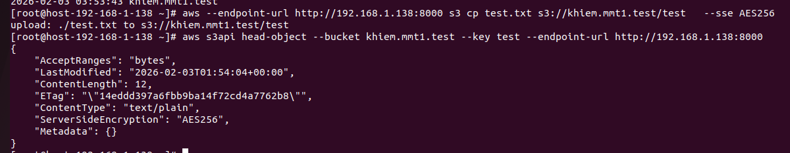
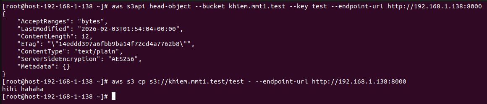
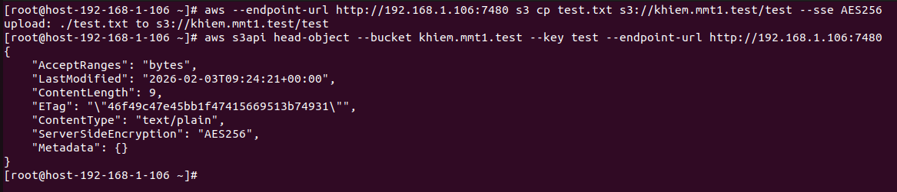
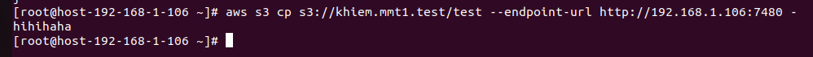

# SSE-S3
## Khái niệm và cơ chế hoạt dộng
1. Khái niệm
- SSE-S3 (Server-Side Encryption with S3-Managed Keys) là phương thức mã hóa phía máy chủ trong đó hệ thống lưu trữ (Object Storage Service) chịu trách nhiệm toàn trình về việc quản lý khóa, thực hiện mã hóa dữ liệu trước khi lưu xuống đĩa cứng (Data at Rest) và giải mã dữ liệu khi có yêu cầu truy xuất hợp lệ.
- Trong mô hình này, người dùng (Client) không cần phải quản lý hoặc lưu trữ các khóa mã hóa. Thay vào đó, mỗi đối tượng (Object) khi được tải lên (PUT) sẽ được hệ thống tự động mã hóa bằng một khóa duy nhất.
- SSE-S3 sử dụng thuật toán AES-256 để mã hóa dữ liệu
2. Cơ chế hoạt động 
- Hệ thống sử dụng hai cấp độ khóa chính:
  - Data Key (Khóa dữ liệu): Khóa dùng để mã hóa trực tiếp dữ liệu của đối tượng (Object payload). Mỗi đối tượng sẽ có một Data Key riêng biệt.
  - Master Key (Khóa chủ): Khóa dùng để mã hóa chính cái Data Key đó. Master Key được quản lý nội bộ bởi hệ thống lưu trữ và thường được xoay vòng (rotated) định kỳ để tăng cường bảo mật.
- Quá trình ghi dữ liệu: 
  - Khi một yêu cầu PUT được gửi kèm header x-amz-server-side-encryption: AES256, hệ thống sẽ thực hiện các bước sau:
   - Ceph tạo ra một khóa DEK (Data encryption key).
   - Ceph gửi DEK này sang Vault.
   - Vault dùng khóa chủ (Master Key) mã hóa DEK rồi gửi lại cho Ceph.
   - Ceph lưu dữ liệu đã mã hóa + DEK đã bị khóa (metadata) vào ổ đĩa.
## Triển khai SSE-S3
- Khi cụm Ceph đã triển khai được RGW và upload được file bình thường lên s3, để an toàn dữ liệu ta cần cấu hình mã hóa SSE-S3 với backend lưu trữ key là Vault
### Cài đặt Hashicorp Vault
Bước 1: Tải gói và cài đặt 
```sh
yum install yum-utils
yum-config-manager --add-repo https://rpm.releases.hashicorp.com/RHEL/hashicorp.repo
yum -y install vault
```
Bước 2: Cấu hình Vault trong `/etc/vault.d/vault.hcl`:
```sh
storage "file" {
  path = "/opt/vault/data"
}

listener "tcp" {
  address     = "192.168.1.138:8200"
  tls_disable = 1
}
api_addr = "http://192.168.1.138:8200"
ui = true
disable_mlock = true
``` 
Bước 3: Kiểm tra
```sh
export VAULT_ADDR="http://192.168.1.138:8200"
systemctl start vault
vault status
```


Bước 4: Lấy mã Unseal và root token 
```sh
vault operator init
```


***LƯU Ý: PHẢI LƯU LẠI CÁC KEY NÀY ĐỂ BƯỚC SAU UNSEAL***

Bước 6:  Khi chưa nhập mã Unseal, Vault luôn trong trạng thái sealed. Ở trạng thái này Vault không thể giải mã dữ liệu nào ở bên trong và mọi secret đều bị từ chối. Nhập Unseal Vaule (3 lần) và mỗi lần nhập 1 loại Unseal khác nhau để giá trị unseal process trả về 3/3.
```sh
vault operator unseal 
```


Bước 7: Đăng nhập và bật chế độ transit secret
```sh
vault login 
vault secrets enable transit
```


### Cấu hình SSE-S3
#### Cephadm (RGW container)
- Để SSE-S3 hoạt động, ta cần cho cấu hình để Ceph có thể kết nối tới Vault và yêu cầu sử dụng SSE-S3
- Cấu hình Ceph kết nối tới Vault (Cấu hình này cũng sẽ tự động lưu vào trong các container nên không cần phải vào các container chạy dịch vụ rgw cấu hình lại)
```sh
# Cấu hình backend cho sse-s3 là vault
ceph config set client.rgw.sse.host-192-168-1-138.dovwzs  rgw_crypt_sse_s3_backend vault
# Cấu hình địa chỉ truy cập Vault cho sse-s3
ceph config set client.rgw.sse.host-192-168-1-138.dovwzs  rgw_crypt_sse_s3_vault_addr http://192.168.1.142:8200
# Cấu hình auth để truy cập vault là token 
ceph config set client.rgw.sse.host-192-168-1-138.dovwzs  rgw_crypt_sse_s3_vault_auth token
# Cấu hình nơi để export thông tin dữ liệu để mã hóa
ceph config set client.rgw.sse.host-192-168-1-138.dovwzs  rgw_crypt_sse_s3_vault_prefix /v1/transit 
# Cấu hình nói lưu trữ là transit
ceph config set client.rgw.sse.host-192-168-1-138.dovwzs  rgw_crypt_sse_s3_vault_secret_engine transit
# Cấu hình đường dẫn tới file token 
ceph config set client.rgw.sse.host-192-168-1-138.dovwzs  rgw_crypt_sse_s3_vault_token_file /etc/ceph/vault-root.token 
# Cấu hình tắt truy cập bằng cert 
ceph config set client.rgw.sse.host-192-168-1-138.dovwzs rgw_crypt_require_ssl false
```
- Khi đã cấu hình cho Ceph kết nối tới Vault, restart lại dịch vụ rgw 
```sh
ceph orch restart rgw.sse
```
- Lấy ID của container và dùng podman để vào bên từng container chạy dịch vụ rgw để cấu hình đường dẫn tới vault.token
```sh
podman exec -it <ID container> /bin/bash 
vi /etc/ceph/vault.token
#(QUAN TRỌNG) Phải cấu hình đúng quyền 600 và người dùng ceph cho file token để đảm bảo tính bảo mật nếu không sẽ báo lỗi permission
chmod 600 /etc/ceph/vault.token
chown ceph:ceph /etc/ceph/vault.token
```
***LƯU Ý: NẾU RESTART LẠI CONTAINER THÌ MẶC ĐỊNH CẤU HÌNH ĐƯỜNG DẪN TỚI VAULT.TOKEN SẼ MẤT, PHẢI VÀO CẤU HÌNH LẠI***

- Để dùng dịch vụ SSE-S3 khi upload file cần phải có thêm trường gọi mã hóa `--sse AES256`, nếu không mặc định nó vẫn sẽ upload file thường không mã hóa lên s3
  - Upload mac dinh
```sh
 aws --endpoint-url http://192.168.1.142:8000 s3 cp test_folder s3://khiem.mmt.test/test1 --recursive # --recursive cho phép thực hiện dối với tất cả các đối tượng file trong 1 folder thay vì 1 file duy nhất
```
  - Upload khi thêm trường SSE
```sh
aws --endpoint-url http://192.168.1.142:8000 s3 cp test.txt s3://khiem.mmt.test/test   --sse AES256
```
- Kiểm tra file upload lên xem có mã hóa không dùng trường --head-object để check
```sh
aws s3api head-object --bucket khiem.mmt1.test --key test
```


- Do ta đã có đủ quyền access-key và secret-key nên khi đọc file đã upload server sẽ tự động giải mã và trả về cho đúng nội dung cho ta. Dùng `-` ở cuối câu lệnh `cp` hoặc `get-object` để đọc file
```sh
aws s3 cp s3://khiem.mmt1.test/test --endpoint-url http://192.168.1.138:8000 -
```


- Ta vẫn có thể đọc file đã upload trước khi cấu hình SSE-S3


- Sử dụng python boto3 (Sử dụng bản 3.11 trở lên) để upload file mã hóa 
```sh
*** SSE-S3 ***
import boto3
s3_client = boto3.client(
    's3',
    endpoint_url='http://192.168.1.142:8000',
    aws_access_key_id='4Z0I11STI5YXIHC4PCX2',
    aws_secret_access_key='mLaKyEA6t9YzzqaMRwLpZXLnQ4IOyYMrOx4z21fa',
    region_name='us-east-1'
)
def upload_with_sse_s3(bucket, key, data):
    response = s3_client.put_object(
        Bucket=bucket,
        Key=key,
        Body=data,
        ServerSideEncryption= 'AES256'
    )
    return response
upload_with_sse_s3('khiem.mmt.test', 'test.txt', 'Nội dung bảo mật')
```

### Ceph-deploy (RGW services)
- Check trạng thái của systemd
```sh
systemctl status  ceph-radosgw@rgw.host-192-168-1-106
```
- Khi trạng thái đã active để upload file với mã hóa SSE-S3 trong Ceph-deploy ta vẫn cần Vault làm backend để mã hóa Data-Key. Cài đặt Vault như trên để lấy được root-token
- Cấu hình Ceph-deploy để kết nối tới Vault 
```sh
# Cấu hình backend cho sse-s3 là vault
ceph config set client.rgw.host-192-168-1-106 rgw_crypt_sse_s3_backend vault
# Cấu hình địa chỉ truy cập Vault cho sse-s3
ceph config set client.rgw.host-192-168-1-106 rgw_crypt_sse_s3_vault_addr http://192.168.1.106:8200
# Cấu hình auth để truy cập vault là token 
ceph config set client.rgw.host-192-168-1-106   rgw_crypt_sse_s3_vault_auth token
# Cấu hình nơi để export thông tin dữ liệu để mã hóa
ceph config set client.rgw.host-192-168-1-106 rgw_crypt_sse_s3_vault_prefix /v1/transit 
# Cấu hình nói lưu trữ là transit
ceph config set client.rgw.host-192-168-1-106  rgw_crypt_sse_s3_vault_secret_engine transit
# Cấu hình đường dẫn tới file token 
ceph config set client.rgw.host-192-168-1-106  rgw_crypt_sse_s3_vault_token_file /etc/ceph/vault.token 
# Cấu hình tắt truy cập bằng cert 
ceph config set client.rgw.host-192-168-1-106 rgw_crypt_require_ssl false
```
- Kiểm tra 
```sh
ceph config dump | grep rgw_crypt
```


- Vào thư mục `/etc/ceph/` tạo vault.token và điền root-token vào 
```sh
vi /etc/ceph/vault.token
```
- Restart lại dịch vụ rgw
- Để dùng dịch vụ SSE-S3 khi upload file cần phải có thêm trường gọi mã hóa `--sse AES256`, nếu không mặc định nó vẫn sẽ upload file thường không mã hóa lên s3
```sh
aws --endpoint-url http://192.168.1.138:7480 s3 cp test.txt s3://khiem.mmt1.test/test   --sse AES256
```
- Kiểm tra file upload lên xem có mã hóa không dùng trường --head-object để check
```sh
aws s3api head-object --bucket khiem.mmt1.test --key test --endpoint-url http://192.168.1.106:7480
```


- Do ta đã có đủ quyền access-key và secret-key nên khi đọc file đã upload server sẽ tự động giải mã và trả về cho đúng nội dung cho ta. Dùng `-` ở cuối câu lệnh `cp` hoặc `get-object` để đọc file
```sh
aws s3 cp s3://khiem.mmt1.test/test --endpoint-url http://192.168.1.138:8000 -
```


