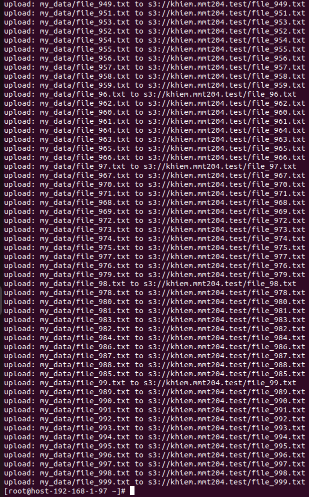
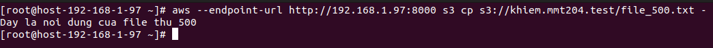
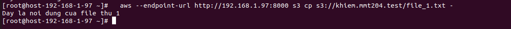
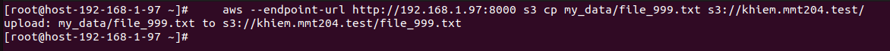
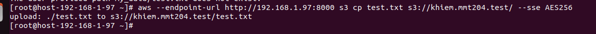
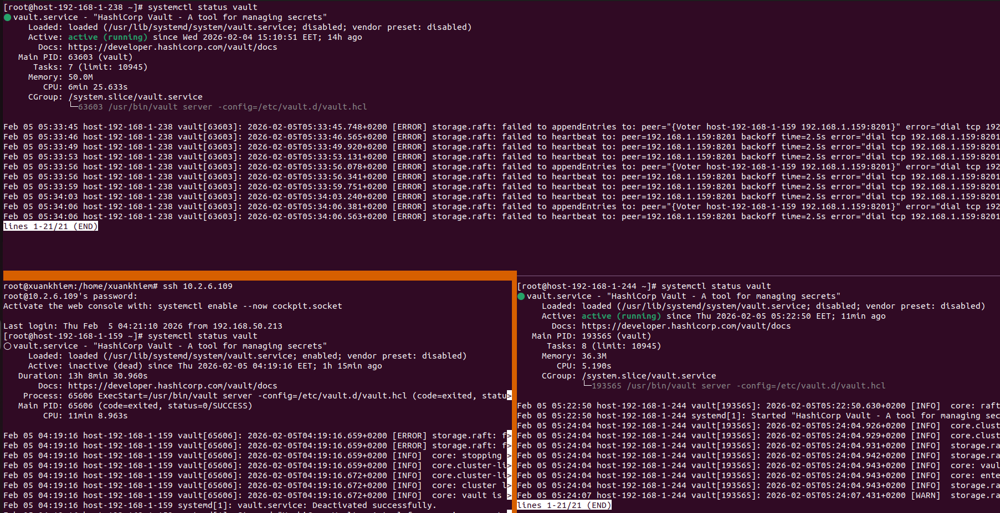
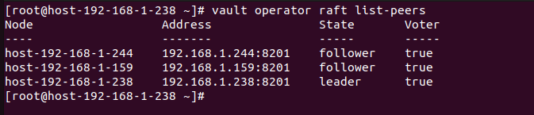
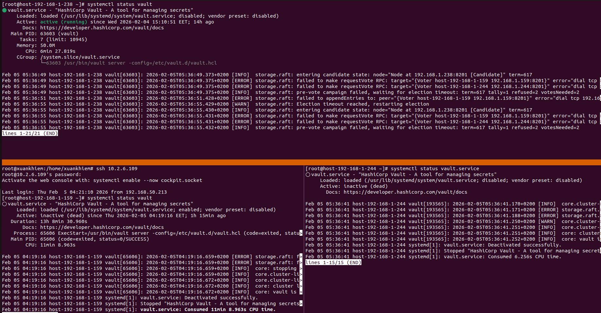
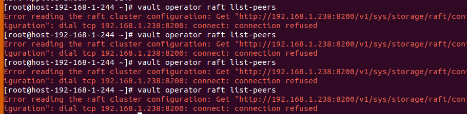

# KIỂM THỬ MÃ HÓA DỮ LIỆU CEPH RGW VỚI HASHICORP VAULT
1. Tổng quan hệ thống
  - Cụm Ceph: 3 node (RGW chạy trên port 8000).
  - Cụm Vault HA: 3 node (Raft storage) + Keepalived VIP: 192.168.1.100:8200.
  - Cơ chế mã hóa: Server-Side Encryption (SSE-S3) sử dụng Transit Secret Engine.
2. Kịch bản 
  - Giai đoạn 1: Chưa config SSE, sử dụng s3 upload bình thường nhiều file vào(1k file), read xem bình thường
  - Giai đoạn 2: Cấu hình SSE rồi xem có đọc được các dữ liệu cũ ở giai đoạn 1 hay ko
  - Giai đoạn 3: Sau khi config SSE rồi upload theo cách bình thường được không 
  - Giai đoạn 4: Thử nghiệm sẽ như thế nào nếu trong cụm Vault 3 node có 1 node chết, 2 node chết và tất cả đều chết, nó ảnh hưởng gì tới Ceph
GIAI ĐOẠN 1: KIỂM THỬ TRƯỚC KHI CẤU HÌNH MÃ HÓA

Mục tiêu: Đảm bảo cụm Ceph RGW hoạt động bình thường ở chế độ lưu trữ thuần túy.
1.1. Tạo 1,000 file dữ liệu mẫu

Sử dụng script để tạo nhanh các file nhỏ:
```sh
mkdir my_data
for i in $(seq 1 1000); do 
    echo "Noi dung file mau thu $i" > my_data/file_$i.txt; 
done
```
1.2. Upload dữ liệu lên S3 (Chế độ thường)
Sử dụng AWS CLI để đẩy dữ liệu vào bucket (Sử dụng sync thay vì cp để an toàn cho file dữ liệu lớn ):
```sh
aws --endpoint-url http://192.168.1.97:8000 s3 sync my_data/ s3://khiem.mmt204.test/test
```


1.3. Kiểm tra khả năng đọc
Đọc ngẫu nhiên một file để xác nhận:
```sh
aws --endpoint-url http://192.168.1.97:8000 s3 cp s3://khiem.mmt204.test/file_500.txt -
```



GIAI ĐOẠN 2: CẤU HÌNH MÃ HÓA (SSE-S3)

Mục tiêu: Liên kết Ceph RGW với cụm Vault VIP.
2.1. Chuẩn bị trên HashiCorp Vault

Thực hiện trên node Leader của Vault:

    Bật Transit Engine: vault secrets enable transit

    Tạo khóa mã hóa: vault write -f transit/keys/s3

    Cấp quyền (Policy): Tạo policy cho phép RGW truy cập khóa s3.

2.2. Cấu hình Ceph RGW

Chỉnh sửa cấu hình Ceph để trỏ về Vault VIP:
```sh
ceph config set client.rgw rgw_crypt_sse_s3_backend vault
ceph config set client.rgw rgw_crypt_sse_s3_vault_addr http://192.168.1.100:8200
ceph config set client.rgw rgw_crypt_sse_s3_vault_auth token
ceph config set client.rgw rgw_crypt_sse_s3_vault_token_file /etc/ceph/vault.token
ceph config set client.rgw rgw_crypt_sse_s3_vault_prefix transit
ceph config set client.rgw rgw_crypt_require_ssl false
```

Sau đó khởi động lại dịch vụ RGW trên các node.
GIAI ĐOẠN 3: KIỂM THỬ SAU KHI CẤU HÌNH
3.1. Dữ liệu cũ (ở Giai đoạn 1) có xem được không?

    Câu trả lời: có, do SSE-S3 là thuộc tính được gán cho từng Object tại thời điểm upload. Các file đã upload trước khi cấu hình Vault không mang cờ mã hóa trong Metadata, nên RGW sẽ đọc trực tiếp từ OSD mà không đi qua Vault.

    Lệnh kiểm tra: 
  ```sh 
    aws --endpoint-url http://192.168.1.97:8000 s3 cp s3://khiem.mmt204.test/file_1.txt -
```


3.2. Sau khi config SSE, upload "bình thường" được không?

    Câu trả lời: có, nếu ta không thêm flag --sse AES256, file sẽ được upload lên ở dạng không mã hóa (Plaintext). Việc cấu hình Vault chỉ là "mở tính năng", không ép buộc mọi file phải mã hóa trừ khi bạn thiết lập Bucket Policy.

    Lệnh kiểm tra:
  ```sh

    aws --endpoint-url http://192.168.1.97:8000 s3 cp my_data/file_999.txt s3://khiem.mmt204.test/
```



3.3. Kiểm tra upload có mã hóa (SSE-S3)

Đây là phần quan trọng nhất để xác nhận Vault đang hoạt động:
```sh
aws --endpoint-url http://192.168.1.97:8000 s3 cp my_data/test.txt s3://khiem.mmt204.test/ --sse AES256
```


Giai đoạn 4: Thử nghiệm sự ảnh hưởng của Vault 
- Vì ta dùng thuật toán Raft. Với n=3, bạn cần ít nhất 2 node chạy để cụm làm việc.
- Kịch bản 1: 1 Node chết



    Trạng thái: BÌNH THƯỜNG.



    Diễn biến: * Nếu node chết là Follower: Không có chuyện gì xảy ra, Leader vẫn làm việc.

        Nếu node chết là Leader: 2 node còn lại sẽ tổ chức bầu cử (Election) trong vài mili giây. Node mới lên làm Leader. Keepalived sẽ chuyển VIP .100 sang node mới.

    Ảnh hưởng: RGW có thể bị gián đoạn khoảng 1-2 giây rồi tự động ổn định lại. Ta vẫn có thể upload và đọc file với dịch vụ SSE binh thường 

Upload file


Đọc file


Kịch bản 2: 2 Node chết (Chỉ còn 1 node sống)



    Trạng thái: HỆ THỐNG DỪNG (Stall).

  

    Ảnh hưởng: Toàn bộ tính năng mã hóa của Ceph bị tê liệt hoàn toàn.
    
    Lúc này RGW sẽ không còn gọi đến Vault được nữa nên SSE sẽ bị lỗi không hoạt động

    

Kịch bản 3: Chết sạch cả 3 node (Blackout)

    Trạng thái: SẬP TOÀN DIỆN.

    Diễn biến: Không còn gì để bàn, dịch vụ Vault biến mất.

    Ảnh hưởng: Giống như kịch bản 2, nhưng bạn sẽ mất thêm thời gian để khởi động lại và Unseal từng node một khi chúng sống lại.
