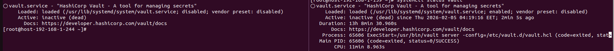
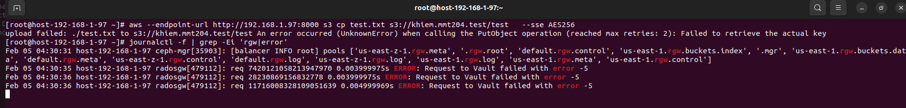

# Thử nghiệm về cụm Vault ảnh hưởng tới dịch vụ S3 của Ceph
- Do Vault sử dụng thuật toán đồng thuận raft nên dữ liệu ở các node đều được đồng bộ hóa giống hệt nhau và số node tối đa chịu lỗi được tính theo ct (n-1)/2 (n là số lẻ).
- Khi cụm Vault chết thì RGW sẽ gặp lỗi kết nối tới endpoint của Vault đã cấu hình. Giả sử 2/3 node Vault chết 

- Thử lại upload file với dịch vụ SSE sẽ hiện lỗi kết nối tới Vault fail

- Chỉ riêng upload file bình thường và dịch vụ SSE-C vẫn hoạt động bình thường do không có liên quan tới Vault 

